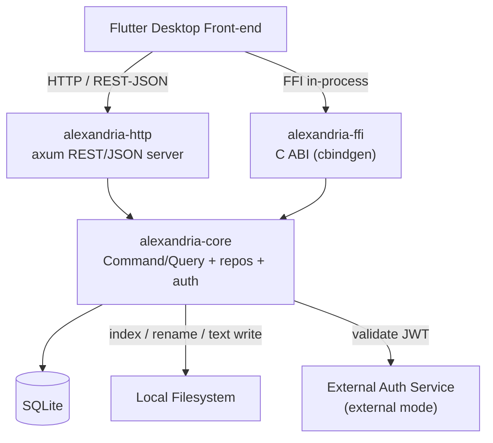

# Alexandria

A fast, type-aware personal library back-end written in Rust. Alexandria indexes,
organizes, and surfaces a single user's on-disk media and documents — audio,
movies and series, HTML pages, Markdown and text files, PDFs and e-books, comic
books, images, and browser bookmarks — without re-encoding, duplicating, or
relocating them. The domain logic lives in a reusable Rust core library exposed
over both an HTTP/REST-JSON API and a Flutter FFI surface, so any client in any
language can drive it and the Flutter desktop front-end can call it in-process.

> Single-user. Metadata + path/content-hash only. No complex media editing.
> Two-phase soft/hard deletion. Pluggable auth (external JWT **or** local
> encrypted login).

## Project status

Issues are tracked in the [Alexandria API project board](https://github.com/users/artur-rios/projects/8)
and grouped into [milestones](https://github.com/artur-rios/alexandria-api/milestones)
that mirror the feature groups in
[System Requirements Document §9.1](docs/requirements/System%20Requirements%20Document.md).
Each row below links to its issue; GitHub renders the issue's `#` reference with
its open/closed state, so the tables stay in sync with the board automatically.

| Milestone | Scope | Progress |
| --- | --- | :---: |
| [F-00 Foundation & operations](https://github.com/artur-rios/alexandria-api/milestone/1) | Scaffold, config, migrations, health | 1 / 2 |
| [F-01 File indexing](https://github.com/artur-rios/alexandria-api/milestone/2) | UC-01 … UC-02 | 2 / 2 |
| [F-02 Catalog browsing & metadata editing](https://github.com/artur-rios/alexandria-api/milestone/3) | UC-03 … UC-04 | 2 / 2 |
| [F-03 Renaming & lifecycle management](https://github.com/artur-rios/alexandria-api/milestone/4) | UC-05 … UC-09 | 5 / 5 |
| [F-04 Text file content editing](https://github.com/artur-rios/alexandria-api/milestone/5) | UC-32 … UC-33 | 0 / 2 |
| [F-05 Collections](https://github.com/artur-rios/alexandria-api/milestone/6) | UC-10 … UC-14 | 0 / 5 |
| [F-06 Bookmarks](https://github.com/artur-rios/alexandria-api/milestone/7) | UC-15 … UC-19 | 0 / 5 |
| [F-07 Watchlists](https://github.com/artur-rios/alexandria-api/milestone/8) | UC-20 … UC-25 | 0 / 6 |
| [F-08 Reading lists](https://github.com/artur-rios/alexandria-api/milestone/9) | UC-26 … UC-31 | 0 / 6 |
| [F-09 Pluggable authentication](https://github.com/artur-rios/alexandria-api/milestone/10) | UC-34 … UC-36 | 0 / 3 |
| **Total** | | **10 / 38** |

### F-00 — Foundation & operations

Workspace scaffold, configuration, migrations, logging, and the health surface.

| Issue | Use case | Status | Title | Requirements |
| --- | --- | :---: | --- | --- |
| [#1](https://github.com/artur-rios/alexandria-api/issues/1) | — | &#9745; | Scaffold and initial infrastructure | IR-01 … IR-06 |
| [#38](https://github.com/artur-rios/alexandria-api/issues/38) | UC-37 | &#9744; | Health check | IR-03, IR-04, IR-05 |

### F-01 — File indexing

Discover on-disk files, classify them by type, hash their bytes, and keep the
catalog current.

| Issue | Use case | Status | Title | Requirements |
| --- | --- | :---: | --- | --- |
| [#2](https://github.com/artur-rios/alexandria-api/issues/2) | UC-01 | &#9745; | Index library files | FR-FC-01 … FR-FC-09, FR-FC-24 |
| [#3](https://github.com/artur-rios/alexandria-api/issues/3) | UC-02 | &#9745; | Re-index and refresh the catalog | FR-FC-08, FR-FC-10, FR-FC-11, FR-FC-24 |

### F-02 — Catalog browsing & metadata editing

Read the catalog and edit type-specific metadata.

| Issue | Use case | Status | Title | Requirements |
| --- | --- | :---: | --- | --- |
| [#4](https://github.com/artur-rios/alexandria-api/issues/4) | UC-03 | &#9745; | Browse and view file metadata | FR-FC-12, FR-FC-13, FR-FC-24 |
| [#5](https://github.com/artur-rios/alexandria-api/issues/5) | UC-04 | &#9745; | Edit file metadata | FR-FC-14 … FR-FC-18, FR-FC-24 |

### F-03 — Renaming & lifecycle management

Rename on disk, plus the two-phase soft-delete → restore → purge lifecycle.

| Issue | Use case | Status | Title | Requirements |
| --- | --- | :---: | --- | --- |
| [#6](https://github.com/artur-rios/alexandria-api/issues/6) | UC-05 | &#9745; | Rename a file | FR-FC-19, FR-FC-24 |
| [#7](https://github.com/artur-rios/alexandria-api/issues/7) | UC-06 | &#9745; | Soft-delete a file | FR-FC-20, FR-FC-24 |
| [#8](https://github.com/artur-rios/alexandria-api/issues/8) | UC-07 | &#9745; | Restore a soft-deleted file | FR-FC-21, FR-FC-24 |
| [#9](https://github.com/artur-rios/alexandria-api/issues/9) | UC-08 | &#9745; | Hard-purge a file record | FR-FC-22, FR-FC-24, NFR-07 |
| [#10](https://github.com/artur-rios/alexandria-api/issues/10) | UC-09 | &#9745; | Purge a file on disk | FR-FC-23, FR-FC-24 |

### F-04 — Text file content editing

Read and write TextFile content on disk, refreshing the content hash.

| Issue | Use case | Status | Title | Requirements |
| --- | --- | :---: | --- | --- |
| [#33](https://github.com/artur-rios/alexandria-api/issues/33) | UC-32 | &#9744; | Read text file content | FR-TX-01, FR-FC-24 |
| [#34](https://github.com/artur-rios/alexandria-api/issues/34) | UC-33 | &#9744; | Edit text file content | FR-TX-02, FR-TX-03, FR-FC-24 |

### F-05 — Collections

Flat file and bookmark groupings; deleting a collection preserves its items.

| Issue | Use case | Status | Title | Requirements |
| --- | --- | :---: | --- | --- |
| [#11](https://github.com/artur-rios/alexandria-api/issues/11) | UC-10 | &#9744; | Create a collection | FR-CO-01, FR-CO-02, FR-FC-24 |
| [#12](https://github.com/artur-rios/alexandria-api/issues/12) | UC-11 | &#9744; | Rename a collection | FR-CO-03, FR-FC-24 |
| [#13](https://github.com/artur-rios/alexandria-api/issues/13) | UC-12 | &#9744; | Delete a collection | FR-CO-04, FR-FC-24 |
| [#14](https://github.com/artur-rios/alexandria-api/issues/14) | UC-13 | &#9744; | Add items to a collection | FR-CO-05, FR-FC-24 |
| [#15](https://github.com/artur-rios/alexandria-api/issues/15) | UC-14 | &#9744; | Remove and list items in a collection | FR-CO-06, FR-CO-07, FR-FC-12, FR-FC-24 |

### F-06 — Bookmarks

Browser bookmarks, with the same two-phase deletion model as files.

| Issue | Use case | Status | Title | Requirements |
| --- | --- | :---: | --- | --- |
| [#16](https://github.com/artur-rios/alexandria-api/issues/16) | UC-15 | &#9744; | Create a bookmark | FR-BM-01, FR-FC-24 |
| [#17](https://github.com/artur-rios/alexandria-api/issues/17) | UC-16 | &#9744; | Update a bookmark | FR-BM-02, FR-FC-24 |
| [#18](https://github.com/artur-rios/alexandria-api/issues/18) | UC-17 | &#9744; | Browse bookmarks | FR-BM-06, FR-FC-24 |
| [#19](https://github.com/artur-rios/alexandria-api/issues/19) | UC-18 | &#9744; | Soft-delete and restore a bookmark | FR-BM-03, FR-BM-05, FR-FC-24 |
| [#20](https://github.com/artur-rios/alexandria-api/issues/20) | UC-19 | &#9744; | Hard-purge a bookmark | FR-BM-04, FR-FC-24 |

### F-07 — Watchlists

Video consumption tracking, per episode for series.

| Issue | Use case | Status | Title | Requirements |
| --- | --- | :---: | --- | --- |
| [#21](https://github.com/artur-rios/alexandria-api/issues/21) | UC-20 | &#9744; | Create a watchlist | FR-WL-01, FR-FC-24 |
| [#22](https://github.com/artur-rios/alexandria-api/issues/22) | UC-21 | &#9744; | Browse watchlists and progress | FR-WL-08, FR-FC-24 |
| [#23](https://github.com/artur-rios/alexandria-api/issues/23) | UC-22 | &#9744; | Add a video to a watchlist | FR-WL-02, FR-WL-03, FR-FC-24 |
| [#24](https://github.com/artur-rios/alexandria-api/issues/24) | UC-23 | &#9744; | Update watch progress | FR-WL-04, FR-WL-05, FR-FC-24 |
| [#25](https://github.com/artur-rios/alexandria-api/issues/25) | UC-24 | &#9744; | Remove a video from a watchlist | FR-WL-06, FR-FC-24 |
| [#26](https://github.com/artur-rios/alexandria-api/issues/26) | UC-25 | &#9744; | Delete a watchlist | FR-WL-07, FR-FC-24 |

### F-08 — Reading lists

Book and comic consumption tracking, per issue for comic series.

| Issue | Use case | Status | Title | Requirements |
| --- | --- | :---: | --- | --- |
| [#27](https://github.com/artur-rios/alexandria-api/issues/27) | UC-26 | &#9744; | Create a reading list | FR-RL-01, FR-FC-24 |
| [#28](https://github.com/artur-rios/alexandria-api/issues/28) | UC-27 | &#9744; | Browse reading lists and progress | FR-RL-08, FR-FC-24 |
| [#29](https://github.com/artur-rios/alexandria-api/issues/29) | UC-28 | &#9744; | Add an item to a reading list | FR-RL-02, FR-RL-03, FR-FC-24 |
| [#30](https://github.com/artur-rios/alexandria-api/issues/30) | UC-29 | &#9744; | Update reading progress | FR-RL-04, FR-RL-05, FR-FC-24 |
| [#31](https://github.com/artur-rios/alexandria-api/issues/31) | UC-30 | &#9744; | Remove an item from a reading list | FR-RL-06, FR-FC-24 |
| [#32](https://github.com/artur-rios/alexandria-api/issues/32) | UC-31 | &#9744; | Delete a reading list | FR-RL-07, FR-FC-24 |

### F-09 — Pluggable authentication

Exactly one active auth mode: external JWT **or** local encrypted login.

| Issue | Use case | Status | Title | Requirements |
| --- | --- | :---: | --- | --- |
| [#35](https://github.com/artur-rios/alexandria-api/issues/35) | UC-34 | &#9744; | Local login | FR-AU-01, FR-AU-04, FR-AU-07, FR-AU-08 |
| [#36](https://github.com/artur-rios/alexandria-api/issues/36) | UC-35 | &#9744; | Set or change local login credentials | FR-AU-05, FR-AU-06, FR-AU-08 |
| [#37](https://github.com/artur-rios/alexandria-api/issues/37) | UC-36 | &#9744; | Authenticate via external JWT | FR-AU-01, FR-AU-02, FR-AU-03, FR-AU-07, FR-AU-08 |

To update the tables: when an issue closes, flip its marker from **&#9744;** to
**&#9745;** and bump the milestone's progress count. The issue number references
are live GitHub links, so they also reflect state via the issue badge.

## Architecture

Three crates share one core library so the HTTP REST/JSON surface and the
Flutter FFI surface cannot drift:



The domain follows SOLID with a Command/Query (CQRS-style) baseline. Repository
and auth-service **traits** in `alexandria-core` are what make the handlers
unit-testable; `alexandria-http` and `alexandria-ffi` are thin transport layers
over the same handlers.

## Repository layout

```txt
alexandria-api/
├── Cargo.toml                 # workspace
├── crates/
│   ├── alexandria-core/       # domain: commands, queries, repos, auth, config
│   ├── alexandria-http/       # axum routes + middleware
│   └── alexandria-ffi/        # extern "C" + cbindgen header
├── config.toml.example
├── docs/
│   ├── initial/               # informal docs (Project Overview, Stack, Workflow, Business Rules)
│   └── requirements/         # formal specs (Vision, SRD, Use Cases, …)
├── tools/
└── README.md
```

## Building

Requirements: Rust **1.94** or newer (edition 2021) and `cargo`. The floor comes
from sqlx 0.9, the highest MSRV in the dependency graph.

```bash
# Build the whole workspace (core + http + ffi)
cargo build --workspace --release

# Build the HTTP server binary
cargo build --release -p alexandria-http

# Build the FFI dynamic library + regenerate the C header via cbindgen
cargo build --release -p alexandria-ffi
```

The workspace enforces `#![deny(unsafe_code)]` in every crate.

## Running

Configuration is read from `config.toml` at startup, with any key overridable
through an `ALEXANDRIA_*` environment variable. See [`config.toml.example`](config.toml.example)
for the full list (auth mode, HTTP bind address, SQLite path, indexing
concurrency, soft-delete retention, log level).

```bash
# 1. Create a local config from the example
cp config.toml.example config.toml

# 2. Optional: run migrations ahead of time. The server and the FFI
#    `alexandria_index_init` both apply them on startup, so this is only
#    needed to prepare a database out-of-band.
sqlx migrate run --source crates/alexandria-core/migrations \
  --database-url "sqlite:${ALEXANDRIA_DATABASE_PATH:-alexandria.sqlite}?mode=rwc"

# 3. Start the HTTP server (binds to loopback by default)
cargo run --release -p alexandria-http

# or, once packaged, run the bundled binary alongside the Flutter desktop app
```

Two notes on that URL, verified against sqlx-cli 0.9.0: `?mode=rwc` is required
or the CLI refuses to create a database that does not exist yet, and the scheme
takes a single colon with no `//`. The `sqlite://` form fails on Windows
absolute paths, where the drive letter parses as a URL authority.

Both surfaces read the same configuration: `ALEXANDRIA_CONFIG` (default
`config.toml`) plus `ALEXANDRIA_*` environment overrides.

In external auth mode, set `ALEXANDRIA_AUTH_MODE=external` and
`ALEXANDRIA_AUTH_JWKS_URL` to the external auth service's JWKS endpoint. In
local login mode (`ALEXANDRIA_AUTH_MODE=local`), set the owner's credentials
once via the local credential setup operation (UC-35) before callers can
authenticate.

### Health check

```bash
curl http://127.0.0.1:8080/health
# {"status":"ok","database":"reachable","filesystem":"reachable","authMode":"external"}
```

## Testing

Tests are organized by crate and split into **unit** (handler logic against
trait fakes), **integration** (HTTP/FFI end-to-end against real SQLite and a
temp filesystem), and **parity** (HTTP vs FFI must return identical results).
See [`docs/requirements/Testing Specification Document.md`](docs/requirements/Testing%20Specification%20Document.md)
for the full standard.

```bash
# Run the entire suite
cargo test --workspace

# Run only unit tests
cargo test --workspace --lib

# Run only integration tests
cargo test --workspace --test '*'

# Run the HTTP / FFI parity suite alone
cargo test -p alexandria-ffi --test parity

# Optional: line/branch coverage
cargo tarpaulin --workspace --out Html
```

Every use case is delivered with its tests in the same change, per the
[Development Workflow Document](docs/requirements/Development%20Workflow%20Document.md).

## Documentation

The full specification set lives under [`docs/`](docs/):

- Informal: [`docs/initial/`](docs/initial/) — Project Overview, Technology Stack, Workflow, Business Rules.
- Formal: [`docs/requirements/`](docs/requirements/) — Vision, System Requirements, Use Case Specification, Development Workflow, Testing Specification, Operations & Infrastructure, Technology Stack.

These are the source of truth the issues trace into. Reading order for a new
contributor: `docs/initial/Project Overview.md` → `docs/requirements/Vision Document.md` → `docs/requirements/Use Case Specification Document.md`.

## Legal details

This project is **proprietary and confidential**. All rights are reserved by the
copyright holder. No part of this repository may be reproduced, distributed, or
used in any form without the prior written permission of the copyright holder.

The full license terms are in the [LICENSE](LICENSE) file.

For licensing inquiries, contact the repository owner via the GitHub repository's
contact channels.
