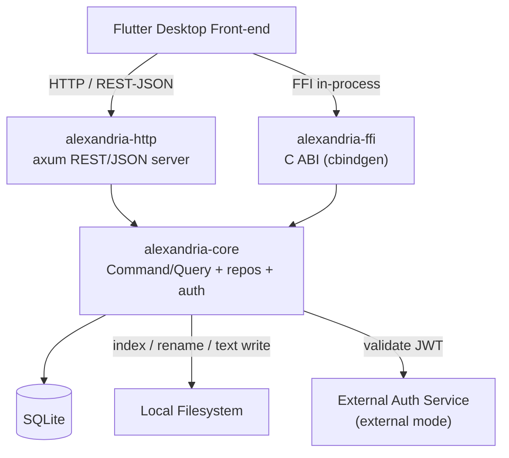

# Alexandria

A fast, type-aware personal library back-end written in Rust. Alexandria indexes,
organizes, and surfaces a single user's on-disk media and documents — audio,
movies and series, HTML pages, Markdown and text files, PDFs and e-books, comic
books, images, and browser bookmarks — without re-encoding, duplicating, or
relocating them. The domain logic lives in a reusable Rust core library exposed
over both an HTTP/REST-JSON API and a Flutter FFI surface, so any client in any
language can drive it and the Flutter desktop front-end can call it in-process.

> Single-user. Metadata + path/content-hash only. No complex media editing.
> Two-phase soft/hard deletion. Pluggable auth (external JWT **or** local
> encrypted login).

## Project status

Issues are tracked in the [Alexandria API project board](https://github.com/users/artur-rios/projects/8)
and grouped into [milestones](https://github.com/artur-rios/alexandria-api/milestones)
that mirror the feature groups in
[System Requirements Document §9.1](docs/requirements/System%20Requirements%20Document.md).
Each row below links to its issue; GitHub renders the issue's `#` reference with
its open/closed state, so the tables stay in sync with the board automatically.

| Milestone | Scope | Progress |
| --- | --- | :---: |
| [F-00 Foundation & operations](https://github.com/artur-rios/alexandria-api/milestone/1) | Scaffold, config, migrations, health | 2 / 2 |
| [F-01 File indexing](https://github.com/artur-rios/alexandria-api/milestone/2) | UC-01 … UC-02, UC-42 | 2 / 3 |
| [F-02 Catalog browsing & metadata editing](https://github.com/artur-rios/alexandria-api/milestone/3) | UC-03 … UC-04 | 2 / 2 |
| [F-03 Renaming & lifecycle management](https://github.com/artur-rios/alexandria-api/milestone/4) | UC-05 … UC-09 | 5 / 5 |
| [F-04 Text file content editing](https://github.com/artur-rios/alexandria-api/milestone/5) | UC-32 … UC-33 | 2 / 2 |
| [F-05 Collections](https://github.com/artur-rios/alexandria-api/milestone/6) | UC-10 … UC-14 | 5 / 5 |
| [F-06 Bookmarks](https://github.com/artur-rios/alexandria-api/milestone/7) | UC-15 … UC-19 | 5 / 5 |
| [F-07 Watchlists](https://github.com/artur-rios/alexandria-api/milestone/8) | UC-20 … UC-25 | 6 / 6 |
| [F-08 Reading lists](https://github.com/artur-rios/alexandria-api/milestone/9) | UC-26 … UC-31 | 6 / 6 |
| [F-09 Pluggable authentication](https://github.com/artur-rios/alexandria-api/milestone/10) | UC-34 … UC-36, UC-41 | 3 / 4 |
| [F-10 Media playback](https://github.com/artur-rios/alexandria-api/milestone/11) | UC-38 … UC-40 | 3 / 3 |
| **Total** | | **41 / 43** |

### F-00 — Foundation & operations

Workspace scaffold, configuration, migrations, logging, and the health surface.

| Issue | Use case | Status | Title | Requirements |
| --- | --- | :---: | --- | --- |
| [#1](https://github.com/artur-rios/alexandria-api/issues/1) | — | &#9745; | Scaffold and initial infrastructure | IR-01 … IR-06 |
| [#38](https://github.com/artur-rios/alexandria-api/issues/38) | UC-37 | &#9745; | Health check | IR-03, IR-04, IR-05 |

### F-01 — File indexing

Discover on-disk files, classify them by type, hash their bytes, and keep the
catalog current.

| Issue | Use case | Status | Title | Requirements |
| --- | --- | :---: | --- | --- |
| [#2](https://github.com/artur-rios/alexandria-api/issues/2) | UC-01 | &#9745; | Index library files | FR-FC-01 … FR-FC-09, FR-FC-24 |
| [#3](https://github.com/artur-rios/alexandria-api/issues/3) | UC-02 | &#9745; | Re-index and refresh the catalog | FR-FC-08, FR-FC-10, FR-FC-11, FR-FC-24 |
| [#99](https://github.com/artur-rios/alexandria-api/issues/99) | UC-42 | &#9744; | Query an index or refresh run | FR-FC-24, FR-FC-27, FR-FC-28, FR-FC-29 |

### F-02 — Catalog browsing & metadata editing

Read the catalog and edit type-specific metadata.

| Issue | Use case | Status | Title | Requirements |
| --- | --- | :---: | --- | --- |
| [#4](https://github.com/artur-rios/alexandria-api/issues/4) | UC-03 | &#9745; | Browse and view file metadata | FR-FC-12, FR-FC-13, FR-FC-24 |
| [#5](https://github.com/artur-rios/alexandria-api/issues/5) | UC-04 | &#9745; | Edit file metadata | FR-FC-14 … FR-FC-18, FR-FC-24 |

### F-03 — Renaming & lifecycle management

Rename on disk, plus the two-phase soft-delete → restore → purge lifecycle.

| Issue | Use case | Status | Title | Requirements |
| --- | --- | :---: | --- | --- |
| [#6](https://github.com/artur-rios/alexandria-api/issues/6) | UC-05 | &#9745; | Rename a file | FR-FC-19, FR-FC-24 |
| [#7](https://github.com/artur-rios/alexandria-api/issues/7) | UC-06 | &#9745; | Soft-delete a file | FR-FC-20, FR-FC-24 |
| [#8](https://github.com/artur-rios/alexandria-api/issues/8) | UC-07 | &#9745; | Restore a soft-deleted file | FR-FC-21, FR-FC-24 |
| [#9](https://github.com/artur-rios/alexandria-api/issues/9) | UC-08 | &#9745; | Hard-purge a file record | FR-FC-22, FR-FC-24, NFR-07 |
| [#10](https://github.com/artur-rios/alexandria-api/issues/10) | UC-09 | &#9745; | Purge a file on disk | FR-FC-23, FR-FC-24 |

### F-04 — Text file content editing

Read and write TextFile content on disk, refreshing the content hash.

| Issue | Use case | Status | Title | Requirements |
| --- | --- | :---: | --- | --- |
| [#33](https://github.com/artur-rios/alexandria-api/issues/33) | UC-32 | &#9745; | Read text file content | FR-TX-01, FR-FC-24 |
| [#34](https://github.com/artur-rios/alexandria-api/issues/34) | UC-33 | &#9745; | Edit text file content | FR-TX-02, FR-TX-03, FR-FC-24 |

### F-05 — Collections

Flat file and bookmark groupings; deleting a collection preserves its items.

| Issue | Use case | Status | Title | Requirements |
| --- | --- | :---: | --- | --- |
| [#11](https://github.com/artur-rios/alexandria-api/issues/11) | UC-10 | &#9745; | Create a collection | FR-CO-01, FR-CO-02, FR-FC-24 |
| [#12](https://github.com/artur-rios/alexandria-api/issues/12) | UC-11 | &#9745; | Rename a collection | FR-CO-03, FR-FC-24 |
| [#13](https://github.com/artur-rios/alexandria-api/issues/13) | UC-12 | &#9745; | Delete a collection | FR-CO-04, FR-FC-24 |
| [#14](https://github.com/artur-rios/alexandria-api/issues/14) | UC-13 | &#9745; | Add items to a collection | FR-CO-05, FR-FC-24 |
| [#15](https://github.com/artur-rios/alexandria-api/issues/15) | UC-14 | &#9745; | Remove and list items in a collection | FR-CO-06, FR-CO-07, FR-FC-12, FR-FC-24 |

### F-06 — Bookmarks

Browser bookmarks, with the same two-phase deletion model as files.

| Issue | Use case | Status | Title | Requirements |
| --- | --- | :---: | --- | --- |
| [#16](https://github.com/artur-rios/alexandria-api/issues/16) | UC-15 | &#9745; | Create a bookmark | FR-BM-01, FR-FC-24 |
| [#17](https://github.com/artur-rios/alexandria-api/issues/17) | UC-16 | &#9745; | Update a bookmark | FR-BM-02, FR-FC-24 |
| [#18](https://github.com/artur-rios/alexandria-api/issues/18) | UC-17 | &#9745; | Browse bookmarks | FR-BM-06, FR-FC-24 |
| [#19](https://github.com/artur-rios/alexandria-api/issues/19) | UC-18 | &#9745; | Soft-delete and restore a bookmark | FR-BM-03, FR-BM-05, FR-FC-24 |
| [#20](https://github.com/artur-rios/alexandria-api/issues/20) | UC-19 | &#9745; | Hard-purge a bookmark | FR-BM-04, FR-FC-24 |

### F-07 — Watchlists

Video consumption tracking, per episode for series.

| Issue | Use case | Status | Title | Requirements |
| --- | --- | :---: | --- | --- |
| [#21](https://github.com/artur-rios/alexandria-api/issues/21) | UC-20 | &#9745; | Create a watchlist | FR-WL-01, FR-FC-24 |
| [#22](https://github.com/artur-rios/alexandria-api/issues/22) | UC-21 | &#9745; | Browse watchlists and progress | FR-WL-08, FR-FC-24 |
| [#23](https://github.com/artur-rios/alexandria-api/issues/23) | UC-22 | &#9745; | Add a video to a watchlist | FR-WL-02, FR-WL-03, FR-FC-24 |
| [#24](https://github.com/artur-rios/alexandria-api/issues/24) | UC-23 | &#9745; | Update watch progress | FR-WL-04, FR-WL-05, FR-FC-24 |
| [#25](https://github.com/artur-rios/alexandria-api/issues/25) | UC-24 | &#9745; | Remove a video from a watchlist | FR-WL-06, FR-FC-24 |
| [#26](https://github.com/artur-rios/alexandria-api/issues/26) | UC-25 | &#9745; | Delete a watchlist | FR-WL-07, FR-FC-24 |

### F-08 — Reading lists

Book and comic consumption tracking, per issue for comic series.

| Issue | Use case | Status | Title | Requirements |
| --- | --- | :---: | --- | --- |
| [#27](https://github.com/artur-rios/alexandria-api/issues/27) | UC-26 | &#9745; | Create a reading list | FR-RL-01, FR-FC-24 |
| [#28](https://github.com/artur-rios/alexandria-api/issues/28) | UC-27 | &#9745; | Browse reading lists and progress | FR-RL-08, FR-FC-24 |
| [#29](https://github.com/artur-rios/alexandria-api/issues/29) | UC-28 | &#9745; | Add an item to a reading list | FR-RL-02, FR-RL-03, FR-FC-24 |
| [#30](https://github.com/artur-rios/alexandria-api/issues/30) | UC-29 | &#9745; | Update reading progress | FR-RL-04, FR-RL-05, FR-FC-24 |
| [#31](https://github.com/artur-rios/alexandria-api/issues/31) | UC-30 | &#9745; | Remove an item from a reading list | FR-RL-06, FR-FC-24 |
| [#32](https://github.com/artur-rios/alexandria-api/issues/32) | UC-31 | &#9745; | Delete a reading list | FR-RL-07, FR-FC-24 |

### F-09 — Pluggable authentication

Exactly one active auth mode: external JWT **or** local encrypted login.

| Issue | Use case | Status | Title | Requirements |
| --- | --- | :---: | --- | --- |
| [#35](https://github.com/artur-rios/alexandria-api/issues/35) | UC-34 | &#9745; | Local login | FR-AU-01, FR-AU-04, FR-AU-07, FR-AU-08 |
| [#36](https://github.com/artur-rios/alexandria-api/issues/36) | UC-35 | &#9745; | Set or change local login credentials | FR-AU-05, FR-AU-06, FR-AU-07, FR-AU-08, FR-AU-11 |
| [#37](https://github.com/artur-rios/alexandria-api/issues/37) | UC-36 | &#9745; | Authenticate via Heimdall JWT | FR-AU-01, FR-AU-02, FR-AU-03, FR-AU-07, FR-AU-08 |
| [#96](https://github.com/artur-rios/alexandria-api/issues/96) | UC-41 | &#9744; | Register the local account | FR-AU-10, FR-AU-11, FR-AU-13, FR-AU-19 |
| — | UC-43 | &#9745; | Redeem a recovery code | FR-AU-11, FR-AU-14, FR-AU-15, FR-AU-16 |
| — | UC-44 | &#9745; | Regenerate recovery codes | FR-AU-17, FR-AU-19 |

### F-10 — Media playback

Serve file bytes to the front-end, plus comic pages and thumbnails.

| Issue | Use case | Status | Title | Requirements |
| --- | --- | :---: | --- | --- |
| [#90](https://github.com/artur-rios/alexandria-api/issues/90) | UC-38 | &#9745; | Stream file content | FR-MP-01, FR-MP-02, FR-MP-03, FR-MP-06 |
| [#91](https://github.com/artur-rios/alexandria-api/issues/91) | UC-39 | &#9745; | Read a comic book page | FR-MP-03, FR-MP-04, FR-MP-06 |
| [#92](https://github.com/artur-rios/alexandria-api/issues/92) | UC-40 | &#9745; | Get a file thumbnail | FR-MP-05, FR-MP-06 |

To update the tables: when an issue closes, flip its marker from **&#9744;** to
**&#9745;** and bump the milestone's progress count. The issue number references
are live GitHub links, so they also reflect state via the issue badge.

## Architecture

Three crates share one core library so the HTTP REST/JSON surface and the
Flutter FFI surface cannot drift:



The domain follows SOLID with a Command/Query (CQRS-style) baseline. Repository
and auth-service **traits** in `alexandria-core` are what make the handlers
unit-testable; `alexandria-http` and `alexandria-ffi` are thin transport layers
over the same handlers.

## Repository layout

```txt
alexandria-api/
├── Cargo.toml                 # workspace
├── crates/
│   ├── alexandria-core/       # domain: commands, queries, repos, auth, config
│   ├── alexandria-http/       # axum routes + middleware
│   └── alexandria-ffi/        # extern "C" + cbindgen header
├── config.toml.example
├── docs/
│   ├── initial/               # informal docs (Project Overview, Stack, Workflow, Business Rules)
│   └── requirements/         # formal specs (Vision, SRD, Use Cases, …)
├── tools/
└── README.md
```

## Building

Requirements: Rust **1.94** or newer (edition 2021) and `cargo`. The floor comes
from sqlx 0.9, the highest MSRV in the dependency graph.

`alexandria-core` links against `ffmpeg-next` for video metadata extraction, so
the ffmpeg C development libraries and `clang` (for bindgen) must be installed
locally before the workspace will build — the only system dependency this
project has. Without them `cargo build` and `cargo test` fail for the whole
workspace, not just the video code, so install them first.

Any ffmpeg from **3.0 to 9.0** works — `ffmpeg-sys-next 9` gates its bindings
by version and covers that whole range — so on a platform with a system package
you can install whatever it offers. CI builds against Ubuntu's 6.1.

### Debian/Ubuntu

```bash
sudo apt-get install libavformat-dev libavcodec-dev libavutil-dev libavfilter-dev libavdevice-dev libswscale-dev libswresample-dev pkg-config clang
```

### macOS

```bash
brew install ffmpeg pkg-config llvm
```

Homebrew's `ffmpeg` formula tracks the current major, which is inside the
supported range.

### Windows

Windows has no system package that ffmpeg's build tooling finds automatically,
so this takes a few deliberate steps. One constraint causes nearly every failed
attempt, so read it before picking an option.

**The build needs ffmpeg's headers and import libraries, not `ffmpeg.exe`.**
Most Windows ffmpeg downloads — including everything labelled "essentials", and
the packages you get by searching for "ffmpeg windows" — ship only a `bin/`
directory with the executables. Those are useless here. You need a build that
also ships `include/` and `lib/`, which in BtbN's naming means a **`.Shared.`**
variant, and in the ffmpeg world generally is called a *dev* or *shared* build.

Version is not a constraint: `ffmpeg-sys-next 9` supports ffmpeg 3.0 through
9.0, so any current build will do.

Prerequisites for every option below:

- **MSVC build tools** — the Visual Studio "Desktop development with C++"
  workload, matching Rust's `x86_64-pc-windows-msvc` target.
- **LLVM/clang**, which `bindgen` needs to parse ffmpeg's headers:
  ```bash
  winget install LLVM.LLVM
  ```
  A default LLVM install is normally enough — bindgen locates `libclang.dll`
  without help (verified against LLVM 22 installed this way). Only if it
  reports that it cannot find libclang do you need to point at it explicitly:
  ```bash
  setx LIBCLANG_PATH "C:\Program Files\LLVM\bin"
  ```

`setx` writes a persistent user variable but does **not** affect the shell you
type it in. Open a new terminal before building. Never use `setx PATH` — it
truncates `PATH` at 1024 characters and can destroy it; edit `PATH` through
Settings → *Edit environment variables for your account* instead.

#### Option A — winget, prebuilt (fastest; ~1 minute)

Best if you just want the workspace building. The trade-off is licensing: BtbN's
packages are GPL builds (see [Licensing](#a-note-on-ffmpeg-licensing) below).

1. Install a **shared** build. Pinning a release branch rather than `master`
   keeps the toolchain reproducible; any of the release branches work:
   ```bash
   winget install BtbN.FFmpeg.GPL.Shared.7.1
   ```
   `winget search ffmpeg` lists the alternatives. Avoid `Gyan.FFmpeg` unless you
   confirm the package ships `include/` and `lib/` — its widely-mirrored builds
   are executables only.
2. Find where winget put it — the directory name contains a hash, so it must be
   looked up rather than guessed. In PowerShell:
   ```powershell
   Get-ChildItem "$env:LOCALAPPDATA\Microsoft\WinGet\Packages" -Recurse -Depth 3 -Directory -Filter include | Where-Object { $_.FullName -like "*ffmpeg*" }
   ```
3. Confirm the parent of that `include` directory also contains `lib` and `bin`.
   That parent is your ffmpeg root. If there is no `include`, you installed a
   non-`Shared` variant — go back to step 1.
4. Point the build at it, substituting the path from step 3:
   ```bash
   setx FFMPEG_DIR "C:\path\to\ffmpeg-n7.1-...-shared"
   ```
5. Add that root's `bin` directory to `PATH` (via Settings, per the warning
   above). **Do not skip this.** It is needed at **run** time rather than build
   time, so the symptom is confusing: `cargo build` succeeds, then every test
   binary dies instantly with `exit code: 0xc0000135, STATUS_DLL_NOT_FOUND`,
   because a shared build resolves its DLLs when the process starts.
6. Open a new terminal and jump to [Verifying](#verifying-the-toolchain).

#### Option B — vcpkg (slower; LGPL by default)

Preferred if you care about the licensing of what you link, since vcpkg's
default ffmpeg port is LGPL — it omits the GPL-only codecs. It builds from
source, so budget 30–60 minutes on first install.

1. Clone and bootstrap vcpkg:
   ```bash
   git clone https://github.com/microsoft/vcpkg C:\vcpkg
   C:\vcpkg\bootstrap-vcpkg.bat
   ```
2. Install ffmpeg, pinning a supported major version:
   ```bash
   C:\vcpkg\vcpkg.exe install "ffmpeg[core,avcodec,avformat,avfilter,avdevice,swscale,swresample]:x64-windows"
   ```
3. Tell the build where the tree is — `ffmpeg-sys-next` looks for `VCPKG_ROOT`
   as its second discovery method, after `FFMPEG_DIR`:
   ```bash
   setx VCPKG_ROOT "C:\vcpkg"
   ```
4. The `x64-windows` triplet is a dynamic (DLL) build, and the `vcpkg` crate
   ignores dynamic libraries unless told otherwise:
   ```bash
   setx VCPKGRS_DYNAMIC "1"
   ```
   To avoid this and the runtime DLL question entirely, use
   `:x64-windows-static-md` in step 2 and skip this step.
5. Open a new terminal and jump to [Verifying](#verifying-the-toolchain).

#### Option C — a downloaded build, placed by hand

Equivalent to Option A without winget; use it when you want a specific build.
Download a **shared** ffmpeg 6.1 or 7.1 archive, extract it somewhere stable
such as `C:\ffmpeg`, confirm that directory contains `include/`, `lib/`, and
`bin/`, then:

```bash
setx FFMPEG_DIR "C:\ffmpeg"
```

Add `C:\ffmpeg\bin` to `PATH` for the runtime DLLs, open a new terminal, and
verify.

#### Verifying the toolchain

Build the one crate that links ffmpeg, before the whole workspace — its failure
messages are the legible ones:

```bash
cargo build -p alexandria-core
```

Then confirm the libraries also resolve at run time, which a build alone does
not prove:

```bash
cargo test -p alexandria-core --test hashing
```

#### When it still fails

`ffmpeg-sys-next` reports which discovery methods it tried, in order:
`FFMPEG_DIR`, then vcpkg, then `pkg-config`. Read that list in the error — it
tells you which step above did not take effect.

| Symptom | Cause and fix |
| --- | --- |
| `1. FFMPEG_DIR environment variable (not set)` | `setx` does not affect the current shell. Open a new terminal. |
| `2. vcpkg package manager (ffmpeg package not found)` | `VCPKG_ROOT` unset or the port is not installed for the `x64-windows` triplet. |
| `The pkg-config command could not be found` | Expected on Windows and harmless — it is only the third fallback. If you see it, the real failure is that methods 1 and 2 both missed. |
| `Unable to find libclang` | `LIBCLANG_PATH` is unset or wrong. It must point at the directory containing `libclang.dll`, normally `C:\Program Files\LLVM\bin`. |
| Compile or link errors inside `ffmpeg-sys-next` | Usually a partial install — headers present but import libraries missing, or a mix of two ffmpeg versions on `PATH`/`FFMPEG_DIR`. Confirm one root holds `include/`, `lib/`, and `bin/` together. |
| Builds fine, but tests fail to start or exit with `0xc0000135` | The shared build's DLLs are not on `PATH`. Add the ffmpeg `bin` directory. |

#### A note on ffmpeg licensing

Alexandria is proprietary (see [LICENSE](LICENSE)). ffmpeg is LGPL by default,
but builds configured with `--enable-gpl` — which includes every BtbN `GPL`
package above, and most convenience builds — are GPL. Linking a GPL library
into a proprietary binary you distribute is a licensing problem; using one on
your own machine to develop is not. If Alexandria is ever shipped with ffmpeg
bundled, that build needs to be an LGPL one (vcpkg's default port, Option B, is
LGPL). Flagging the distinction, not giving legal advice.

```bash
# Build the whole workspace (core + http + ffi)
cargo build --workspace --release

# Build the HTTP server binary
cargo build --release -p alexandria-http

# Build the FFI dynamic library + regenerate the C header via cbindgen
cargo build --release -p alexandria-ffi
```

The workspace enforces `#![deny(unsafe_code)]` in every crate.

## Running

Configuration is read from `config.toml` at startup, with any key overridable
through an `ALEXANDRIA_*` environment variable. See [`config.toml.example`](config.toml.example)
for the full list (auth mode and session TTL, HTTP bind address, SQLite path,
filesystem root — which both feeds the health probe and bounds what indexing
may reach — indexing concurrency, soft-delete retention, log level).

```bash
# 1. Create a local config from the example
cp config.toml.example config.toml

# 2. Optional: run migrations ahead of time. The server and the FFI
#    `alexandria_index_init` both apply them on startup, so this is only
#    needed to prepare a database out-of-band.
sqlx migrate run --source crates/alexandria-core/migrations \
  --database-url "sqlite:${ALEXANDRIA_DATABASE_PATH:-alexandria.sqlite}?mode=rwc"

# 3. Start the HTTP server (binds to loopback by default)
cargo run --release -p alexandria-http

# or, once packaged, run the bundled binary alongside the Flutter desktop app
```

Two notes on that URL, verified against sqlx-cli 0.9.0: `?mode=rwc` is required
or the CLI refuses to create a database that does not exist yet, and the scheme
takes a single colon with no `//`. The `sqlite://` form fails on Windows
absolute paths, where the drive letter parses as a URL authority.

Both surfaces read the same configuration: `ALEXANDRIA_CONFIG` (default
`config.toml`) plus `ALEXANDRIA_*` environment overrides.

In external auth mode, set `ALEXANDRIA_AUTH_MODE=external` and
`ALEXANDRIA_AUTH_HEIMDALL_TOKEN_SECRET` to the HS256 secret Heimdall signs
with, and `ALEXANDRIA_AUTH_HEIMDALL_SCOPE_ID` to the UUID of the Heimdall
scope whose members are accepted as the owner. In
local login mode (`ALEXANDRIA_AUTH_MODE=local`),
create the owner's account once via `POST /v1/auth/local/register` (UC-41) —
it takes `email`, `password`, and `passwordConfirmation`, succeeds only once,
and returns a `sessionId` you are immediately authenticated with. Passwords
must be at least 12 characters. `POST /v1/auth/local/credentials` (UC-35)
changes those credentials afterwards and requires an authenticated session.
Local mode has no bearer token of its own: `POST
/v1/auth/local/login` returns a `sessionId`, and that id is what subsequent
requests present as `Authorization: Bearer <sessionId>` until it expires
(`auth.session_ttl_hours`, default 24).

### Health check

```bash
curl http://127.0.0.1:8080/health
# {"status":"ok","database":"reachable","filesystem":"reachable","authMode":"external"}
```

### Media playback

```bash
# Stream a file, seeking to a byte offset the way a player does
curl -H "Authorization: Bearer $TOKEN" \
     -H "Range: bytes=1048576-2097151" \
     http://127.0.0.1:8080/v1/files/$UUID/stream --output chunk.bin

# Page 3 of a CBZ comic
curl -H "Authorization: Bearer $TOKEN" \
     http://127.0.0.1:8080/v1/files/$UUID/pages/3 --output page3.jpg

# A 320px thumbnail
curl -H "Authorization: Bearer $TOKEN" \
     http://127.0.0.1:8080/v1/files/$UUID/thumbnail --output thumb.jpg
```

The Flutter front-end must send the `Authorization` header on media
requests; `video_player` and `just_audio` both support per-request headers.
Over FFI there is no stream: `alexandria_file_playback_source` returns the
file's path and the client opens it directly.

## Testing

Tests are organized by crate and split into **unit** (handler logic against
trait fakes), **integration** (HTTP/FFI end-to-end against real SQLite and a
temp filesystem), and **parity** (HTTP vs FFI must return identical results).
See [`docs/requirements/Testing Specification Document.md`](docs/requirements/Testing%20Specification%20Document.md)
for the full standard.

```bash
# Run the entire suite
cargo test --workspace

# Run only unit tests
cargo test --workspace --lib

# Run only integration tests
cargo test --workspace --test '*'

# Run the HTTP / FFI parity suite alone
cargo test -p alexandria-ffi --test parity

# Optional: line/branch coverage
cargo tarpaulin --workspace --out Html
```

Every use case is delivered with its tests in the same change, per the
[Development Workflow Document](docs/requirements/Development%20Workflow%20Document.md).

## Documentation

The full specification set lives under [`docs/`](docs/):

- Informal: [`docs/initial/`](docs/initial/) — Project Overview, Technology Stack, Workflow, Business Rules.
- Formal: [`docs/requirements/`](docs/requirements/) — Vision, System Requirements, Use Case Specification, Development Workflow, Testing Specification, Operations & Infrastructure, Technology Stack.

These are the source of truth the issues trace into. Reading order for a new
contributor: `docs/initial/Project Overview.md` → `docs/requirements/Vision Document.md` → `docs/requirements/Use Case Specification Document.md`.

## Legal details

This project is **proprietary and confidential**. All rights are reserved by the
copyright holder. No part of this repository may be reproduced, distributed, or
used in any form without the prior written permission of the copyright holder.

The full license terms are in the [LICENSE](LICENSE) file.

For licensing inquiries, contact the repository owner via the GitHub repository's
contact channels.
