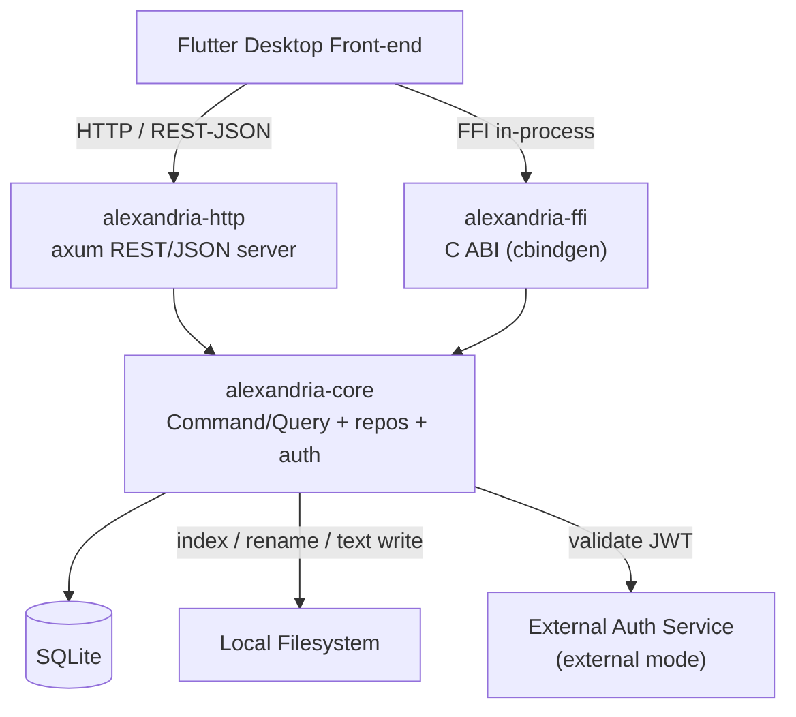

# Alexandria API

A fast, type-aware personal library back-end written in Rust. Alexandria indexes,
organizes, and surfaces a single user's on-disk media and documents — audio,
movies and series, HTML pages, Markdown and text files, PDFs and e-books, comic
books, images, and browser bookmarks — without re-encoding, duplicating, or
relocating them. The domain logic lives in a reusable Rust core library exposed
over both an HTTP/REST-JSON API and a Flutter FFI surface, so any client in any
language can drive it and the Flutter desktop front-end can call it in-process.

> Single-user. Metadata + path only, never the bytes. No complex media editing.
> Two-phase soft/hard deletion. Pluggable auth (external JWT, local encrypted
> login, **or** the Windows account the server process runs as).

## Project status

Issues are tracked in the [Alexandria API project board](https://github.com/users/artur-rios/projects/8)
and grouped into [milestones](https://github.com/artur-rios/alexandria-api/milestones)
that mirror the feature groups in
[System Requirements Document §9.1](docs/requirements/System%20Requirements%20Document.md).
Each row below links to its issue; GitHub renders the issue's `#` reference with
its open/closed state, so the tables stay in sync with the board automatically.

| Milestone | Scope | Progress |
| --- | --- | :---: |
| [F-00 Foundation & operations](https://github.com/artur-rios/alexandria-api/milestone/1) | Scaffold, config, migrations, health, settings | 3 / 3 |
| [F-01 File indexing](https://github.com/artur-rios/alexandria-api/milestone/2) | UC-01 … UC-02, UC-42, UC-48 | 3 / 3 |
| [F-02 Catalog browsing & metadata editing](https://github.com/artur-rios/alexandria-api/milestone/3) | UC-03 … UC-04 | 2 / 2 |
| [F-03 Renaming & lifecycle management](https://github.com/artur-rios/alexandria-api/milestone/4) | UC-05 … UC-09 | 5 / 5 |
| [F-04 Text file content editing](https://github.com/artur-rios/alexandria-api/milestone/5) | UC-32 … UC-33 | 2 / 2 |
| [F-05 Collections](https://github.com/artur-rios/alexandria-api/milestone/6) | UC-10 … UC-14, UC-46 | 6 / 6 |
| [F-06 Bookmarks](https://github.com/artur-rios/alexandria-api/milestone/7) | UC-15 … UC-19 | 5 / 5 |
| [F-07 Watchlists](https://github.com/artur-rios/alexandria-api/milestone/8) | UC-20 … UC-25 | 6 / 6 |
| [F-08 Reading lists](https://github.com/artur-rios/alexandria-api/milestone/9) | UC-26 … UC-31 | 6 / 6 |
| [F-09 Pluggable authentication](https://github.com/artur-rios/alexandria-api/milestone/10) | UC-34 … UC-36, UC-41 | 4 / 4 |
| [F-10 Media playback](https://github.com/artur-rios/alexandria-api/milestone/11) | UC-38 … UC-40, and the energy envelope | 4 / 4 |
| F-11 Playlists | UC-49 … UC-50 | 2 / 2 |
| F-12 Libraries | UC-51 | 1 / 1 |
| F-13 Music enrichment | Lyrics and artist photography | 1 / 1 |
| F-14 Play history | Recording a play, and the rankings | 1 / 1 |
| **Total** | | **50 / 50** |

The last four carry no milestone links and no issue numbers, and that is
honest rather than an omission: they were built from design documents in
`docs/superpowers/specs/` rather than from the issue-per-use-case backlog the
first eleven follow. What they are not is undocumented — each has its
requirements in
[System Requirements Document §3](docs/requirements/System%20Requirements%20Document.md)
and its routes in §5, which is what the tables below trace against.

### F-00 — Foundation & operations

Workspace scaffold, configuration, migrations, logging, and the health surface.

| Issue | Use case | Status | Title | Requirements |
| --- | --- | :---: | --- | --- |
| [#1](https://github.com/artur-rios/alexandria-api/issues/1) | — | &#9745; | Scaffold and initial infrastructure | IR-01 … IR-06 |
| [#38](https://github.com/artur-rios/alexandria-api/issues/38) | UC-37 | &#9745; | Health check | IR-03, IR-04, IR-05 |
| [#108](https://github.com/artur-rios/alexandria-api/issues/108) | UC-47 | &#9745; | Report the retention window | FR-FC-30, FR-FC-24 |

### F-01 — File indexing

Discover on-disk files, classify them by type, record the stat pair every
directory entry already carries, and keep the catalog current — with each run
observable, pausable, resumable, and cancellable while it walks.

| Issue | Use case | Status | Title | Requirements |
| --- | --- | :---: | --- | --- |
| [#2](https://github.com/artur-rios/alexandria-api/issues/2) | UC-01 | &#9745; | Index library files | FR-FC-01 … FR-FC-09, FR-FC-24 |
| [#3](https://github.com/artur-rios/alexandria-api/issues/3) | UC-02 | &#9745; | Re-index and refresh the catalog | FR-FC-08, FR-FC-10, FR-FC-11, FR-FC-24 |
| [#99](https://github.com/artur-rios/alexandria-api/issues/99) | UC-42 | &#9745; | Query an index or refresh run | FR-FC-24, FR-FC-27, FR-FC-28, FR-FC-29, FR-FC-35 |
| — | UC-48 | &#9745; | Pause, resume, or cancel an index run | FR-FC-24, FR-FC-27, FR-FC-29, FR-FC-31 … FR-FC-34 |

### F-02 — Catalog browsing & metadata editing

Read the catalog and edit type-specific metadata.

| Issue | Use case | Status | Title | Requirements |
| --- | --- | :---: | --- | --- |
| [#4](https://github.com/artur-rios/alexandria-api/issues/4) | UC-03 | &#9745; | Browse and view file metadata | FR-FC-12, FR-FC-13, FR-FC-24 |
| [#5](https://github.com/artur-rios/alexandria-api/issues/5) | UC-04 | &#9745; | Edit file metadata | FR-FC-14 … FR-FC-18, FR-FC-24 |

### F-03 — Renaming & lifecycle management

Rename on disk, plus the two-phase soft-delete → restore → purge lifecycle.

| Issue | Use case | Status | Title | Requirements |
| --- | --- | :---: | --- | --- |
| [#6](https://github.com/artur-rios/alexandria-api/issues/6) | UC-05 | &#9745; | Rename a file | FR-FC-19, FR-FC-24 |
| [#7](https://github.com/artur-rios/alexandria-api/issues/7) | UC-06 | &#9745; | Soft-delete a file | FR-FC-20, FR-FC-24 |
| [#8](https://github.com/artur-rios/alexandria-api/issues/8) | UC-07 | &#9745; | Restore a soft-deleted file | FR-FC-21, FR-FC-24 |
| [#9](https://github.com/artur-rios/alexandria-api/issues/9) | UC-08 | &#9745; | Hard-purge a file record | FR-FC-22, FR-FC-24, NFR-07 |
| [#10](https://github.com/artur-rios/alexandria-api/issues/10) | UC-09 | &#9745; | Purge a file on disk | FR-FC-23, FR-FC-24 |

### F-04 — Text file content editing

Read and write TextFile content on disk, refreshing the content hash.

| Issue | Use case | Status | Title | Requirements |
| --- | --- | :---: | --- | --- |
| [#33](https://github.com/artur-rios/alexandria-api/issues/33) | UC-32 | &#9745; | Read text file content | FR-TX-01, FR-FC-24 |
| [#34](https://github.com/artur-rios/alexandria-api/issues/34) | UC-33 | &#9745; | Edit text file content | FR-TX-02, FR-TX-03, FR-FC-24 |

### F-05 — Collections

Flat file and bookmark groupings; deleting a collection preserves its items.

| Issue | Use case | Status | Title | Requirements |
| --- | --- | :---: | --- | --- |
| [#11](https://github.com/artur-rios/alexandria-api/issues/11) | UC-10 | &#9745; | Create a collection | FR-CO-01, FR-CO-02, FR-FC-24 |
| [#12](https://github.com/artur-rios/alexandria-api/issues/12) | UC-11 | &#9745; | Rename a collection | FR-CO-03, FR-FC-24 |
| [#13](https://github.com/artur-rios/alexandria-api/issues/13) | UC-12 | &#9745; | Delete a collection | FR-CO-04, FR-FC-24 |
| [#14](https://github.com/artur-rios/alexandria-api/issues/14) | UC-13 | &#9745; | Add items to a collection | FR-CO-05, FR-FC-24 |
| [#15](https://github.com/artur-rios/alexandria-api/issues/15) | UC-14 | &#9745; | Remove and list items in a collection | FR-CO-06, FR-CO-07, FR-FC-12, FR-FC-24 |
| [#106](https://github.com/artur-rios/alexandria-api/issues/106) | UC-46 | &#9745; | Browse collections | FR-CO-08, FR-FC-24 |

### F-06 — Bookmarks

Browser bookmarks, with the same two-phase deletion model as files.

| Issue | Use case | Status | Title | Requirements |
| --- | --- | :---: | --- | --- |
| [#16](https://github.com/artur-rios/alexandria-api/issues/16) | UC-15 | &#9745; | Create a bookmark | FR-BM-01, FR-FC-24 |
| [#17](https://github.com/artur-rios/alexandria-api/issues/17) | UC-16 | &#9745; | Update a bookmark | FR-BM-02, FR-FC-24 |
| [#18](https://github.com/artur-rios/alexandria-api/issues/18) | UC-17 | &#9745; | Browse bookmarks | FR-BM-06, FR-FC-24 |
| [#19](https://github.com/artur-rios/alexandria-api/issues/19) | UC-18 | &#9745; | Soft-delete and restore a bookmark | FR-BM-03, FR-BM-05, FR-FC-24 |
| [#20](https://github.com/artur-rios/alexandria-api/issues/20) | UC-19 | &#9745; | Hard-purge a bookmark | FR-BM-04, FR-FC-24 |

### F-07 — Watchlists

Video consumption tracking, per episode for series.

| Issue | Use case | Status | Title | Requirements |
| --- | --- | :---: | --- | --- |
| [#21](https://github.com/artur-rios/alexandria-api/issues/21) | UC-20 | &#9745; | Create a watchlist | FR-WL-01, FR-FC-24 |
| [#22](https://github.com/artur-rios/alexandria-api/issues/22) | UC-21 | &#9745; | Browse watchlists and progress | FR-WL-08, FR-FC-24 |
| [#23](https://github.com/artur-rios/alexandria-api/issues/23) | UC-22 | &#9745; | Add a video to a watchlist | FR-WL-02, FR-WL-03, FR-FC-24 |
| [#24](https://github.com/artur-rios/alexandria-api/issues/24) | UC-23 | &#9745; | Update watch progress | FR-WL-04, FR-WL-05, FR-FC-24 |
| [#25](https://github.com/artur-rios/alexandria-api/issues/25) | UC-24 | &#9745; | Remove a video from a watchlist | FR-WL-06, FR-FC-24 |
| [#26](https://github.com/artur-rios/alexandria-api/issues/26) | UC-25 | &#9745; | Delete a watchlist | FR-WL-07, FR-FC-24 |

### F-08 — Reading lists

Book and comic consumption tracking, per issue for comic series.

| Issue | Use case | Status | Title | Requirements |
| --- | --- | :---: | --- | --- |
| [#27](https://github.com/artur-rios/alexandria-api/issues/27) | UC-26 | &#9745; | Create a reading list | FR-RL-01, FR-FC-24 |
| [#28](https://github.com/artur-rios/alexandria-api/issues/28) | UC-27 | &#9745; | Browse reading lists and progress | FR-RL-08, FR-FC-24 |
| [#29](https://github.com/artur-rios/alexandria-api/issues/29) | UC-28 | &#9745; | Add an item to a reading list | FR-RL-02, FR-RL-03, FR-FC-24 |
| [#30](https://github.com/artur-rios/alexandria-api/issues/30) | UC-29 | &#9745; | Update reading progress | FR-RL-04, FR-RL-05, FR-FC-24 |
| [#31](https://github.com/artur-rios/alexandria-api/issues/31) | UC-30 | &#9745; | Remove an item from a reading list | FR-RL-06, FR-FC-24 |
| [#32](https://github.com/artur-rios/alexandria-api/issues/32) | UC-31 | &#9745; | Delete a reading list | FR-RL-07, FR-FC-24 |

### F-09 — Pluggable authentication

Exactly one active auth mode: external JWT, local encrypted login, or the
Windows account the server process runs as.

| Issue | Use case | Status | Title | Requirements |
| --- | --- | :---: | --- | --- |
| [#35](https://github.com/artur-rios/alexandria-api/issues/35) | UC-34 | &#9745; | Local login | FR-AU-01, FR-AU-04, FR-AU-07, FR-AU-08 |
| [#36](https://github.com/artur-rios/alexandria-api/issues/36) | UC-35 | &#9745; | Set or change local login credentials | FR-AU-05, FR-AU-06, FR-AU-07, FR-AU-08, FR-AU-11 |
| [#37](https://github.com/artur-rios/alexandria-api/issues/37) | UC-36 | &#9745; | Authenticate via Heimdall JWT | FR-AU-01, FR-AU-02, FR-AU-03, FR-AU-07, FR-AU-08 |
| [#96](https://github.com/artur-rios/alexandria-api/issues/96) | UC-41 | &#9745; | Register the local account | FR-AU-10, FR-AU-11, FR-AU-13, FR-AU-19 |
| — | UC-43 | &#9745; | Redeem a recovery code | FR-AU-11, FR-AU-14, FR-AU-15, FR-AU-16 |
| — | UC-44 | &#9745; | Regenerate recovery codes | FR-AU-17, FR-AU-19 |
| — | UC-45 | &#9745; | Log in with the Windows account | FR-AU-20, FR-AU-22 |

### F-10 — Media playback

Serve file bytes to the front-end, plus comic pages and thumbnails.

| Issue | Use case | Status | Title | Requirements |
| --- | --- | :---: | --- | --- |
| [#90](https://github.com/artur-rios/alexandria-api/issues/90) | UC-38 | &#9745; | Stream file content | FR-MP-01, FR-MP-02, FR-MP-03, FR-MP-06 |
| [#91](https://github.com/artur-rios/alexandria-api/issues/91) | UC-39 | &#9745; | Read a comic book page | FR-MP-03, FR-MP-04, FR-MP-06 |
| [#92](https://github.com/artur-rios/alexandria-api/issues/92) | UC-40 | &#9745; | Get a file thumbnail | FR-MP-05, FR-MP-06 |
| — | — | &#9745; | Measure a track's energy envelope | FR-MP-07 |

### F-11 — Playlists

Named, ordered groupings of audio tracks — audio's counterpart to watchlists
and reading lists.

| Issue | Use case | Status | Title | Requirements |
| --- | --- | :---: | --- | --- |
| — | UC-49 | &#9745; | Manage a playlist | FR-TR-01 … FR-TR-11 |
| — | UC-50 | &#9745; | Play a playlist | FR-TR-07, FR-TR-11 |

### F-12 — Libraries

A folder browsed as its own tree, whose files are shown there and not in the
type panels.

| Issue | Use case | Status | Title | Requirements |
| --- | --- | :---: | --- | --- |
| — | UC-51 | &#9745; | Group a folder as a library | FR-FC-36 … FR-FC-41 |

### F-13 — Music enrichment

The one area that reaches services outside this machine: a track's words and
an artist's photograph, looked up once and kept.

| Issue | Use case | Status | Title | Requirements |
| --- | --- | :---: | --- | --- |
| — | — | &#9745; | Look up lyrics and artist photography | FR-EN-01 … FR-EN-09 |

### F-14 — Play history

What was played, and the rankings built from it.

| Issue | Use case | Status | Title | Requirements |
| --- | --- | :---: | --- | --- |
| — | — | &#9745; | Record a play and rank what was played most | FR-PH-01 … FR-PH-10 |

To update the tables: when an issue closes, flip its marker from **&#9744;** to
**&#9745;** and bump the milestone's progress count. The issue number references
are live GitHub links, so they also reflect state via the issue badge.

## Architecture

Three crates share one core library so the HTTP REST/JSON surface and the
Flutter FFI surface cannot drift:


```mermaid
graph TD
    FL["Flutter Desktop Front-end"]
    HTTP["alexandria-http<br/>axum REST/JSON server"]
    FFI["alexandria-ffi<br/>C ABI (cbindgen)"]
    CORE["alexandria-core<br/>Command/Query + repos + auth"]
    DB[("SQLite")]
    FS["Local Filesystem"]
    AUTH["External Auth Service<br/>(external mode)"]

    FL -->|HTTP / REST-JSON| HTTP
    FL -->|FFI in-process| FFI
    HTTP --> CORE
    FFI --> CORE
    CORE --> DB
    CORE -->|index / rename / text write| FS
    CORE -->|validate JWT| AUTH
```

The domain follows SOLID with a Command/Query (CQRS-style) baseline. Repository
and auth-service **traits** in `alexandria-core` are what make the handlers
unit-testable; `alexandria-http` and `alexandria-ffi` are thin transport layers
over the same handlers.

## Running

The server is built from source. It needs Rust **1.94** or newer and, because
`alexandria-core` links ffmpeg for video metadata extraction, the ffmpeg C
development libraries (any version from 3.0 to 9.0) and `clang` installed
before the workspace will build. The per-platform install — including Windows,
which takes a few deliberate steps — is in
[CONTRIBUTING.md](./CONTRIBUTING.md#prerequisites).

Configuration is read from `config.toml` at startup, with every key overridable
through an environment variable named `ALEXANDRIA_<SECTION>_<KEY>` —
`ALEXANDRIA_HTTP_PORT`, `ALEXANDRIA_AUTH_MODE`, `ALEXANDRIA_LOGGING_LEVEL`. The
rule has no exceptions. See [`config.toml.example`](config.toml.example) for the
full list (auth mode and session TTL, HTTP bind address, SQLite path, filesystem
root — which both feeds the health probe and bounds what indexing, library
moves, and file access may reach — indexing concurrency, soft-delete
retention, log level).

> Two configuration changes landed together while the project is pre-release,
> and both fail quietly rather than loudly. The log level's override is now
> `ALEXANDRIA_LOGGING_LEVEL`; `ALEXANDRIA_LOG_LEVEL` is no longer read, so a
> shell profile still exporting it leaves the level at its default. And
> `auth.local_db` is gone — nothing ever read it — so a `config.toml` still
> carrying it parses fine, because unknown keys are ignored.

```bash
# 1. Create a local config from the example
cp config.toml.example config.toml

# 2. Optional: run migrations ahead of time. The server and the FFI
#    `alexandria_index_init` both apply them on startup, so this is only
#    needed to prepare a database out-of-band.
sqlx migrate run --source crates/alexandria-core/migrations \
  --database-url "sqlite:${ALEXANDRIA_DATABASE_PATH:-alexandria.sqlite}?mode=rwc"

# 3. Start the HTTP server (binds to loopback by default)
cargo run --release -p alexandria-http
```

The desktop front-end does not need this server: it links the core in process
over FFI, and its packages carry the FFI library only.

Two notes on that URL, verified against sqlx-cli 0.9.0: `?mode=rwc` is required
or the CLI refuses to create a database that does not exist yet, and the scheme
takes a single colon with no `//`. The `sqlite://` form fails on Windows
absolute paths, where the drive letter parses as a URL authority.

Both surfaces read the same configuration: `ALEXANDRIA_CONFIG` (default
`config.toml`) plus `ALEXANDRIA_*` environment overrides.

In external auth mode, set `ALEXANDRIA_AUTH_MODE=external` and
`ALEXANDRIA_AUTH_HEIMDALL_TOKEN_SECRET` to the HS256 secret Heimdall signs
with, and `ALEXANDRIA_AUTH_HEIMDALL_SCOPE_ID` to the UUID of the Heimdall
scope whose members are accepted as the owner. In
local login mode (`ALEXANDRIA_AUTH_MODE=local`),
create the owner's account once via `POST /v1/auth/local/register` (UC-41) —
it takes `email`, `password`, and `passwordConfirmation`, succeeds only once,
and returns a `sessionId` you are immediately authenticated with. Passwords
must be at least 12 characters. `POST /v1/auth/local/credentials` (UC-35)
changes those credentials afterwards and requires an authenticated session.
Local mode has no bearer token of its own: `POST
/v1/auth/local/login` returns a `sessionId`, and that id is what subsequent
requests present as `Authorization: Bearer <sessionId>` until it expires
(`auth.session_ttl_hours`, default 24).

In Windows mode (`ALEXANDRIA_AUTH_MODE=windows`), set
`ALEXANDRIA_AUTH_WINDOWS_OWNER_SID` to the SID of the Windows account the
server process is allowed to run as (find it with `whoami /user`); startup
fails otherwise. There is no credential to submit: `POST
/v1/auth/windows/login` takes no body and returns a `sessionId` with the same
TTL local mode uses. This mode proves the process was launched by that
account, not who is calling it — keep `http.bind_addr` on loopback, since
startup only warns, and does not fail, when it is not.

### Upgrading

**Alexandria is pre-release, and an upgrade can require you to delete your
database.** Until the first packaged release, the two baseline migrations
(`00000000000001_catalog.sql` and `00000000000011_catalog_runs.sql`) are
amended in place rather than corrected by a new migration — see
[Operations & Infrastructure Document §2.5](docs/requirements/Operations%20&%20Infrastructure%20Document.md).
sqlx checksums a migration's file content, so an amended baseline no longer
matches what your database recorded, and migrations run before the server
serves (IR-05). The upgrade therefore fails at startup rather than misbehaving
later:

```
database migration error: migration 1 was previously applied but has been modified
```

The fix is to delete the database file and let it rebuild:

```bash
rm "${ALEXANDRIA_DATABASE_PATH:-alexandria.sqlite}"
```

Then start the server and re-run `POST /v1/index` against your library. The
catalog is derived from the files on disk, so re-indexing restores it — but
anything the catalog holds that is *not* derived from disk is lost: edited
metadata, collections, bookmarks, watchlists, reading lists, watch and reading
progress, and local-auth accounts. Export or note whatever you need first.

#### Breaking changes so far

| Change | Effect |
| --- | --- |
| `size_bytes`/`mtime` change detection replaced full-file hashing (FR-FC-09), and the run record gained progress, pause, priority, and segment columns (UC-42) | Both baselines amended. Delete the database and re-index. |

### Health check

```bash
curl http://127.0.0.1:8080/health
# {"status":"ok","database":"reachable","filesystem":"reachable","authMode":"external"}
```

### Media playback

```bash
# Stream a file, seeking to a byte offset the way a player does
curl -H "Authorization: Bearer $TOKEN" \
     -H "Range: bytes=1048576-2097151" \
     http://127.0.0.1:8080/v1/files/$UUID/stream --output chunk.bin

# Page 3 of a CBZ comic
curl -H "Authorization: Bearer $TOKEN" \
     http://127.0.0.1:8080/v1/files/$UUID/pages/3 --output page3.jpg

# A 320px thumbnail
curl -H "Authorization: Bearer $TOKEN" \
     http://127.0.0.1:8080/v1/files/$UUID/thumbnail --output thumb.jpg
```

An HTTP client must send the `Authorization` header on media requests. Over
FFI there is no stream: `alexandria_file_playback_source` returns the file's
path and the client opens it directly, which is what the desktop front-end's
player (media_kit, over libmpv) does.

## Documentation

The full specification set lives under [`docs/`](docs/):

- Informal: [`docs/initial/`](docs/initial/) — Project Overview, Technology Stack, Workflow, Business Rules.
- Formal: [`docs/requirements/`](docs/requirements/) — Vision, System Requirements, Use Case Specification, Development Workflow, Testing Specification, Operations & Infrastructure, Technology Stack.
- Behavior: [`docs/System Behavior Document.md`](docs/System%20Behavior%20Document.md) — how the running system actually behaves, with diagrams: startup, the request path, the indexing and run-control machinery, playback and byte streaming, the deletion lifecycle, and the three authentication modes.

The requirements documents say what the system *shall* do and are the source of
truth the issues trace into; the behavior document says what it *does*. Where
the two disagree, one of them is a bug.

## Changelog

Notable changes are recorded in [CHANGELOG.md](./CHANGELOG.md). No release has
been tagged yet.

## Contributing

The repository layout, building from source, running the tests, migrations,
the branching model and the versioning policy are described in
[CONTRIBUTING.md](./CONTRIBUTING.md).

## Legal details

Copyright (c) 2026 Artur Rios.

Alexandria is free software: you can redistribute it and/or modify it under the
terms of the GNU General Public License as published by the Free Software
Foundation, either version 3 of the License, or (at your option) any later
version. The full text is in [LICENSE](LICENSE).

It is distributed in the hope that it will be useful, but WITHOUT ANY WARRANTY;
without even the implied warranty of MERCHANTABILITY or FITNESS FOR A
PARTICULAR PURPOSE. See the GNU General Public License for more details.

### Why this changed

This project was proprietary and all rights were reserved. It is copyleft now
because of what it links.

The core links ffmpeg, and the desktop front end
([alexandria-ui](https://github.com/artur-rios/alexandria-ui)) links this core
in process and plays video through libmpv. Its Linux packages are meant to be
plug and play: unpack one on a machine with a desktop and it runs, with nothing
to install first. That means carrying those libraries rather than asking the
user's distribution for them, and libmpv is copyleft from every distribution
that ships it, as are the x264 and x265 encoders ffmpeg links whether or not
anything ever encodes with them.

Distributing a program alongside those libraries puts the whole of it under the
GPL. The front end and this core are one program in the sense the licence
means, so they are licensed alike.

The alternative was building LGPL versions of mpv and ffmpeg from source and
staying closed. That was weighed and not chosen: it trades a licence change for
a release pipeline that builds two large C projects every time and takes on
their security patching.
