# System Behavior Document — Alexandria

## 1. Introduction

### 1.1 Purpose

The requirements documents say what Alexandria **shall** do. This one says what
it **does**: the order things happen in, the state each operation moves through,
what is written where, and which failures the system absorbs rather than
reports.

It is written for someone who has to reason about the running system — porting a
client, diagnosing a scan that stopped, or deciding whether a change is safe.

### 1.2 How it relates to the other documents

| Document | Answers |
| --- | --- |
| [Vision Document](requirements/Vision%20Document.md) | Why the system exists |
| [System Requirements Document](requirements/System%20Requirements%20Document.md) | What it shall do (`FR-*`, `NFR-*`) |
| [Use Case Specification Document](requirements/Use%20Case%20Specification%20Document.md) | What each operation's flows and alternatives are (`UC-*`, `AF-*`) |
| **This document** | How the implementation actually behaves |
| [Operations & Infrastructure Document](requirements/Operations%20%26%20Infrastructure%20Document.md) | How it is configured, logged, and deployed (`IR-*`) |

Where this document and a requirements document disagree, one of them is a bug.
Requirement identifiers are cited throughout so the two can be checked against
each other.

### 1.3 Scope

Everything the core does at run time, with two subsystems covered in depth
because they are the ones with real machinery behind them: **indexing** (§5) and
**playback** (§6).

---

## 2. Shape of the system

Three crates. One core library holds every decision; two transport layers carry
it to callers and hold none of their own.

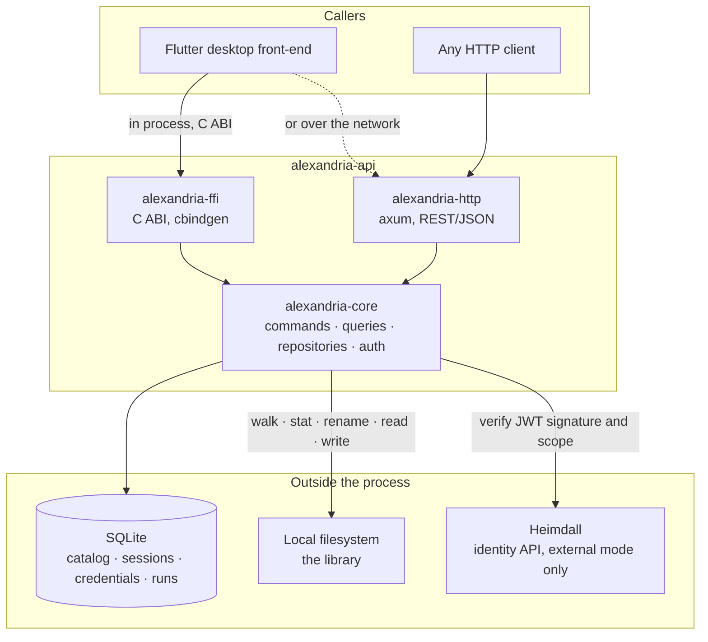

The desktop application uses the FFI path: one process, no network hop, no
second thing to install. The HTTP server is for any other client and has no
packaged release.

### 2.1 Why both surfaces answer alike

`FR-FC-24`, `FR-AU-08`, and `NFR-09` require the two surfaces to return
identical results. That holds because neither surface contains a decision:

- Every operation is a **handler** in `alexandria-core`, generic over its
  collaborators (auth service, repositories, filesystem, clock).
- `alexandria-http` maps a request onto a handler call and a `DomainError` onto
  a status code. `alexandria-ffi` maps a C call onto the same handler and the
  same `DomainError` onto an integer.
- The error **body** is built by the core's own `error_body`, not by either
  transport, so the failure path is shared code rather than two `match` arms
  kept in step by hand.

A `parity` test suite asserts this operation by operation.

The single exception is byte transfer (`FR-MP-06`): the C ABI cannot carry a
stream, so `alexandria_file_playback_source` returns a descriptor and the client
opens the file itself. See §6.4.

---

## 3. Startup

Both surfaces run the same sequence before serving anything.

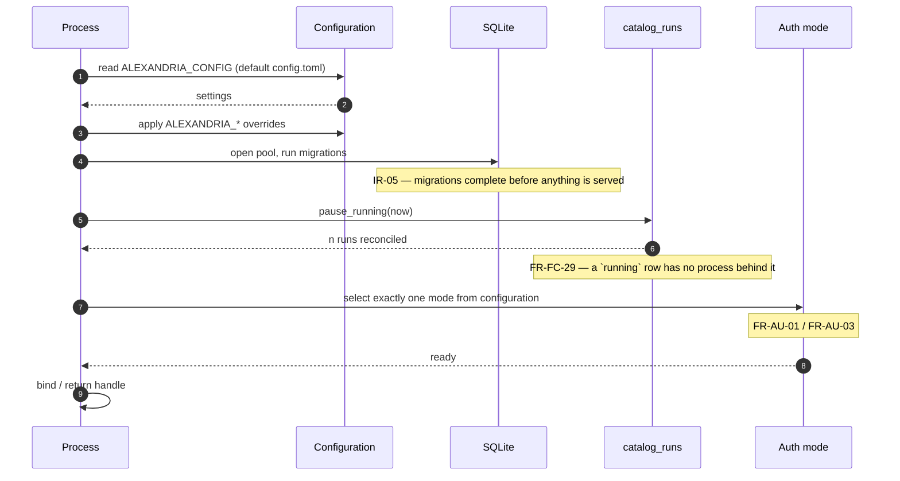

### 3.1 Configuration

Read once from `config.toml`, then overridden per key from the environment. The
naming rule is `ALEXANDRIA_<SECTION>_<KEY>` — `ALEXANDRIA_HTTP_PORT`,
`ALEXANDRIA_AUTH_MODE`, `ALEXANDRIA_LOGGING_LEVEL` — and every key follows it,
with no exceptions.

Unknown keys are ignored, so a stale key left in a config file is inert rather
than fatal. Every key is listed in
[`config.toml.example`](../config.toml.example).

### 3.2 Migrations

Applied by both the server and `alexandria_index_init` before any request is
served (`IR-05`). While the project is pre-release the two baseline migrations
are **amended in place** rather than corrected by a new migration, so an
existing database can fail startup with:

```
database migration error: migration 1 was previously applied but has been modified
```

That is deliberate and the recovery is to delete the database and re-index —
see the README's *Upgrading* section for what is and is not recoverable.

### 3.3 Run reconciliation

Runs execute in-process. A row still marked `running` at startup therefore
provably has no task behind it, so it is recorded `paused` (`FR-FC-29`) and
offered for resume. **Nothing resumes by itself.** A failure here is logged and
startup continues: the catalog is fully usable, and the stale rows are
reconciled on the next boot.

---

## 4. Every request

### 4.1 The authorization gate

`/health` is open. Every `/v1` route sits behind a `route_layer` that runs
**before the matched route's extractors**, so an unauthenticated caller is
rejected without its path or body ever being parsed (`FR-AU-07`). Without that
ordering a malformed body would answer `400` to a caller holding no credentials
at all, telling it something about the request it was not entitled to learn.

Handlers still authenticate themselves. The layer is the transport gate; the
domain check stays inside the handler where it is unit-testable.

Four auth endpoints are deliberately outside the gate, because a caller has no
credentials yet by definition: `register`, `local/login`, `windows/login`, and
`recovery/redeem` — the presented code *is* the credential. `credentials`,
`account`, and `recovery/regenerate` are routed outside it but authenticate in
their own handlers.

### 4.2 Credential extraction

`Authorization: Bearer <token>`, prefix matched case-insensitively. A missing or
malformed header yields an empty token, which every auth service rejects as
`Unauthorized` — never a distinct "header malformed" answer.

### 4.3 The error model

One `DomainError` per failure, mapped to a class, then to a transport code.

| `DomainError` | Class | HTTP | Meaning |
| --- | --- | :---: | --- |
| `NotFound` | NotFound | 404 | No entity by that id |
| `Unauthorized` | Unauthorized | 401 | Absent, expired, or rejected credential |
| `InvalidInput` | BadRequest | 400 | Input the domain refuses |
| `Rejected` | BadRequest | 400 | Same, plus a stable machine-readable reason code (`FR-AU-12`) |
| `InvalidState` | Conflict | 409 | Illegal transition for the entity's current state |
| `Conflict` | Conflict | 409 | Collides with state that already exists |
| `Disk` | Internal | 500 | A filesystem operation failed; nothing was committed |
| `Integrity` | Internal | 500 | A write's post-write verification failed |
| `ServiceUnavailable` | ServiceUnavailable | 503 | A dependency could not be reached |

An extractor rejection is folded into `Rejected("malformed_body")` so it answers
`400` with the project's `{"error": …}` envelope rather than axum's bare-text
`422`.

`Rejected` exists so a client can distinguish the individual rejections and
render each in its own language without parsing English (`FR-AU-12`).

---

## 5. Indexing

The largest subsystem, and the one whose behavior is least guessable from the
API surface.

### 5.1 What a scan costs, and why

Indexing **reads no file bytes to identify a file** (`FR-FC-09`). Per-file work
is one `stat` plus, at first index only, a tag-header read. Re-index is one
`stat` and nothing else.

This is the single most important behavioral fact about the system, because it
inverts the cost model:

| | Cost scales with | A 418 GB library |
| --- | --- | --- |
| Hashing every file | total **size** | tens of minutes |
| Stat pair (current) | file **count** | proportional to how many files, not how big |

The change signal is the **stat pair** — `size_bytes` and `mtime`, both taken
from the directory entry the walk already produced (`FR-FC-10`). A difference in
either is a change.

`content_hash` is therefore `NULL` for essentially every file. Nothing on the
scan path writes it; the only writer is the post-write verification of a text
edit (`FR-TX-03`), and a re-index **clears** it on a changed file so a hash can
never outlive the bytes it described.

### 5.2 The run record

Every index and re-index is a **run**, recorded in `catalog_runs` and addressable
by the id `start` returns (`FR-FC-27`).

| Column group | Columns | Written by |
| --- | --- | --- |
| Identity | `id`, `kind`, `root`, `started_at` | `start` |
| Lifecycle | `status`, `finished_at`, `error` | terminal writes and the control verbs |
| Index counts | `scanned`, `indexed`, `skipped`, `already_cataloged`, `failed` | `finish` / `cancel` |
| Re-index counts | `refreshed`, `marked_missing`, `unchanged`, `failed` | `finish` / `cancel` |
| Progress | `phase`, `total`, `processed` | periodic flush from the in-memory cell |
| Pause accounting | `paused_at`, `paused_millis` | `pause` / `resume` |
| Pacing | `concurrency` | `start`, and `resume` when it re-paces |
| Race guard | `segment` | `resume` only |

`skipped` (unsupported extension) and `already_cataloged` (a path the catalog
already held) are counted **apart**. Folding them together made a resumed run
report every entry an earlier segment had cataloged as a skip — a tally that
misdescribes what happened.

### 5.3 Run states

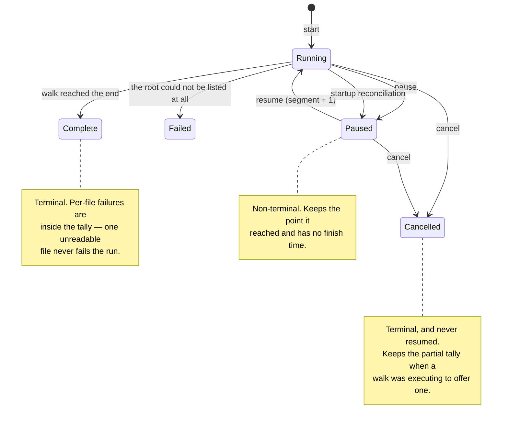

`running` and `paused` are the non-terminal states; a request for a transition
the current state does not permit is refused as a conflict rather than silently
accepted (`FR-FC-32`, `FR-FC-33`, `FR-FC-34`).

### 5.4 Start and execute are separate

A scan takes minutes. The call that begins one returns in milliseconds.

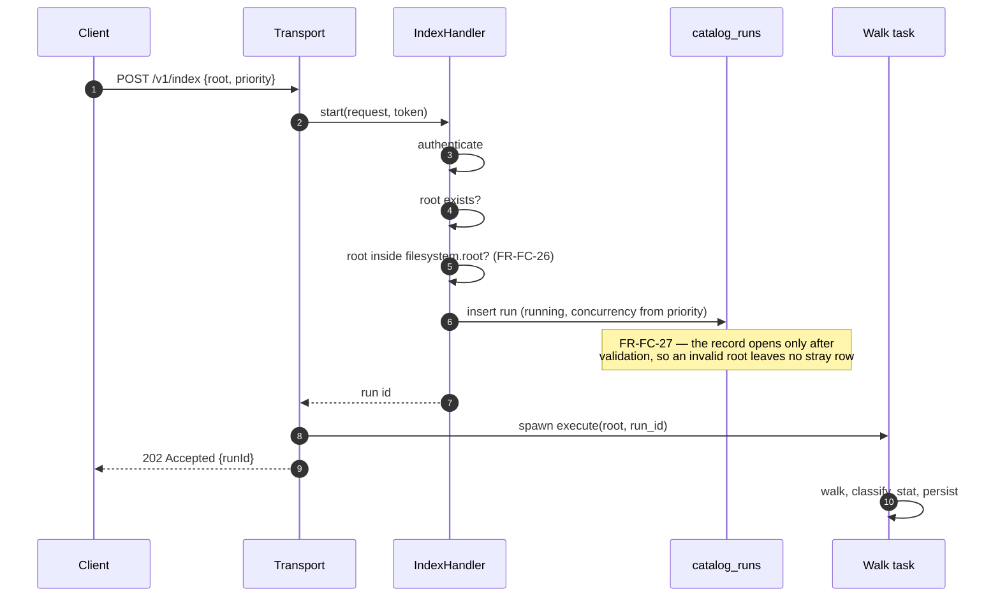

Validation happens in `start`, so a rejected request never leaves a run record
behind. The run id is handed back only once a record exists to query — the one
write in this handler whose failure is *not* swallowed, because a caller must
never receive an id it can never look up.

### 5.5 The library-root bound

When `filesystem.root` is set, an index root must be that path or a descendant
(`FR-FC-26`). Both sides are **canonicalized** before comparison, which is what
holds the bound against `<root>/../../etc`, against `<root>` vs `<root>/` vs
`<root>/.`, and against a symlinked root. The comparison is `Path::starts_with`,
matching whole components — a string prefix test would let `/library-evil` past a
`/library` bound.

Two distinct rejections, deliberately:

| Condition | Message |
| --- | --- |
| The requested root is genuinely outside | `root path is outside the configured library root` |
| The server's own `filesystem.root` cannot be resolved | `the server's configured library root could not be resolved; contact the operator` |

The second is a misconfiguration, not a caller error, and indexing is **refused**
rather than degraded to unconstrained. A security bound that disappears when its
configuration is wrong is worse than no bound, because the operator believes it
is there. Neither message names the configured path.

When `filesystem.root` is unset the bound is off entirely and any readable root
is accepted — the constraint is opt-in by configuration, so no existing
deployment changes behavior on upgrade. Re-index takes no root and is unaffected.

### 5.6 The walk

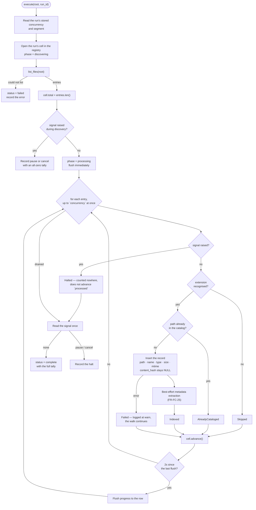

Points worth stating plainly:

- **One unreadable file never abandons the walk.** A failure concerning one
  specific file is counted in `failed`, logged at `warn`, and the walk
  continues. Only a failure to list the root at all makes the run `failed`.
- **Order is unspecified, counts are not.** Up to `concurrency` entries are in
  flight, so completion order varies; each entry contributes exactly one
  outcome regardless of when it lands.
- **A duplicate path cannot corrupt the catalog.** `list_files` cannot produce a
  path twice, and the `files.path` unique constraint turns any duplicate into
  that entry's own `failed` rather than a second record.

### 5.7 Concurrency and priority

A run is started at `normal` or `low` priority (`FR-FC-31`), resolved against
configuration into a width:

| Priority | Setting | Default |
| --- | --- | :---: |
| `normal` | `indexing.concurrency` | 4 |
| `low` | `indexing.low_priority_concurrency` | 1 |

Zero is clamped to 1 for both — a stream buffered zero deep makes no progress.

An absent or unrecognised priority is **`normal`**, on both surfaces, rather than
a rejected call. The HTTP deserializer and the FFI parser agree byte for byte,
including on values that are not strings at all.

The width is read from **the run's own row**, not from a field on the handler.
`IndexHandler` is built once at startup and serves both fresh and resumed runs,
so a field could not tell the two apart; the row is what lets a resumed run
continue at the width it was last set to. Three outcomes on that read:

| Row says | Behavior |
| --- | --- |
| a width | use it |
| no width (run predates the column, or `execute` was called without `start`) | fall back to `indexing.concurrency`, silently |
| the read failed | fall back to `indexing.concurrency`, logged at `warn` |

A transient store error must not abort a scan that could run perfectly well at
the default width — that would be a correctness regression caused by a
performance knob — but only one of the two fallbacks is silent.

Raising `concurrency` far past 8 buys nothing: SQLite admits one writer at a
time and the pool caps at 8 connections, so the database half of each file's
work still serializes.

### 5.8 Progress

Two publication paths, with different guarantees.

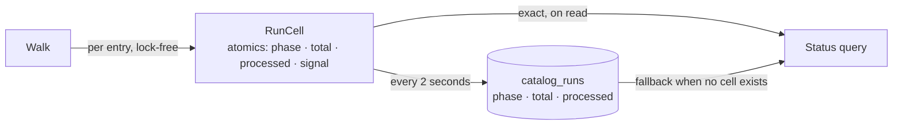

- The **cell** is authoritative while the run executes. Every field is
  `Ordering::Relaxed`: these counters are read for display, nothing branches on
  them, and paying for a fence per indexed file to make a progress bar
  microseconds fresher is not a trade worth making.
- The **row** is flushed every 2 seconds. It is not what a client watching a
  live run reads — it is what a *stopped* run leaves behind, which bounds the
  loss on an abrupt stop to two seconds of work.
- A flush failure is logged and swallowed. The next flush is two seconds away and
  writes the same fact; failing a run over a bookkeeping write would throw away
  real work.

The flush is inline in the processing loop rather than on a timer task, which
costs one short stall per interval while the loop awaits a SQLite write. The
alternative would force `Send + 'static` onto ten collaborators and leave a task
whose lifetime has to be tied back to the run.

A status query overlays the cell onto the row when one exists, so a caller always
gets the freshest answer available (§5.11).

### 5.9 Pause, resume, cancel

Specified as `UC-48`; the queries that observe a run are `UC-42` (§5.11).

A control call does **not** abort the walk's task. It raises a signal in the
run's cell, which the loop reads before each entry.

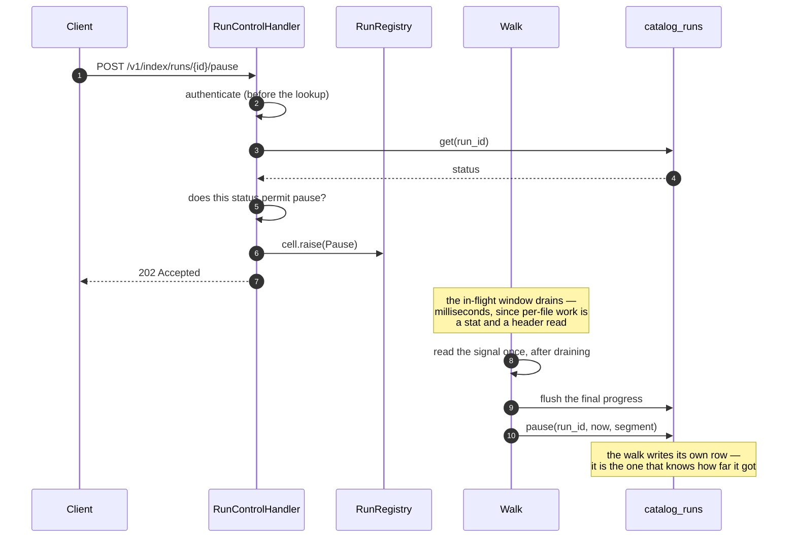

Why a signal rather than an abort: the walk owns a tally and a row, and dropping
it mid-flight would leave both half-written. Draining costs milliseconds and buys
a run that records its stopping point exactly once, in the same place it would
have recorded its completion.

**Authentication runs ahead of the lookup.** Everything after it discloses
whether the run exists and what state it is in; a caller with a bad token must
learn neither.

Which transitions each verb permits:

| Verb | From `running` | From `paused` | From terminal |
| --- | :---: | :---: | :---: |
| pause | yes | conflict | conflict |
| resume | conflict | yes | conflict |
| cancel | yes | yes | conflict |

Cancel accepts a paused run because abandoning one is the whole reason to cancel
rather than pause; without it a paused run could never be got rid of.

#### No live cell

When nothing in this process is executing the run — a paused run being cancelled,
or the brief window after a walk has closed its cell but not yet written its row
— the control call writes the row itself. A pause is still recorded as a pause:
the run has already stopped, so the only question is what it may become, and
`paused` keeps the owner's options open.

#### What a resume does

`resume` records the state change and returns; it spawns nothing. The transport
layer owns the runtime, and a handler that spawned would force `Send + 'static`
onto collaborators with no other reason to carry it.

The resumed walk **starts over from the root**. There is no cursor and none is
wanted: per-file work is a stat, so everything an earlier segment cataloged falls
out as `already_cataloged` in seconds. That leaves no checkpoint to keep honest
and no drift to correct.

Resume also banks the pause that is ending into `paused_millis`, and may re-pace
the run:

| `priority` on resume | Effect |
| --- | --- |
| `"low"` or `"normal"` | resolve to a width, **overwrite** the run's stored `concurrency` |
| absent, `null`, unrecognised, or not a string | keep the width the run already has |

This is the one place the priority parser deliberately differs from the one on
`start`. Starting a run must produce *some* width, so an unreadable value falls
to `normal`. A run being resumed already has one, and falling to `normal` would
silently speed up every low-priority run the moment a client written before this
field existed sent the bodiless resume it has always sent.

Re-pacing works this way — rather than as a live throttle — because
`buffer_unordered` fixes its width when the stream is built. Pausing and resuming
is how a large scan started at `normal` gets throttled down without losing the
work already done or the run's record.

#### The races, and what holds them

The walk drops its cell *before* its terminal write, so a control call and a walk
can both be writing the same row. Every terminal write is therefore conditional:

| Write | Conditional on |
| --- | --- |
| `pause` | the row still reads `running`, and the segment matches |
| `cancel` | the row reads `running`, `paused`, or `cancelled`, and the segment matches |
| `resume` | the row still reads `paused` |

`segment` exists because `status` alone cannot tell "still running" from "running
again". A pause and a resume can both land in the gap between a walk dropping its
cell and writing its row, leaving that walk's late write facing a row that reads
`running` because a *different* segment is walking it. Both halt verbs match on
the segment the walk captured before it began, so the late write is refused
instead of pausing — or terminally cancelling — a run that is actively working.

A refused write is logged rather than swallowed: silence would hide the next bug
of this shape, which is how both of these were found.

`RunCell::raise` never downgrades a signal. A pause racing a cancel must not turn
the cancel into a pause, because the control handler reads the *row* to decide
legality and the row still says `running` for the moment between a cancel being
raised and the loop writing it.

#### Halted entries

An entry the loop skipped because a signal was already raised contributes to no
counter and does **not** advance `processed`. For a halted run this breaks the
tally invariant on purpose: `scanned` exceeds
`indexed + skipped + already_cataloged + failed`, and the difference is exactly
the entries never opened. Counting them anywhere would tell a client — and a
resume — that the run got through files it never touched.

A pause keeps no partial tally (the run is resumed and re-walks, so it would be
superseded); a cancel keeps its own (a cancelled run is never resumed, so what it
got through is final).

### 5.10 Re-index

Specified as `UC-02`. It iterates **every cataloged path** — there is no tree walk, because
discovering new files is indexing's job — and stats each one.

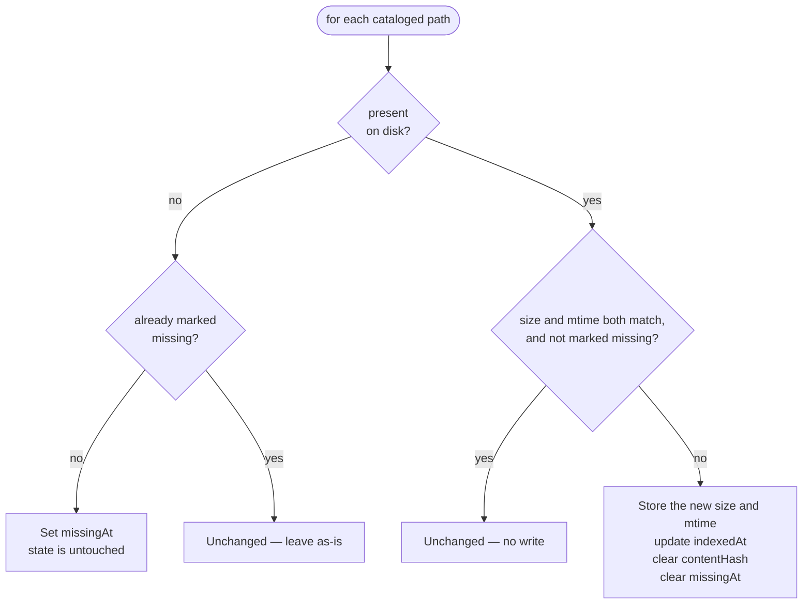

A file that returned to disk while marked missing is refreshed even when its
stats match, because `missing_at` has to be cleared.

Marking a path missing sets `missingAt` and leaves `state` alone (`FR-FC-11`) —
soft-deletion is a separate, owner-driven operation.

Re-index **never re-runs metadata extraction**, which is what guarantees an
owner's edit is never overwritten (`FR-FC-25`).

Everything in §5.6–§5.9 — concurrency, priority, progress, pause, resume, cancel
— applies identically. A re-index is the same one-stat-per-file workload, so
splitting the pacing knobs per command would only invite them to disagree.

### 5.11 Reading a run

Specified as `UC-42`.

Two queries, one overlay.

| Call | Answers |
| --- | --- |
| `GET /v1/index/runs/{runId}` | one run (`FR-FC-28`) |
| `GET /v1/index/runs` | every **outstanding** run — `running` or `paused` — newest first (`FR-FC-35`) |

Both overlay the live cell onto the stored row through the same code. A run this
process is no longer executing still reports its last flushed progress, so a run
paused across a restart can say how far it got.

The outstanding-runs listing exists because a client cannot answer two questions
from per-run ids alone: "is anything indexing?" and "is there a run to offer back
at launch?" A client only knows about runs it happens to remember, and it has no
way to notice a run the *core itself* paused at startup. An empty list is the
normal answer for an idle library, not an error.

#### `activeMillis`

Elapsed wall time minus time spent paused, clamped at zero:

```
activeMillis = max(0, (elapsedTo − startedAt) − pausedMillis − openPause)

elapsedTo = finishedAt, or now for a run still going
openPause = elapsedTo − pausedAt, or 0
```

Two subtractions, not one. `pausedMillis` only banks pauses that have **ended**,
so a run paused right now has a stretch in neither term. Without `openPause` a
run left over from a previous launch — paused, no finish time — would have its
clock run for every day the application stayed shut, and a client dividing
`processed` by it to estimate what is left would get an answer that degrades the
longer the owner leaves the run alone.

The open pause is measured to `elapsedTo` rather than to now, so it freezes for a
terminal run: a run cancelled while paused keeps its `pausedAt`, and measuring
that to now would make a finished clock move again.

**No remaining-time estimate is reported** (`FR-FC-28`). `processed`, `total`,
and `activeMillis` are the inputs a client cannot derive for itself; smoothing an
estimate over them is a presentation decision.

### 5.12 Metadata extraction

At **first index only** (`FR-FC-25`), and always best-effort: a parse failure or
a write failure leaves the fields empty, is logged at `warn`, and is **not**
counted in the run's `failed` tally.

| Type | Read from | Fields |
| --- | --- | --- |
| Audio | embedded tags (`lofty`) | title, artist, album, year, genre, track, albumArtist |
| Image | EXIF (`kamadak-exif`) | dimensions, title |
| Document | PDF (`lopdf`) / EPUB (`epub`) | title, author, year, page count, `formatKind` |
| Video | container (`ffmpeg-next`) | title, year, resolution, duration |
| Comic | `ComicInfo.xml` in the archive | title, series, issue number, page count |

Two fields are never inferred: a video's `mediaKind` (nothing in the file
distinguishes a movie from an episode) and an image's `caption`. Each type's
writes are independent — one failing does not block the other.

An audio file's `albumArtist` is read the same as its other six fields (issue
#120) — `ALBUMARTIST` / `TPE2` / `aART`, whichever the file carries — but it is
never derived from `artist` when the tag is absent. A file with no album
artist tag reads `albumArtist: null`, not a copy of its track artist: an
absent tag and a present one that happens to equal the track artist are
different things, and the core reports what the file says rather than
guessing on a client's behalf.

`formatKind` is set from the format itself: `book` for PDF, `ebook` for EPUB.

### 5.13 Classification

By extension alone, matched case-insensitively. Anything else is skipped.

| Type | Extensions |
| --- | --- |
| Audio | mp3, flac, wav, ogg, oga, m4a, aac, opus, wma |
| Video | mp4, m4v, mkv, avi, mov, webm, mpg, mpeg, wmv, flv |
| Html | html, htm, mhtml |
| Text | md, markdown, txt |
| Document | pdf, epub, mobi, azw, azw3 |
| Comic | cbr, cbz |
| Image | jpg, jpeg, png, gif, webp, bmp, tif, tiff, svg |

A `.pdf` indexes as a Document even when it is a comic: extension alone cannot
distinguish a comic PDF from a book PDF.

---

## 6. Playback

Three operations, one resolution path, one MIME table.

### 6.1 Resolving a playable file

Every playback call resolves and guards **before any byte is written**, so a
failure is always a clean error envelope and never a truncated `200`.

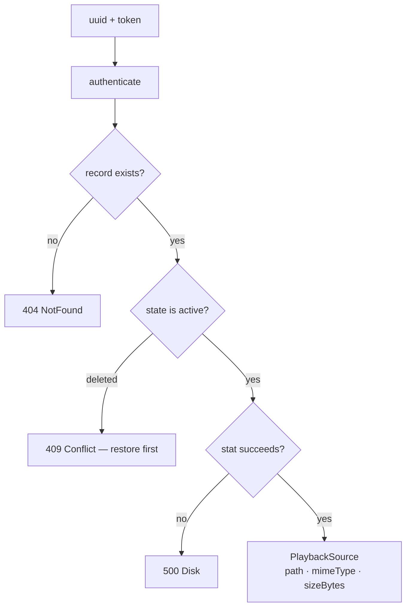

The `stat` is load-bearing twice: it supplies `sizeBytes` for the FFI descriptor,
and it turns a file that vanished without a re-index into a `Disk` error rather
than letting the HTTP file server answer its own bare `404` and misreport the
catalog.

MIME comes from the **catalog's own extension table**, which mirrors the
classification table exactly. An extension absent from it yields
`application/octet-stream` rather than an error: the bytes are still perfectly
streamable, and refusing to serve a file the catalog happily indexed would be
inconsistent.

### 6.2 Streaming — `GET /v1/files/{uuid}/stream`

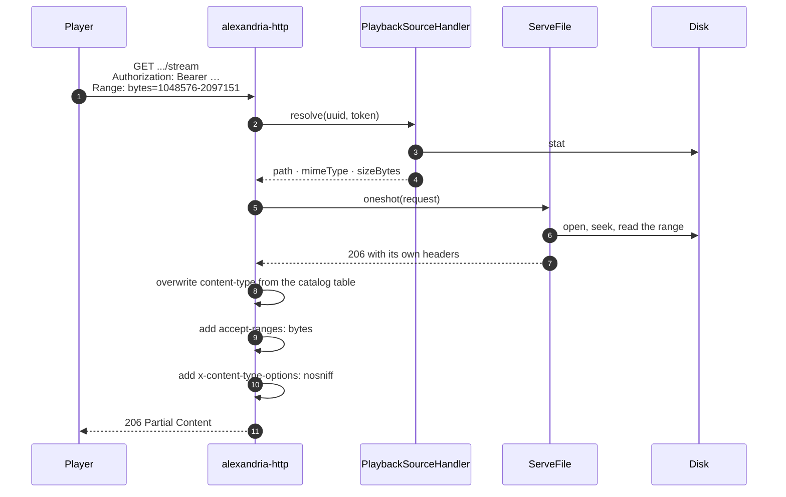

Byte ranges are handled by `tower-http`'s file service rather than parsed by this
surface (`FR-MP-02`). The bytes are never re-encoded, transcoded, or modified in
any way (`FR-MP-03`).

Response shaping:

| Status | Meaning | Playback headers stamped? |
| :---: | --- | :---: |
| 200 | whole file | yes |
| 206 | a satisfied range | yes |
| 416 | unsatisfiable range | **no** |
| 304 | not modified | **no** |
| 404 from the file service | the file vanished between the stat and the open | converted to a `Disk` 500 |

A `416` or `304` is an answer about the *request*, carries no bytes from the file,
and has no business claiming its content type.

The `404` conversion closes a residual window. The core stats first, so a file
already gone is a clean JSON error; but the file can still vanish between that
stat and the open. The file service answers its own bare `404` — no body, nothing
in this API's envelope — and stamping `content-type: video/mp4` onto it would
hand the client a response that is neither a valid error nor valid video. It
becomes the same `Disk` error the stat guard would have produced. (The same
service answers `404` for `PermissionDenied`, which belongs in the same bucket:
the bytes are there but unreadable.)

**`accept-ranges: bytes` is advertised even on a full-file `200`**, so a player
knows it may seek.

#### `nosniff`

These three routes are the API's only byte-serving surface, and what they serve
includes `text/html`, `multipart/related`, and `image/svg+xml` straight from the
library. A library HTML or SVG file containing a script, opened in a webview at
its stream URL, would otherwise execute in the API's origin. Impact is bounded —
authentication is a bearer header, so there is no cookie for such a script to
steal — but the header also holds browsers to the catalog's MIME answer rather
than letting them re-sniff the bytes.

### 6.3 Comic pages and thumbnails

**`GET /v1/files/{uuid}/pages/{page}`** returns one page of a CBZ, 1-based
(`FR-MP-04`), as the archive entry's **own bytes, undecoded**. Not a comic, not a
CBZ, or a page out of range is a `400`.

**`GET /v1/files/{uuid}/thumbnail`** returns a downscaled JPEG for a video, image,
comic, or audio File (`FR-MP-05`). A type with no thumbnail is a `400`. SVG is
rejected explicitly: it is vector, the raster decoder cannot read it, and
rasterizing it would mean a new dependency.

For audio, the thumbnail is the picture the file's own tag calls the front
cover (or, failing that, whichever picture the tag lists first). An audio File
that parses fine but carries no picture at all is a `400`, the same "not
supported for this file" shape SVG and non-CBZ comics get. An audio File that
cannot be read or parsed as audio at all — missing on disk, corrupt, or a
format `lofty` does not support (`.wma`) — is a `500` disk error instead: it is
told apart from "no picture" deliberately, so an owner is never pointed at the
wrong problem.

The thumbnail cache is keyed on **uuid and mtime**, not on a content hash —
hashing a multi-gigabyte video to decide whether its thumbnail is stale would
cost more than making the thumbnail, and hashes are not computed anyway (§5.1).
The mtime gives back the invalidation-on-change a hash would have provided.
Nothing evicts old entries; delete `playback.thumbnail_cache_dir` to reclaim the
space.

### 6.4 Over FFI

The C ABI cannot carry a byte stream. `alexandria_file_playback_source` therefore
returns a **playback descriptor** — resolved absolute path, MIME type, and byte
size — and the client, which is local by construction, opens the file itself
(`FR-MP-06`).

Parity for streaming is defined on that descriptor and on the authorization,
state, and error decisions, not on byte transfer. Comic pages and thumbnails
return their bytes over **both** surfaces and are byte-exact across them.

---

## 7. Catalog lifecycle

Two-phase, and removing a file from disk is always a separate, explicit act.

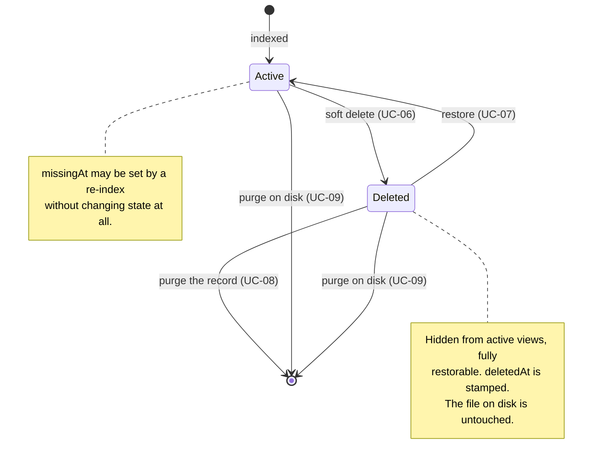

| Operation | Catalog row | File on disk | Retention gate |
| --- | --- | --- | :---: |
| Soft delete | marked `deleted`, `deletedAt` stamped | untouched | — |
| Restore | back to `active` | untouched | — |
| Purge record | removed, with its subtype row | **untouched** | yes — `deletion.retention_days` |
| Purge on disk | removed, with its subtype row | **deleted** | no |

All four are `DELETE /v1/files/{uuid}`, discriminated by query string:
`?purge=true`, `?purge-on-disk=true`, or neither. Setting both is a `400` — they
are distinct operations and the caller must pick one.

Purge-on-disk has no retention gate: an `active` record is purgeable too. When no
on-disk file was there to delete it still succeeds, reporting
`diskFilePresent: false`.

### 7.1 One partial failure worth knowing about

On the purge-on-disk path, if the on-disk delete succeeds but the catalog write
then fails, the response is the generic `{"error": "database error"}` — which is
**indistinguishable from "nothing happened"**, even though the file is already
gone.

A client must not read it as such. Retrying the same call is safe and is the
intended recovery: the second attempt finds no on-disk file, removes the
now-orphaned row, and returns `200` with `diskFilePresent: false`.

---

## 8. Authentication

Exactly one mode is active, chosen at startup (`FR-AU-01`, `FR-AU-03`).
Credentials presented for an inactive mode are rejected.

| Mode | Credential | Who verifies | Bearer token |
| --- | --- | --- | --- |
| `external` | a Heimdall JWT | Alexandria verifies signature and scope | the JWT itself |
| `local` | email + password | Alexandria, against an Argon2 hash | a session id |
| `windows` | the OS account the process runs as | the OS | a session id |

### 8.1 External mode

The client logs in against [Heimdall](https://github.com/artur-rios/heimdall-api)
directly — completing two-factor there if asked — and presents the resulting JWT.
Alexandria verifies the HS256 signature against a shared secret and accepts the
caller as the owner only when the token names the configured scope, as the
holder's scope or as one they own.

A previous secret is accepted alongside the current one, so a rotation on the
Heimdall side does not black out Alexandria. Issuer and audience are each checked
only when configured, because Heimdall signs tokens carrying neither by default.

Alexandria never sees a password, proxies no login, and gains no endpoints of its
own. Everyone Heimdall places in the scope acts as the same single owner:
Alexandria keeps no per-person state and honours none of Heimdall's roles.

### 8.2 Local mode

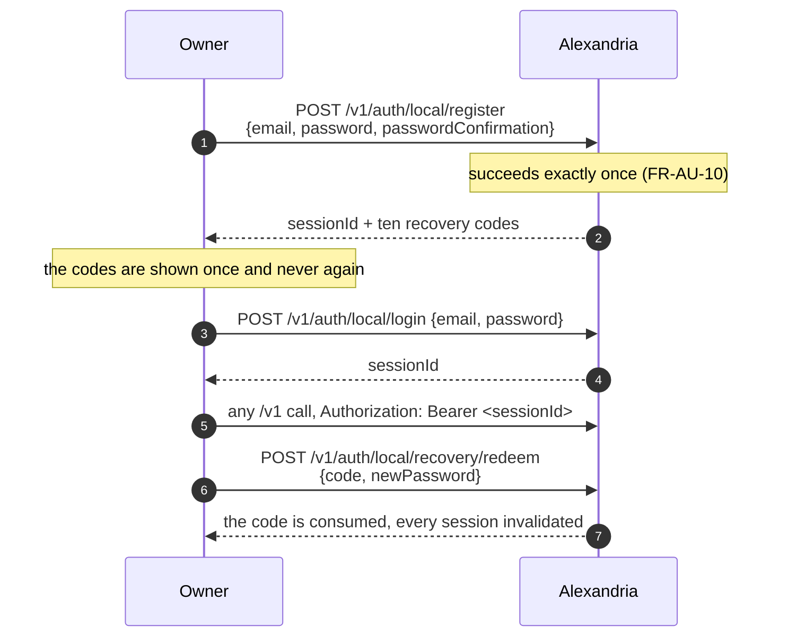

Sessions expire after `auth.session_ttl_hours` (default 24). An unknown or
expired session id is `Unauthorized` (`FR-AU-09`).

Passwords are rejected (`FR-AU-11`) when shorter than 12 characters, longer than
128, entirely whitespace, a single repeated character, equal to or containing the
submitted email, or on a common-password list. Each rejection carries a distinct
machine-readable reason code so a client can render it in its own language
(`FR-AU-12`).

**Recovery codes.** Ten, minted at registration, returned exactly once; only
their hashes are stored (`FR-AU-13`, `FR-AU-19`). Redeeming one replaces the
password, consumes that code, and invalidates every existing session. A rejected
code is reported in a way that distinguishes *unrecognised* from *already
consumed*, and a redemption that fails for any other reason does **not** consume
the code. An authenticated owner can regenerate the full set, which invalidates
the old ones, and can ask how many remain.

There is **no mail of any kind**. The address is a login identifier and nothing
else.

### 8.3 Windows mode

The credential is the OS account the process runs as. Startup **fails** unless
the process is running on Windows as the account named by
`auth.windows_owner_sid` (`FR-AU-21`). `POST /v1/auth/windows/login` takes no
body and returns a session id with the same TTL local mode uses.

Read what this proves before enabling it: **it proves the process was launched by
that account, never who is calling.** Any caller that can reach the port is
authorized. Startup only *warns* when `http.bind_addr` is not loopback
(`FR-AU-24`) — it does not refuse — so keeping the bind address on loopback is
the operator's responsibility.

Every local-mode credential and recovery operation is refused in this mode, since
no credential is stored (`FR-AU-23`).

---

## 9. Behaviors that are easy to get wrong

A summary of decisions a reader is most likely to assume the other way.

| Assumption | Actual behavior |
| --- | --- |
| Indexing hashes file bytes | It does not. Size and mtime are the change signal; `contentHash` is `NULL` for essentially every file |
| A re-index recomputes metadata | It never re-runs extraction, so owner edits survive |
| A file that fails to index fails the run | It is counted in `failed`; only an unlistable root fails a run |
| A paused run's `processed` counts every entry discovery found | Entries the loop never opened are counted nowhere |
| Resuming continues from a cursor | It re-walks from the root; the prefix falls out as `already_cataloged` |
| A resume with no priority means `normal` | It means *keep the current width* |
| A start with no priority is rejected | It is `normal`; unrecognised values are too |
| Cancelling a run that already finished succeeds | It is refused as a conflict |
| Purging a record deletes the file | It does not. Only purge-on-disk touches the disk |
| `filesystem.root` being unset is safe by default | It disables the indexing bound entirely |
| Windows mode authenticates the caller | It authenticates the *process*; anyone reaching the port is the owner |
| The FFI surface can stream bytes | It returns a path descriptor instead |

---

## 10. Observability

Structured logging through `tracing`, at `logging.level` (default `info`).

| Level | What lands there |
| --- | --- |
| `info` | run completion with the full tally, startup reconciliation counts |
| `warn` | per-file indexing failures, refused terminal writes, swallowed bookkeeping failures, best-effort extraction failures |
| `error` | an unresolvable `filesystem.root` |

Credentials are never logged (`FR-AU-06`).

`GET /health` is unauthenticated and reports database and filesystem
reachability plus the active auth mode:

```json
{"status":"ok","database":"reachable","filesystem":"reachable","authMode":"external"}
```

`status` is `ok` only when both probes succeed, and `degraded` otherwise. The
response is always `200` — the body carries the verdict, not the status line, so
a probe can read the detail rather than only the fact that something is wrong.

The filesystem probe requires `filesystem.root` to resolve to a **directory**, so
an unset root reports `unreachable` and the whole check reports `degraded`. That
is the same configuration in which the indexing bound is off (§5.5), which makes
a `degraded` health response the visible symptom of an unset library root.
