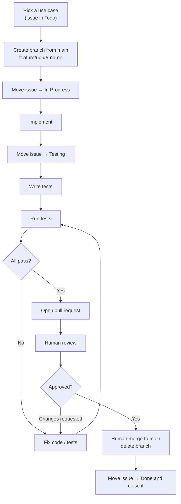

# Development Workflow Document — Alexandria

## 1. Purpose

This document defines **how a use case moves from backlog to merged** — the branch,
the issue status transitions, the testing gate, and the pull request. It is the
standard every contributor (human or agent) follows so that each use case in the
[Use Case Specification Document](Use%20Case%20Specification%20Document.md) is
delivered the same way.

It complements the
[Testing Specification Document](Testing%20Specification%20Document.md), which
defines *how* the tests themselves are written; this document defines *when* they
happen in the delivery flow.

> **One use case = one branch = one issue = one pull request.**

## 2. Workflow at a glance



## 3. Issue status lifecycle

| Order | Status | Set when |
| --- | --- | --- |
| 1 | **Todo** | The use case has not been started (default). |
| 2 | **In Progress** | A branch has been created and implementation has begun. |
| 3 | **Testing** | Implementation is finished; tests are being written, run, and fixed until green. |
| 4 | **Done** | The pull request has been reviewed and merged; the issue is then **closed**. |

An issue only ever moves **forward** during normal flow. If review requests
changes, work continues on the same branch (still linked to the same issue) until
tests pass again and the pull request is re-reviewed.

## 4. Pause gates

The work is reviewed before it advances. Therefore:

- **The only status change made unattended is `Todo → In Progress`**, right after
  the branch is created.
- **Every other stage transition requires explicit approval first.** Before
  moving to **Testing**, before opening a **pull request**, and before moving to
  **Done**, the implementer stops, shows what was done, and asks.
- **Never merge the pull request, never self-approve, never delete the branch.**
  Review, merge, and branch deletion are human actions. An agent may *prepare and
  push* the pull request.

## 5. Step-by-step

### Step 1 — Branch from the main branch

Every use case is implemented on its own branch, created from an up-to-date
`main` branch:

```bash
git switch main
git pull
git switch -c feature/uc-01-index-library-files
```

**Branch naming pattern:**

```
feature/uc-##-use-case-name
```

| Use case | Branch |
| --- | --- |
| UC-01: Index library files | `feature/uc-01-index-library-files` |
| UC-17: Browse bookmarks | `feature/uc-17-browse-bookmarks` |
| UC-33: Edit text file content | `feature/uc-33-edit-text-file-content` |

### Step 2 — Move the issue to **In Progress**

As soon as the branch exists and work starts, set the issue `Status` to
**In Progress**. This is the one status change made without asking.

### Step 3 — Implement

Implement per the use case's specification (main flow **and** every alternative
flow) and the project's architecture and technology stack (see the
[Technology Stack Document](Technology%20Stack%20Document.md)). The core library
follows SOLID and Command/Query (CQRS-style) handlers; both the HTTP and FFI
entry points must stay consistent (parity). All commits go on the branch.

### Step 4 — Move the issue to **Testing**

When the implementation is finished, set the issue `Status` to **Testing** (after
approval, per §4). This signals that the work is code-complete and the testing
gate is now in progress.

### Step 5 — Test until green

Following the [Testing Specification Document](Testing%20Specification%20Document.md):

1. Write the tests for the main flow and each applicable `AF-xx` alternative flow,
   plus an HTTP/FFI parity assertion for the use case.
2. **Run the tests**:

   ```bash
   cargo test
   ```

3. **Fix** any failures — in the implementation or the tests.
4. **Re-run**, and repeat until every test passes.

A use case does not leave the Testing stage until the full suite is green.

### Step 6 — Open a pull request

With all tests passing, push the branch and open a pull request into the `main`
branch. The description references the use case and its issue (e.g.
`Closes #<issue-number>`). Hand off to a human for review; do not merge.

### Step 7 — Human review and merge

- The pull request is **reviewed by a human**. Requested changes are addressed on
  the same branch (back to Step 5 whenever code changes, so the suite stays green).
- Once approved, a human **merges the pull request**.
- The **branch is deleted** after the merge.

> Review and merge are **human actions**. An agent may prepare and push the pull
> request, but must not self-approve or merge it.

### Step 8 — Close the issue

After the merge, set the issue `Status` to **Done** and **close** it.

## 6. Definition of Done

A use case is done only when **all** of the following hold:

- [ ] Implemented on a `feature/uc-##-use-case-name` branch created from `main`.
- [ ] Main flow and every alternative flow from the specification are implemented.
- [ ] Tests cover it per the Testing Specification (main flow + each `AF-xx` + a parity assertion).
- [ ] The full test suite passes (`cargo test`).
- [ ] A pull request was reviewed by a human and merged.
- [ ] The branch was deleted.
- [ ] The issue is in **Done** and closed.

## 7. References

- [Use Case Specification Document](Use%20Case%20Specification%20Document.md) — the use case definitions and their flows.
- [Testing Specification Document](Testing%20Specification%20Document.md) — how the tests are written.
- [System Requirements Document](System%20Requirements%20Document.md) — functional/non-functional requirements.
- [Technology Stack Document](Technology%20Stack%20Document.md) — technologies and versions used.