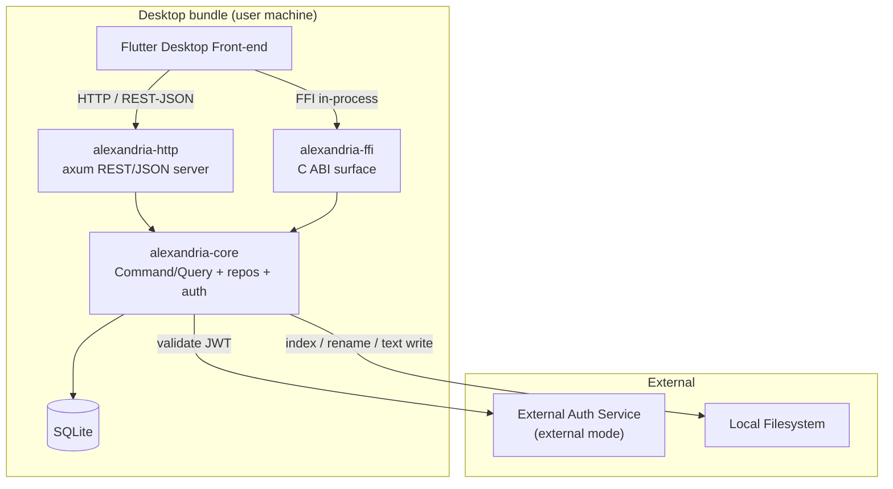

# Operations & Infrastructure Document — Alexandria

## 1. Introduction

### 1.1 Purpose

This document captures **cross-cutting platform concerns** for **Alexandria** that
fall outside the business domain modeled in the
[Vision Document](Vision%20Document.md),
[System Requirements Document](System%20Requirements%20Document.md), and
[Use Case Specification Document](Use%20Case%20Specification%20Document.md).

These are functional capabilities of the *platform* rather than the domain, so
they are documented here to keep the domain documents focused while still
tracking the work formally. The specific technologies and versions this platform
is built on are defined once in the
[Technology Stack Document](Technology%20Stack%20Document.md) and referenced from
here rather than duplicated.

### 1.2 Scope

This document covers the technical foundation and repository layout, platform
requirements, configuration, logging and monitoring, the health endpoint,
environments, and build and delivery.

---

## 2. Technical Foundation

### 2.1 Overview

Alexandria is a three-crate Cargo workspace built on a Rust core library. The
core library carries the domain logic (Command/Query handlers, repository traits
and the sqlx implementation, the auth service, text-file port); an HTTP crate
exposes it as a REST/JSON server; an FFI crate exposes the same operations to the
Flutter desktop front-end. The domain documents describe *what* the system does;
this section describes the structural foundation those features are built on.

### 2.2 Solution Architecture



### 2.3 Repository Layout

```
alexandria-api/
├── Cargo.toml                 # workspace
├── crates/
│   ├── alexandria-core/
│   │   ├── src/
│   │   │   ├── catalog/       # commands, queries, repos (File + subtypes)
│   │   │   ├── collections/
│   │   │   ├── bookmarks/
│   │   │   ├── watchlists/
│   │   │   ├── reading_lists/
│   │   │   ├── text/          # TextFile content port
│   │   │   ├── auth/          # external JWT + local login
│   │   │   ├── errors.rs      # thiserror domain errors
│   │   │   └── lib.rs
│   │   ├── migrations/        # sqlx migrations
│   │   └── tests/
│   ├── alexandria-http/
│   │   ├── src/
│   │   │   ├── routes/        # /v1/* handlers
│   │   │   ├── middleware/    # auth, logging, error mapping
│   │   │   └── lib.rs
│   │   └── tests/
│   └── alexandria-ffi/
│       ├── src/
│       │   ├── lib.rs         # extern "C" surface
│       │   └── header.h       # generated by cbindgen
│       ├── build.rs
│       └── tests/
├── config.toml.example
└── docs/
    ├── initial/
    └── requirements/
```

### 2.4 Platform Requirements

| ID | Requirement |
| --- | --- |
| IR-01 | The solution shall be a Cargo workspace with three crates — `alexandria-core`, `alexandria-http`, `alexandria-ffi` — sharing the core library so HTTP and FFI cannot drift. |
| IR-02 | The workspace shall enforce `#![deny(unsafe_code)]` in every crate. |
| IR-03 | The HTTP server shall bind to a loopback address by default so the API is reachable only from the local machine unless explicitly reconfigured. |
| IR-04 | The core library shall expose domain operations through repository and auth-service **traits**, so the HTTP and FFI layers depend on the same abstractions and remain independently testable. |
| IR-05 | Database migrations shall run at startup before the server begins serving requests. |
| IR-06 | The solution shall generate a C header for the FFI surface (via cbindgen) as part of the build, for the Flutter front-end to consume. |

### 2.5 Migrations are append-only

sqlx records a checksum of every applied migration's **file content** and
refuses to run against a database whose stored checksum no longer matches,
failing with `VersionMismatch`. Editing a migration that has already run —
including changing only a comment — therefore breaks every existing database,
not just schema-relevant edits.

The rule: once a migration has been applied anywhere it must be treated as
frozen; corrections go in a new migration. A database that has drifted (because
a migration was edited before this rule was written down) is repaired by
re-syncing the stored checksum, or, in development, by deleting the database
file and letting it rebuild:

```sql
-- inspect what the database believes it applied
SELECT version, description, checksum FROM _sqlx_migrations ORDER BY version;
```

---

## 3. Configuration

Configuration is read from `config.toml` at startup, with `ALEXANDRIA_*`
environment variables overriding a key. Unknown keys are ignored; invalid
values for required keys fail startup. The table below is the complete set of
keys — a key not listed here does not exist, and only the keys showing an
`ALEXANDRIA_*` name have an environment override.

| Concern | Mechanism | Notes |
| --- | --- | --- |
| `auth.mode` | config / `ALEXANDRIA_AUTH_MODE` | one of `external`, `local`; selects the single active auth mode (FR-AU-01). |
| `auth.jwks_url` | config / `ALEXANDRIA_AUTH_JWKS_URL` | external mode only; where JWT keys are fetched. |
| `auth.local_db` | config | local mode only; flag indicating local credentials are in SQLite. |
| `auth.session_ttl_hours` | config / `ALEXANDRIA_AUTH_SESSION_TTL_HOURS` | local mode only; how long a login session stays valid; default `24` (FR-AU-09). |
| `auth.confirmation_ttl_hours` | config / `ALEXANDRIA_AUTH_CONFIRMATION_TTL_HOURS` | local mode only; how long an e-mail confirmation code stays usable; default `24` (FR-AU-14). |
| `auth.password_reset_ttl_minutes` | config / `ALEXANDRIA_AUTH_PASSWORD_RESET_TTL_MINUTES` | local mode only; how long a password-reset token stays usable; default `60`, deliberately shorter than a confirmation code (FR-AU-16). |
| `auth.resend_interval_seconds` | config / `ALEXANDRIA_AUTH_RESEND_INTERVAL_SECONDS` | local mode only; the shortest gap between two confirmation sends; default `60` (FR-AU-15). |
| `mail.provider` | config | the outbound mail provider; `none` is the default and, until the external mail service is integrated, the only value — it never sends and reports `mail_not_configured` (FR-AU-19). |
| `mail.from_address` | config / `ALEXANDRIA_MAIL_FROM_ADDRESS` | the address outbound messages are sent from; unused while `mail.provider` is `none`. |
| `http.bind_addr` | config / `ALEXANDRIA_HTTP_BIND_ADDR` | default `127.0.0.1`; loopback by default (IR-03). |
| `http.port` | config / `ALEXANDRIA_HTTP_PORT` | default `8080`. |
| `database.path` | config / `ALEXANDRIA_DATABASE_PATH` | SQLite file path; bundled beside the desktop app's data dir. |
| `filesystem.root` | config / `ALEXANDRIA_FILESYSTEM_ROOT` | the library root, in two roles. The health check probes it for reachability (IR-03 / UC-37), and it **bounds indexing**: UC-01 rejects a requested root that is neither it nor a descendant of it (FR-FC-26). Empty — the default — turns both roles off: the probe reports the filesystem unreachable, and indexing is unconstrained, so UC-01 will catalog any absolute path a caller supplies. Startup logs a warning while it is unset. UC-02 takes no root and is unaffected either way. |
| `indexing.concurrency` | config / `ALEXANDRIA_INDEXING_CONCURRENCY` | how many files the UC-01 index and UC-02 re-index walks process at a time; default `4`, `0` is treated as `1`. Hashing runs on the blocking pool, so this is real parallelism; the DB half still serializes behind SQLite's single writer and the 8-connection pool. |
| `deletion.retention_days` | config / `ALEXANDRIA_DELETION_RETENTION_DAYS` | soft-delete retention window; default `30` (NFR-10). |
| `logging.level` | config / `ALEXANDRIA_LOG_LEVEL` | `error` / `warn` / `info` / `debug` / `trace`; default `info`. |
| `playback.thumbnail_cache_dir` | config / `ALEXANDRIA_PLAYBACK_THUMBNAIL_CACHE_DIR` | directory holding thumbnails generated by UC-40, created on first use; default `thumbnails`. Entries are keyed by content hash, so a re-index invalidates a changed file's thumbnail for free; nothing evicts old entries. |

**Secrets:** local-login credentials live only in the SQLite credential row
(never in config or env), and the password is held there only as a one-way
salted Argon2 hash — the row cannot be reversed back to the plaintext. JWT
signing keys are never stored by Alexandria — only the JWKS endpoint URL is
configured.

---

## 4. Logging & Monitoring

Logging uses structured, span-aware logs via `tracing` / `tracing-subscriber`
(see the [Technology Stack Document](Technology%20Stack%20Document.md)).

| Concern | Approach |
| --- | --- |
| Log format | structured (JSON to file; human-readable to console in dev) |
| Destination | console in development; rotating log file in the desktop app's data directory |
| Span fields | `use_case`, `request_id`, `file_uuid`, `operation` on relevant spans |
| Never logged | plaintext passwords, password hashes, JWT contents, full credential values, file contents |

A log line is emitted for indexing progress (files indexed, hashes computed) and
for every catalog write at `info`; validation and auth denials are `warn`; disk
and integrity failures are `error`.

---

## 5. Health & Monitoring Endpoints

### 5.1 Endpoints

| Endpoint | Purpose | Authorization |
| --- | --- | --- |
| GET /health | liveness + readiness: indicates the HTTP server is up and the SQLite database + filesystem root are reachable | public (liveness only) |

### 5.2 Response Contract

```json
{
  "status": "ok",
  "database": "reachable",
  "filesystem": "reachable",
  "authMode": "external"
}
```

`status` is `ok` when both the database and the configured filesystem root are
reachable; otherwise `degraded`. The response leaks no credentials or token
material.

### 5.3 Use Case — UC-37: Health check

| Field | Value |
| --- | --- |
| **ID** | UC-37 |
| **Name** | Health check |
| **Actors** | Client (local monitor or desktop front-end) |
| **Description** | Report liveness and reachability of the database and filesystem. |
| **Preconditions** | The HTTP server is running. |
| **Postconditions** | The caller receives the health status. |
| **Requirements** | IR-03, IR-04, IR-05 |

**Main Flow**

1. The caller requests `GET /health`.
2. The system probes the SQLite database and the configured filesystem root.
3. The system returns the health contract above with the active auth mode.

**Alternative Flows**

| ID | Condition | Outcome |
| --- | --- | --- |
| AF-01 | The database is unreachable | The system returns `status: degraded` with `database: unreachable`. |
| AF-02 | The filesystem root is unreachable | The system returns `status: degraded` with `filesystem: unreachable`. |

Continues the use case numbering from the
[Use Case Specification Document](Use%20Case%20Specification%20Document.md)
(UC-01 … UC-36).

---

## 6. Environments

| Environment | Purpose | Differences |
| --- | --- | --- |
| **Local** | single-user desktop use; the API runs bundled with the Flutter app | loopback bind, SQLite file in the app's data dir, migrations run at startup |
| **Test** | automated tests | in-memory or temp-file SQLite, temp filesystem root, fake auth service, fixed clock |

There is no staging or multi-instance production environment; Alexandria is a
single-user, single-process desktop deployment. If the FFI surface is used
in-process, the HTTP crate is optional at runtime (the core library is the
shared dependency either way).

---

## 7. Build & Delivery

- **Build:** `cargo build --workspace` produces the HTTP server binary and the
  FFI dynamic library; `cbindgen` generates the C header consumed by Flutter.
- **Tests:** `cargo test` (see the
  [Testing Specification Document](Testing%20Specification%20Document.md)).
- **Packaging:** the HTTP binary and the FFI library are bundled alongside the
  Flutter desktop application; the SQLite database file lives in the desktop
  app's per-user data directory. Concrete packaging specifics (installer format,
  asset bundling) are deferred until the desktop integration is built and will be
  documented here when decided.

---

## 8. Traceability

| Platform capability | Requirements |
| --- | --- |
| Three-crate workspace with shared core | IR-01, IR-04 |
| Memory safety | IR-02 |
| Loopback HTTP binding | IR-03 |
| Startup migrations | IR-05 |
| FFI header generation | IR-06 |
| Health endpoint | IR-03, IR-04, IR-05 (UC-37) |