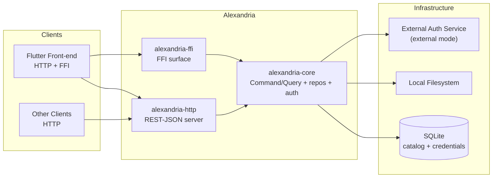
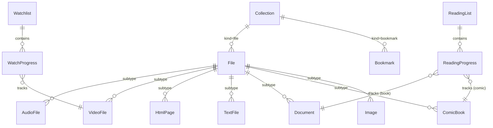
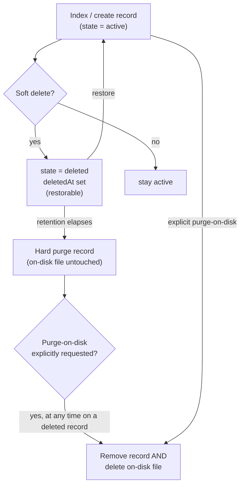

# System Requirements Document — Alexandria

## 1. Introduction

### 1.1 Purpose

This document specifies the functional and non-functional requirements for
**Alexandria**.

The concrete technology stack — platform and language versions, libraries,
database, and tooling — is defined in the
[Technology Stack Document](Technology%20Stack%20Document.md). This document
states requirements and refers to that one for specific technologies and versions
rather than restating them.

### 1.2 Scope

The requirements cover eight capability areas: file catalog and indexing (FC),
collections (CO), bookmarks (BM), watchlists (WL), reading lists (RL), text file
content editing (TX), authentication and authorization (AU), and media playback
(MP). Non-functional
requirements apply across all areas. Operational platform concerns (logging,
health, configuration, deployment) are specified in the
[Operations & Infrastructure Document](Operations%20%26%20Infrastructure%20Document.md).

### 1.3 Definitions

| Term | Definition |
| --- | --- |
| **File** | An indexed on-disk resource. One of seven subtypes: AudioFile, VideoFile, HtmlPage, TextFile, Document, ComicBook, Image. |
| **Path** | The absolute on-disk location of a File. Unique across the catalog. |
| **Content hash** | SHA-256 hash of a File's bytes, computed at index time and refreshed on re-index. |
| **State** | A File or Bookmark lifecycle state: `active`, `deleted` (soft), or purged. |
| **mediaKind** | VideoFile discriminator: `movie` or `series`. |
| **formatKind** | Document discriminator: `book` or `ebook`. |
| **Watch/Read state** | Progress state: `Pending`, `Watching`/`Reading`, `Watched`/`Read`. |
| **Active auth mode** | The single authentication mode (external JWT, local login, or Windows account) selected at startup; the other modes are inactive and their credentials are rejected. |
| **Playback descriptor** | The FFI answer to UC-38: the resolved absolute path, MIME type, and byte size of a File, from which a local client opens the file itself. The FFI surface cannot carry a byte stream. |

---

## 2. System Overview



---

## 3. Functional Requirements

### 3.1 File Catalog & Indexing (FC)

| ID | Requirement |
| --- | --- |
| FR-FC-01 | The system shall index audio files from a specified root path, creating a File record with path, name, type, and content hash, plus an AudioFile subtype record. Its metadata fields are prefilled from the file's embedded tags at first index (FR-FC-25) and are editable by the owner via FR-FC-14. |
| FR-FC-02 | The system shall index video files as VideoFiles. Title, year, resolution and duration are prefilled from the container at first index (FR-FC-25), but `mediaKind` (movie/series) is owner-supplied via FR-FC-15: nothing in a video file distinguishes a movie from an episode, so indexing does not infer it. |
| FR-FC-03 | The system shall index saved HTML pages. |
| FR-FC-04 | The system shall index Markdown and plain-text files as TextFiles. |
| FR-FC-05 | The system shall index PDF and e-book files as Documents. Title, author and page count are prefilled from the file's own metadata at first index, and `formatKind` is set from the format itself — `book` for PDF, `ebook` for EPUB (FR-FC-25). Both remain editable by the owner via FR-FC-16. |
| FR-FC-06 | The system shall index comic-book files (CBR/CBZ) as ComicBooks. Title, series and issue metadata are prefilled from the archive's `ComicInfo.xml` when it has one (FR-FC-25) and are editable by the owner via FR-FC-17. A `.pdf` indexes as a Document (FR-FC-05): file extension alone cannot distinguish a comic PDF from a book PDF. |
| FR-FC-07 | The system shall index image files. |
| FR-FC-08 | The system shall run indexing asynchronously and shall not block read/query operations while indexing is in progress. Filesystem work (directory walks, hashing, metadata parsing) shall run off the async runtime's worker threads, and the index and re-index walks shall process a bounded number of files concurrently (`indexing.concurrency`, default 4) rather than one at a time. |
| FR-FC-09 | The system shall compute a SHA-256 content hash for each indexed file and store it on the File record. |
| FR-FC-10 | The system shall, on re-index, detect a content-hash change for an existing path and refresh that File's stored hash and `indexedAt`. |
| FR-FC-11 | The system shall, on re-index, detect a path that no longer exists on disk and set the File's `missingAt` marker without deleting the record or changing its `state`. |
| FR-FC-12 | The system shall list and query files filtered by type and lifecycle state. Filtering by containing collection is delivered with Collections (FR-CO-07), since no collection exists before then. |
| FR-FC-13 | The system shall return a single file's metadata by its public UUID. |
| FR-FC-14 | The system shall allow editing audio metadata (title, artist, album, year, genre, track). |
| FR-FC-15 | The system shall allow editing video metadata (title, year, resolution; `mediaKind` movie/series). |
| FR-FC-16 | The system shall allow editing document metadata (title, author, year; `formatKind` book/ebook). |
| FR-FC-17 | The system shall allow editing comic-book metadata (title, series, issueNumber). |
| FR-FC-18 | The system shall allow editing image metadata (title, caption). |
| FR-FC-19 | The system shall allow renaming a File, which renames the underlying file on disk. |
| FR-FC-20 | The system shall soft-delete a File record by marking it `deleted`, hiding it from active views, and keeping it restorable. |
| FR-FC-21 | The system shall restore a soft-deleted File to `active`. |
| FR-FC-22 | The system shall hard-purge a File record permanently only after its soft-delete retention window has elapsed. |
| FR-FC-23 | The system shall, on an explicit purge-on-disk operation, remove the File record and delete the underlying file on disk. |
| FR-FC-24 | The system shall expose every catalog operation via both the HTTP/REST-JSON surface and the FFI surface with identical results. FR-MP-06 defines the single exception: byte transfer, where the FFI surface returns a playback descriptor instead of a stream. |
| FR-FC-25 | The system shall, at first index only, prefill a file's subtype metadata from the metadata embedded in the file itself (audio tags, image EXIF, document and comic metadata, video container metadata). Extraction is best-effort: a failure leaves the fields empty and never fails the file's indexing, and re-index (FR-FC-10) never re-runs it, so an owner's edit (FR-FC-14..18) is never overwritten. |
| FR-FC-26 | The system shall reject an index request (FR-FC-01) whose root path is not the configured `filesystem.root` or a descendant of it, comparing the two paths after resolving each to its canonical form so that traversal segments, trailing separators, and symbolic links cannot escape the bound. When `filesystem.root` is unset, indexing is unconstrained and any readable root is accepted — the constraint is opt-in by configuration. Re-index (FR-FC-10, FR-FC-11) takes no root and is unaffected. |
| FR-FC-27 | The system shall record every index and re-index run: its id, kind, start time, terminal status, finish time, and the outcome counts for its kind. A run whose walk completes shall be recorded `complete` even when individual files failed — those are counted in the run's `failed` tally, and one file's failure shall not abandon the rest of the walk. A run that could not proceed at all shall be recorded `failed` with the underlying error. |
| FR-FC-28 | The system shall expose a run's recorded status and outcome to an authenticated caller, given the run id returned when the run was started, over both the HTTP and FFI surfaces. |
| FR-FC-29 | The system shall, at startup, mark every run still recorded as running as interrupted; runs execute in-process and are never resumed. |
| FR-FC-30 | The system shall report the configuration a client needs to render the catalog correctly, beginning with the soft-delete retention window it enforces on every restore and purge. |

### 3.2 Collections (CO)

| ID | Requirement |
| --- | --- |
| FR-CO-01 | The system shall create a file collection (name, `kind` = file). |
| FR-CO-02 | The system shall create a bookmark collection (name, `kind` = bookmark). |
| FR-CO-03 | The system shall rename a collection. |
| FR-CO-04 | The system shall delete a collection by unlinking (preserving) its contained items, not deleting them. |
| FR-CO-05 | The system shall add items of the matching `kind` to a collection, linking those it can and reporting for every submitted item whether it was added and, when it was not, whether it was of the other kind or does not exist. |
| FR-CO-06 | The system shall remove items from a collection. |
| FR-CO-07 | The system shall list the items in a collection. |
| FR-CO-08 | The system shall list the owner's collections, optionally filtered by `kind`, each with the number of items it currently holds. |

### 3.3 Bookmarks (BM)

| ID | Requirement |
| --- | --- |
| FR-BM-01 | The system shall create a bookmark (url, title) in a bookmark collection. |
| FR-BM-02 | The system shall update a bookmark's url, title, and containing collection. |
| FR-BM-03 | The system shall soft-delete a bookmark (mark `deleted`, restorable). |
| FR-BM-04 | The system shall hard-purge a bookmark after its retention window elapses. |
| FR-BM-05 | The system shall restore a soft-deleted bookmark. |
| FR-BM-06 | The system shall list and query bookmarks by containing collection. |

### 3.4 Watchlists (WL)

| ID | Requirement |
| --- | --- |
| FR-WL-01 | The system shall create a watchlist (name). |
| FR-WL-02 | The system shall add a VideoFile to a watchlist, creating a WatchProgress in the `Pending` state. |
| FR-WL-03 | The system shall reject adding a non-VideoFile to a watchlist. |
| FR-WL-04 | The system shall update a WatchProgress state (`Pending` → `Watching` → `Watched`). |
| FR-WL-05 | The system shall track watch progress per episode for a series VideoFile. |
| FR-WL-06 | The system shall remove a video from a watchlist, deleting its WatchProgress. |
| FR-WL-07 | The system shall delete a watchlist, removing its WatchProgress entries only and preserving its VideoFiles. |
| FR-WL-08 | The system shall list watchlists and the watch progress of their items. |

### 3.5 Reading Lists (RL)

| ID | Requirement |
| --- | --- |
| FR-RL-01 | The system shall create a reading list (name). |
| FR-RL-02 | The system shall add a Document or ComicBook to a reading list, creating a ReadingProgress in the `Pending` state. |
| FR-RL-03 | The system shall reject adding a non-read-eligible file (any type other than Document or ComicBook) to a reading list. |
| FR-RL-04 | The system shall update a ReadingProgress state (`Pending` → `Reading` → `Read`). |
| FR-RL-05 | The system shall track reading progress per issue for a comic-book series. |
| FR-RL-06 | The system shall remove an item from a reading list, deleting its ReadingProgress. |
| FR-RL-07 | The system shall delete a reading list, removing its ReadingProgress entries only and preserving its files. |
| FR-RL-08 | The system shall list reading lists and the reading progress of their items. |

### 3.6 Text File Editing (TX)

| ID | Requirement |
| --- | --- |
| FR-TX-01 | The system shall read the content of a TextFile from disk. |
| FR-TX-02 | The system shall write edited content back to the TextFile on disk. |
| FR-TX-03 | The system shall recompute and update the TextFile's content hash after a successful content write. |

### 3.7 Authentication & Authorization (AU)

| ID | Requirement |
| --- | --- |
| FR-AU-01 | The system shall read the active authentication mode from startup configuration; exactly one mode (external JWT, local login, or Windows account) shall be active at runtime. |
| FR-AU-02 | In external mode, the system shall verify each caller's JWT against a configured signing secret shared with the external authentication service, and shall accept the caller as the owner only when the token names the configured scope. |
| FR-AU-03 | The system shall accept only the active auth mode and shall reject credentials presented via the inactive mode. |
| FR-AU-04 | In local mode, the system shall verify the caller's email and password against the salted Argon2 password hash stored in the SQLite credential row. |
| FR-AU-05 | The system shall provide a local setup operation to set or change local-login credentials (email and password). |
| FR-AU-06 | The system shall never store plaintext passwords and shall never log credentials. |
| FR-AU-07 | The system shall authorize the single owner for every catalog operation and shall reject unauthenticated calls. |
| FR-AU-08 | The system shall expose authentication operations via both the HTTP and FFI surfaces consistently. |
| FR-AU-09 | In local mode, a successful login shall create a Session with a configurable expiry (default 24 hours); the caller shall present that session's id on every subsequent request, and the system shall reject an unknown or expired session id as unauthenticated. |
| FR-AU-10 | In local mode, the system shall provide a registration operation that creates the single owner's credential row when none exists, opens a session for the caller, and rejects any subsequent registration as a conflict. |
| FR-AU-11 | The system shall reject a local password that is shorter than 12 characters, longer than 128 characters, entirely whitespace, a single repeated character, equal to or containing the submitted email address, or one of a list of common passwords. |
| FR-AU-12 | The system shall report a rejected authentication input with a stable machine-readable reason code and the parameters that reason interpolates, identically over the HTTP and FFI surfaces. A client shall be able to tell the individual FR-AU-11 rejections apart, and to render each in its own language, without parsing the English message. |
| FR-AU-13 | On registration the system shall generate ten single-use recovery codes, return them to the caller exactly once, and store only their hashes. |
| FR-AU-14 | The system shall replace the local password on presentation of an unconsumed recovery code together with a new password satisfying FR-AU-11, shall consume that code, and shall invalidate every existing session. |
| FR-AU-15 | The system shall reject a presented recovery code with a reason that distinguishes an unrecognised code from one already consumed. |
| FR-AU-16 | The system shall not consume a recovery code when the redemption fails for any other reason. |
| FR-AU-17 | The system shall, for an authenticated owner, replace every recovery code with ten new ones and return them exactly once. |
| FR-AU-18 | The system shall report to an authenticated owner how many recovery codes remain unconsumed. |
| FR-AU-19 | The system shall store only a hash of every recovery code; the plaintext shall exist only in the response that issues it. |
| FR-AU-20 | The system shall support a third authentication mode in which the operating system account running the server process is the credential; exactly one mode remains active at runtime. |
| FR-AU-21 | In Windows mode, the system shall refuse to start unless it is running on Windows as the account named by the configured owner SID. |
| FR-AU-22 | In Windows mode, a successful login shall create a Session with the same configurable expiry local mode uses, and the caller shall present that session's id on every subsequent request. |
| FR-AU-23 | In Windows mode, the system shall refuse every local-mode credential and recovery operation, since no credential is stored. |
| FR-AU-24 | The system shall warn at startup when Windows mode is active and the HTTP bind address is not a loopback address, because in that mode any caller that can reach the port is authorized. |

### 3.8 Media Playback (MP)

| ID | Requirement |
| --- | --- |
| FR-MP-01 | The system shall stream the bytes of an `active` File from its recorded path, with a MIME type derived from the file's extension. |
| FR-MP-02 | The system shall support HTTP byte-range requests over that stream, so a client can seek without transferring the whole file. |
| FR-MP-03 | The system shall never re-encode, transcode, or otherwise modify the bytes it serves. |
| FR-MP-04 | The system shall return a single page of a CBZ ComicBook as an image, addressed by 1-based page index. |
| FR-MP-05 | The system shall return a downscaled thumbnail image for a video, image, or comic File. |
| FR-MP-06 | The system shall expose playback operations via both the HTTP and FFI surfaces. Because the FFI surface cannot carry a byte stream, FR-MP-01 over FFI returns a **playback descriptor** — resolved absolute path, MIME type, and byte size — and parity for it is defined on that descriptor and on the authorization, state, and error decisions rather than on byte transfer. FR-MP-04 and FR-MP-05 return their bytes over both surfaces and are byte-exact across them. |

---

## 4. Data Model

### 4.0 Identifier Strategy

Every entity has an **internal integer primary key** used inside the database for
joins and foreign keys, plus a **public UUID** (v4) that is the stable external
identifier exposed to clients over HTTP and FFI. The `{id}` path parameters and
request/response bodies used throughout the
[Use Case Specification Document](Use%20Case%20Specification%20Document.md) refer
to this public UUID. Local-login credentials use a single-row table keyed by the
owner; it has no public UUID surface beyond the set/change operation.

### 4.1 Entity Relationship Diagram



### 4.2 File Fields

| Field | Type | Constraints | Description |
| --- | --- | --- | --- |
| id | integer | PK, autoincrement | Internal primary key. |
| uuid | UUID | required, unique | Public identifier. |
| path | text | required, unique | Absolute on-disk path. |
| name | text | required | Editable file name. |
| type | enum | required; one of `audio`, `video`, `html`, `text`, `document`, `comic`, `image` | Subtype discriminator. |
| contentHash | text | required | SHA-256 of the file bytes. |
| state | enum | required; one of `active`, `deleted` | Lifecycle state. |
| deletedAt | timestamp | nullable | Set when soft-deleted; drives the retention window. |
| indexedAt | timestamp | required | Last index/re-index time. |
| missingAt | timestamp | nullable | Set by re-index when the on-disk file is gone (FR-FC-11); cleared when it returns. Orthogonal to `state`: a file may be `active` and missing. |
| collectionId | integer | nullable, FK → Collection | Containing collection, if any. Internal only: it is never exposed on the `File` payload, because it is an internal key and its public counterpart is reachable the other way round — `GET /v1/collections/{uuid}/items` (FR-CO-07) lists a collection's members, and `GET /v1/files?collectionUuid=…` (FR-FC-12) filters by it. |

Type-specific subtype tables (AudioFile, VideoFile, HtmlPage, TextFile, Document,
ComicBook, Image) share the File's `id` as a foreign key and carry only their
type-specific metadata. Representative subtype fields:

| Subtype | Extra Fields |
| --- | --- |
| AudioFile | title, artist, album, year, genre, track |
| VideoFile | title, year, resolution, mediaKind (movie/series), episodeCount (series), durationSeconds |
| HtmlPage | title, sourceUrl, savedAt |
| TextFile | (content is read/written on disk, not stored) |
| Document | title, author, year, formatKind (book/ebook), pageCount |
| ComicBook | title, series, issueNumber, comicPageCount |
| Image | title, caption, width, height |

### 4.3 Collection Fields

| Field | Type | Constraints | Description |
| --- | --- | --- | --- |
| id | integer | PK | Internal primary key. |
| uuid | UUID | required, unique | Public identifier. |
| name | text | required, non-empty | Collection name. |
| kind | enum | required; one of `file`, `bookmark` | Discriminator. |

A collection carries no item count of its own: the number is derived by counting
the rows that point at it, so it cannot drift from the membership. `FR-CO-08`'s
listing returns that derived count alongside each collection, excluding
soft-deleted members — the same members `FR-CO-07` lists.

### 4.4 Bookmark Fields

| Field | Type | Constraints | Description |
| --- | --- | --- | --- |
| id | integer | PK | Internal primary key. |
| uuid | UUID | required, unique | Public identifier. |
| url | text | required, valid URL | The bookmarked URL. |
| title | text | required, non-empty | Bookmark title. |
| state | enum | required; `active` or `deleted` | Lifecycle state. |
| deletedAt | timestamp | nullable | Set when soft-deleted. |
| collectionId | integer | nullable, FK → Collection (kind=bookmark) | Containing bookmark collection. |

### 4.5 Watchlist Fields

| Field | Type | Constraints | Description |
| --- | --- | --- | --- |
| id | integer | PK | Internal primary key. |
| uuid | UUID | required, unique | Public identifier. |
| name | text | required, non-empty | Watchlist name. |

### 4.6 WatchProgress Fields

| Field | Type | Constraints | Description |
| --- | --- | --- | --- |
| id | integer | PK | Internal primary key. |
| watchlistId | integer | required, FK → Watchlist | Parent watchlist. |
| videoFileId | integer | required, FK → VideoFile | Tracked video. |
| state | enum | required; `Pending`, `Watching`, `Watched` | Watch state. |
| currentEpisode | integer | nullable | For series: last watched episode. |
| totalEpisodes | integer | nullable | For series: total episodes. |

### 4.7 ReadingList Fields

| Field | Type | Constraints | Description |
| --- | --- | --- | --- |
| id | integer | PK | Internal primary key. |
| uuid | UUID | required, unique | Public identifier. |
| name | text | required, non-empty | Reading-list name. |

### 4.8 ReadingProgress Fields

| Field | Type | Constraints | Description |
| --- | --- | --- | --- |
| id | integer | PK | Internal primary key. |
| readingListId | integer | required, FK → ReadingList | Parent reading list. |
| targetFileId | integer | required, FK → Document or ComicBook | Tracked item. |
| targetKind | enum | required; `Document` or `ComicBook` | Which subtype is tracked. |
| state | enum | required; `Pending`, `Reading`, `Read` | Read state. |
| currentIssue | integer | nullable | For comic series: last read issue. |
| totalIssues | integer | nullable | For comic series: total issues. |

### 4.9 LocalLoginCredential Fields

Single-row table (the owner). The row is created by registration (UC-41) and
changed thereafter by the credentials operation (UC-35).

| Field | Type | Constraints | Description |
| --- | --- | --- | --- |
| id | integer | PK, fixed to 1 | Singleton row. |
| email | text | required, unique, valid email | Owner email. |
| passwordHash | text | required | Argon2 salted hash; never plaintext. |
| updatedAt | timestamp | required | Last credential change. |

The password is stored only as a salted Argon2 hash, which is one-way — the row
cannot be reversed back to the plaintext password (FR-AU-06, NFR-05). The row
itself is not separately encrypted at rest.

The e-mail address is the login identifier only. It is never verified and
nothing in the system writes to it beyond registration and the credentials
operation (UC-35).

### 4.9.1 RecoveryCode Fields

The single-use values that let an owner who has forgotten their password back
into the account without e-mail (FR-AU-13 … FR-AU-19). Ten are generated at
registration and ten replace the whole set on regeneration; there is no expiry
column; a code is valid until it is consumed or the set it belongs to is
replaced.

| Field | Type | Constraints | Description |
| --- | --- | --- | --- |
| id | integer | PK | Row id. |
| codeHash | text | required, unique | SHA-256 of the normalized code; the plaintext is never stored (FR-AU-19). |
| createdAt | timestamp | required | When the code was issued. |
| consumedAt | timestamp | nullable | When it was used, or null while it is still usable. |

Only the hash is stored, so a database read cannot yield a working recovery
code — the same reasoning that keeps FR-AU-06 from storing a plaintext
password. Lookups normalize the presented value (case, hyphen, and whitespace
are all irrelevant) and hash it before matching. Regeneration replaces every
row, used and unused alike, so a printed list that has been superseded stops
working in full rather than partially.

### 4.10 Session Fields

Created by a successful local login (UC-34 / FR-AU-09); local mode has no
bearer token, so the session id is the credential every subsequent request
presents. External mode creates no sessions — each request carries its own JWT.

| Field | Type | Constraints | Description |
| --- | --- | --- | --- |
| id | UUID | PK | The session id returned to the caller at login. |
| createdAt | timestamp | required | When the login succeeded. |
| expiresAt | timestamp | required | `createdAt` + the configured `auth.session_ttl_hours` (default 24). A request presenting a session at or past this instant is unauthenticated. |

### 4.11 CatalogRun Fields

Records each index and re-index run (UC-01, UC-02), queried by run id (UC-42,
FR-FC-27). A row is written `running` when the run starts and closed to a
terminal `status` when it ends; rows are kept indefinitely.

| Field | Type | Constraints | Description |
| --- | --- | --- | --- |
| id | UUID | PK | The run id returned when the run was started. |
| kind | text | required | `index` or `refresh`. |
| status | text | required | `running`, `complete`, `failed`, or `interrupted`. |
| root | text | nullable | The indexed root, for an index run only; `NULL` for a refresh, which takes no root. |
| startedAt | timestamp | required | When the run started. |
| finishedAt | timestamp | nullable | When the run reached a terminal status; `NULL` while `running`. |
| scanned | integer | nullable | Index only: files scanned. |
| indexed | integer | nullable | Index only: files newly indexed. |
| skipped | integer | nullable | Index only: files skipped. |
| refreshed | integer | nullable | Refresh only: records refreshed. |
| markedMissing | integer | nullable | Refresh only: records marked missing. |
| unchanged | integer | nullable | Refresh only: records unchanged. |
| failed | integer | nullable | Both kinds: files that failed individually without abandoning the run. |
| error | text | nullable | The underlying error; set only when `status` is `failed`. |

Every count field and `finishedAt` are `NULL` while the run is `running`. A run
is `interrupted` at startup if it was still recorded `running`, since runs
execute in-process and are never resumed (FR-FC-29).

---

## 5. API Endpoints Overview

The HTTP surface is REST/JSON, versioned under `/v1`. The FFI surface exposes
the same operations as C functions; the table below notes the HTTP form. Every
endpoint requires authentication from the active mode (see §7).

### 5.1 Indexing

| Method | Path | Description | Requirement |
| --- | --- | --- | --- |
| POST | /v1/index | Start an asynchronous indexing scan of a root path. | FR-FC-01..08 |
| POST | /v1/index/refresh | Re-index existing records (refresh hashes/metadata). | FR-FC-10, FR-FC-11 |
| GET | /v1/settings | Report the client-relevant configuration, beginning with the retention window. | FR-FC-30 |
| GET | /v1/index/runs/{runId} | Report an index or re-index run's status and outcome. | FR-FC-27, FR-FC-28 |

### 5.2 Files

| Method | Path | Description | Requirement |
| --- | --- | --- | --- |
| GET | /v1/files | List/query files by type and state (collection filter ships with Collections). An unrecognised filter value is rejected as invalid input. | FR-FC-12 |
| GET | /v1/files/{uuid} | Get one file's metadata. | FR-FC-13 |
| PATCH | /v1/files/{uuid}/metadata | Edit type-specific metadata. | FR-FC-14..18 |
| POST | /v1/files/{uuid}/rename | Rename the file (and on-disk file). | FR-FC-19 |
| DELETE | /v1/files/{uuid} | Soft-delete the record. | FR-FC-20 |
| POST | /v1/files/{uuid}/restore | Restore a soft-deleted record. | FR-FC-21 |
| DELETE | /v1/files/{uuid}?purge=true | Hard-purge the record (after retention). | FR-FC-22 |
| DELETE | /v1/files/{uuid}?purge-on-disk=true | Remove the record and the on-disk file. | FR-FC-23 |

### 5.3 Text File Content

| Method | Path | Description | Requirement |
| --- | --- | --- | --- |
| GET | /v1/files/{uuid}/content | Read a TextFile's content from disk. | FR-TX-01 |
| PUT | /v1/files/{uuid}/content | Write edited content back to disk. | FR-TX-02, FR-TX-03 |

### 5.4 Collections

| Method | Path | Description | Requirement |
| --- | --- | --- | --- |
| GET | /v1/collections | List collections, optionally filtered by `kind`. | FR-CO-08 |
| POST | /v1/collections | Create a collection (file or bookmark). | FR-CO-01, FR-CO-02 |
| PATCH | /v1/collections/{uuid} | Rename a collection. | FR-CO-03 |
| DELETE | /v1/collections/{uuid} | Delete a collection (preserves items). | FR-CO-04 |
| POST | /v1/collections/{uuid}/items | Add items to a collection. | FR-CO-05 |
| DELETE | /v1/collections/{uuid}/items/{itemUuid} | Remove an item. | FR-CO-06 |
| GET | /v1/collections/{uuid}/items | List items in a collection. | FR-CO-07 |

### 5.5 Bookmarks

| Method | Path | Description | Requirement |
| --- | --- | --- | --- |
| POST | /v1/bookmarks | Create a bookmark. | FR-BM-01 |
| PATCH | /v1/bookmarks/{uuid} | Update a bookmark. | FR-BM-02 |
| GET | /v1/bookmarks | List bookmarks by collection. | FR-BM-06 |
| DELETE | /v1/bookmarks/{uuid} | Soft-delete a bookmark. | FR-BM-03 |
| POST | /v1/bookmarks/{uuid}/restore | Restore a soft-deleted bookmark. | FR-BM-05 |
| DELETE | /v1/bookmarks/{uuid}?purge=true | Hard-purge a bookmark. | FR-BM-04 |

### 5.6 Watchlists

| Method | Path | Description | Requirement |
| --- | --- | --- | --- |
| POST | /v1/watchlists | Create a watchlist. | FR-WL-01 |
| GET | /v1/watchlists | List watchlists with progress. | FR-WL-08 |
| DELETE | /v1/watchlists/{uuid} | Delete a watchlist (preserves videos). | FR-WL-07 |
| POST | /v1/watchlists/{uuid}/items | Add a video (rejects non-video). | FR-WL-02, FR-WL-03 |
| PATCH | /v1/watchlists/{uuid}/items/{videoUuid} | Update watch progress. | FR-WL-04, FR-WL-05 |
| DELETE | /v1/watchlists/{uuid}/items/{videoUuid} | Remove a video. | FR-WL-06 |

### 5.7 Reading Lists

| Method | Path | Description | Requirement |
| --- | --- | --- | --- |
| POST | /v1/reading-lists | Create a reading list. | FR-RL-01 |
| GET | /v1/reading-lists | List reading lists with progress. | FR-RL-08 |
| DELETE | /v1/reading-lists/{uuid} | Delete a reading list (preserves items). | FR-RL-07 |
| POST | /v1/reading-lists/{uuid}/items | Add a book/comic (rejects ineligible). | FR-RL-02, FR-RL-03 |
| PATCH | /v1/reading-lists/{uuid}/items/{itemUuid} | Update read progress. | FR-RL-04, FR-RL-05 |
| DELETE | /v1/reading-lists/{uuid}/items/{itemUuid} | Remove an item. | FR-RL-06 |

### 5.8 Authentication

| Method | Path | Description | Requirement |
| --- | --- | --- | --- |
| POST | /v1/auth/local/register | Create the owner's local account and open a session (local mode). | FR-AU-10, FR-AU-11 |
| POST | /v1/auth/local/login | Verify email + password and open a session (local mode). | FR-AU-04, FR-AU-09 |
| POST | /v1/auth/local/credentials | Change existing local credentials (local mode). | FR-AU-05, FR-AU-06 |
| GET | /v1/auth/local/account | Report the owner's address and how many recovery codes remain. | FR-AU-18 |
| POST | /v1/auth/local/recovery/redeem | Replace the password using a recovery code (unauthenticated). | FR-AU-14, FR-AU-15, FR-AU-16 |
| POST | /v1/auth/local/recovery/regenerate | Replace every recovery code with ten new ones. | FR-AU-17, FR-AU-19 |
| POST | /v1/auth/windows/login | Open a session on the strength of the Windows account the server process runs as (Windows mode). | FR-AU-22 |

External JWT verification (FR-AU-02) is enforced by HTTP middleware on every
request, not by an endpoint. The same middleware validates the local-mode
session id (FR-AU-09); both are presented as `Authorization: Bearer <value>`.

#### Error envelope

Every failure on both surfaces renders as one envelope:

```json
{ "error": "password must be at least 12 characters",
  "code": "password_too_short",
  "params": { "min": "12" } }
```

`error` is the human-readable English fallback and is always present. `code` is
a stable `snake_case` identifier, never reused for a different meaning, and
`params` carries the values the message interpolates — together they are what a
client switches on and translates (FR-AU-12). Both are omitted for a failure
that has no stable reason yet; the envelope is then `{"error": …}` alone.

Over FFI the same bytes are returned in the result struct's `json` member,
which is why the status code there stays a coarse class: the reason is the
`code`, not the status.

`/recovery/redeem` sits outside the authentication gate as well, and for a
related reason: the recovery code it carries *is* its credential — requiring a
session in addition would stop an owner who has forgotten their password from
ever reaching the endpoint that replaces it. `/account` and
`/recovery/regenerate` are routed alongside it but authenticate in their own
handlers, since both require an existing session.

The register, login, and credentials endpoints all sit outside the blanket
authentication gate, for the reasons §7 gives: registration is how the
owner's account first comes to exist, and login is how a caller obtains a
session. The credentials endpoint is routed alongside them, but always
requires an authenticated session — the handler enforces that itself rather
than relying on the router-level gate (UC-35 is change-only; creating the
account is UC-41).

### 5.9 Media Playback

| Method | Path | Description | Requirement |
| --- | --- | --- | --- |
| GET | /v1/files/{uuid}/stream | Stream an `active` File's bytes from disk, honouring `Range`. | FR-MP-01, FR-MP-02, FR-MP-03 |
| GET | /v1/files/{uuid}/pages/{page} | Return one page of a CBZ ComicBook, 1-based. | FR-MP-04 |
| GET | /v1/files/{uuid}/thumbnail | Return a downscaled JPEG thumbnail (video, image, comic). | FR-MP-05 |

`/stream` is deliberately not `/content`: that path is UC-32's text-content
read and UC-33's editor, which exchange a JSON document rather than a seekable
byte stream. Over FFI the same three operations exist, except that FR-MP-01
returns a playback descriptor instead of bytes (FR-MP-06).

---

## 6. Non-Functional Requirements

| ID | Category | Requirement |
| --- | --- | --- |
| NFR-01 | Performance | The system shall answer catalog read queries with p95 latency under 200 ms for a library of tens of thousands of files. |
| NFR-02 | Performance | The system shall index at least 500 files per second on a personal machine without blocking read/query operations. |
| NFR-03 | Maintainability | The core library shall be organized by Command/Query (CQRS-style) handlers depending on repository traits, following SOLID principles. |
| NFR-04 | Maintainability | The core library shall contain no `unsafe` code; `#![deny(unsafe_code)]` is enforced workspace-wide. |
| NFR-05 | Security | The system shall never store plaintext passwords and shall never log credentials or tokens. |
| NFR-06 | Security | The system shall reject every operation that lacks valid authentication from the active auth mode. |
| NFR-07 | Reliability | The system shall keep soft-deleted records restorable until their retention window elapses; a hard purge shall not remove the on-disk file. |
| NFR-08 | Functional suitability | The system shall not perform audio re-encoding, video re-encoding, or image manipulation. |
| NFR-09 | Compatibility | The HTTP/REST-JSON surface and the FFI surface shall return identical results for the same operation (parity). |
| NFR-10 | Configurability | The soft-delete retention window shall be configurable; its default shall be 30 days. |

---

## 7. Authorization Matrix

| Operation | Owner (authenticated) | Unauthenticated |
| --- | --- | --- |
| Index files / re-index | ✅ | ❌ |
| Browse and view file metadata | ✅ | ❌ |
| Edit file metadata / rename / content | ✅ | ❌ |
| Soft-delete / restore / hard-purge / purge-on-disk | ✅ | ❌ |
| Create / rename / delete collection; manage items | ✅ | ❌ |
| Create / update / delete / restore bookmark | ✅ | ❌ |
| Create / update / delete watchlist and progress | ✅ | ❌ |
| Create / update / delete reading list and progress | ✅ | ❌ |
| Local login (local mode) | ✅ (open to verify) | ⚠️ only the login verification endpoint; all other operations denied |
| Register the local account (local mode) | n/a — no account exists yet to authenticate as | ⚠️ only once, while no local account exists; a second attempt is denied with a conflict (UC-41) |
| Set or change local credentials (local mode) | ✅ | ❌ |
| External JWT validation | ✅ | ⚠️ only as the bearer of a valid JWT; invalid tokens denied |
| Windows login (Windows mode) | ✅ (open to verify) | ⚠️ only the login endpoint; all other operations denied (UC-45) |

Legend: ✅ allowed · ⚠️ allowed under a stated condition · ❌ denied.

Note: authentication is evaluated **before** a request's path or body is parsed.
An unauthenticated call is denied outright and never learns whether its payload
would have been accepted — a malformed body or an unparseable identifier does
not turn a `401` into a `400`. Both the HTTP and FFI surfaces gate this way
(FR-AU-07, FR-FC-24).

Note: local-login verification and local-account registration are the two
operations that accept unauthenticated input — the credentials being
verified, and the owner's own new credentials, respectively. Login success
grants owner status for every subsequent operation; registration succeeds
at most once, after which every later attempt is a conflict, not a second
bootstrap.

---

## 8. Lifecycle Strategy



Cascade notes:

- **File soft-delete** sets `state = deleted`; filtered out of active views, kept restorable.
- **Hard purge** removes the record permanently only after the configured retention window (default 30 days, NFR-10); the on-disk file is untouched.
- **Purge-on-disk** is a separate explicit operation that removes the record and deletes the physical file; it may be invoked on an active or deleted record.
- **Bookmark** follows the same two-phase model (soft-delete → restore → hard-purge); no disk file is associated.
- **Collection deletion** unlinks (preserves) its items; it is a hard delete of the grouping only.
- **Watchlist / ReadingList deletion** deletes their progress entries only and preserves the referenced files.
- **WatchProgress / ReadingProgress** are deleted when their item is removed from the list or the list is deleted.

---

## 9. Traceability

### 9.1 Feature → Requirements

The feature identifiers are the milestones the
[README](../../README.md#project-status) tracks, in the same order.

| Feature | Requirements |
| --- | --- |
| F-00 Foundation and operations | IR-01 through IR-06 (Operations & Infrastructure Document §2) |
| F-01 File indexing | FR-FC-01 through FR-FC-11, FR-FC-25 through FR-FC-29 |
| F-02 Catalog browsing and metadata editing | FR-FC-12 through FR-FC-18 |
| F-03 Renaming and lifecycle management | FR-FC-19 through FR-FC-23 |
| F-04 Text file content editing | FR-TX-01 through FR-TX-03 |
| F-05 Collections | FR-CO-01 through FR-CO-08 |
| F-06 Bookmark management | FR-BM-01 through FR-BM-06 |
| F-07 Watchlists | FR-WL-01 through FR-WL-08 |
| F-08 Reading lists | FR-RL-01 through FR-RL-08 |
| F-09 Pluggable authentication | FR-AU-01 through FR-AU-24 |
| F-10 Media playback | FR-MP-01 through FR-MP-06 |

Dual-transport parity (FR-FC-24, FR-AU-08, FR-MP-06, NFR-09) is not a
milestone of its own: it is a constraint every feature above satisfies as it
ships, which is why each one lands on both surfaces at once.

### 9.2 Business Rule → Requirements

| Business Rule | Realized by |
| --- | --- |
| BR-01 single owner | FR-AU-07, NFR-06 (all operations require owner auth) |
| BR-02 metadata + path/hash only | FR-FC-09, FR-FC-23, FR-TX-02 (writes to disk, not stored) |
| BR-03 text edits write back to disk | FR-TX-02 |
| BR-04 no complex media editing | NFR-08 |
| BR-05 watchlists only videos | FR-WL-03 |
| BR-06 per-episode series tracking | FR-WL-05 |
| BR-07 dual transport parity | FR-FC-24, FR-AU-08, NFR-09 |
| BR-08 pluggable auth, external + local + Windows | FR-AU-01, FR-AU-02, FR-AU-04, FR-AU-06, FR-AU-20 |
| BR-09 async non-blocking indexing | FR-FC-08, NFR-02 |
| BR-10 two-phase deletion | FR-FC-20, FR-FC-21, FR-FC-22, NFR-07, NFR-10 |
| BR-11 hard purge no disk touch; separate purge-on-disk | FR-FC-22, FR-FC-23 |
| BR-12 delete collection preserves items | FR-CO-04 |
| BR-13 delete watchlist preserves videos | FR-WL-07 |
| BR-14 SOLID / Command-Query baseline | NFR-03, NFR-04 |
| BR-15 reading lists only books/comics | FR-RL-03 |
| BR-16 per-issue comic tracking | FR-RL-05 |
| BR-17 exactly one active auth mode | FR-AU-01, FR-AU-03, FR-AU-20 |
| BR-18 local credential storage | FR-AU-04, FR-AU-05, FR-AU-06, NFR-05 |
| BR-19 delete reading list preserves items | FR-RL-07 |