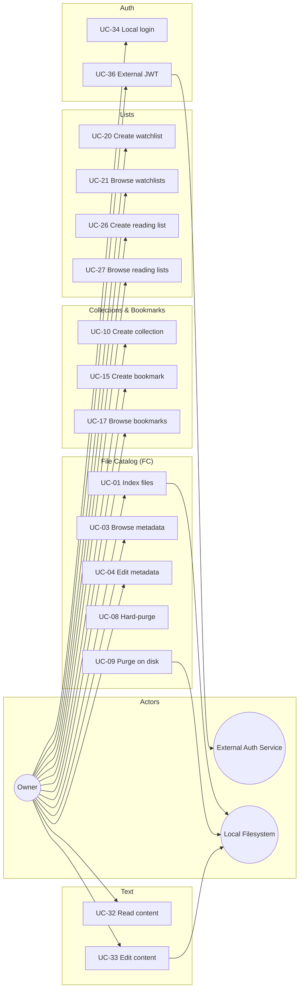
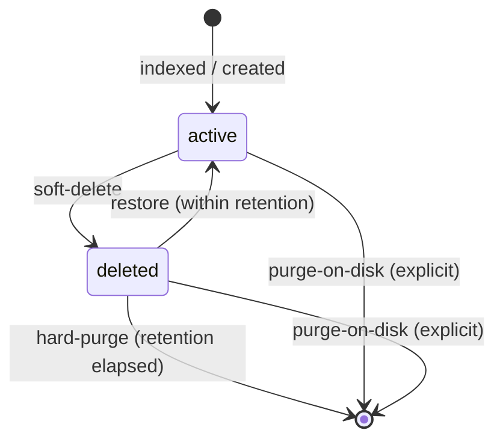
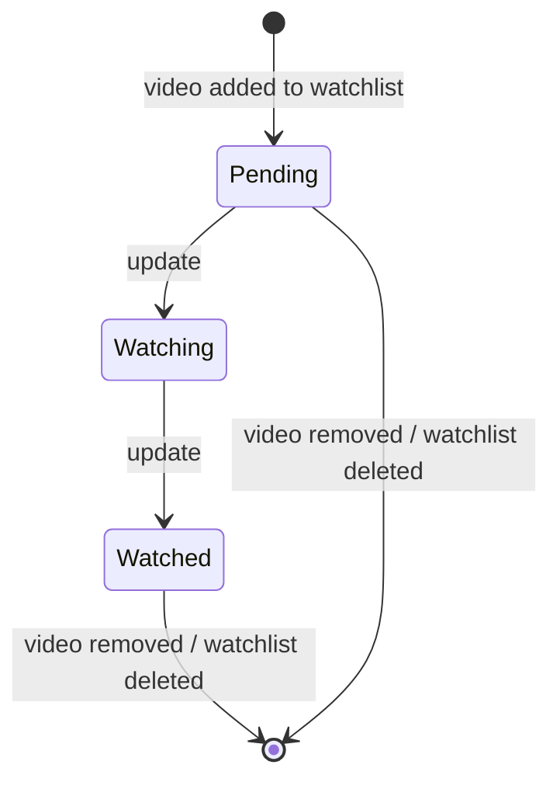
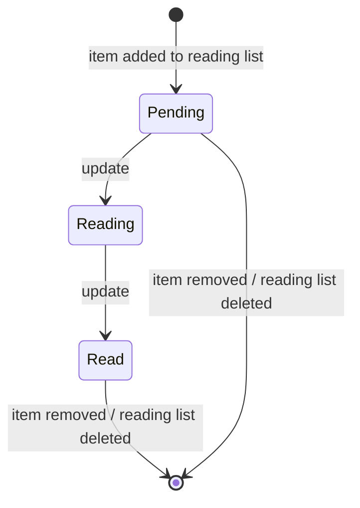

# Use Case Specification Document — Alexandria

## 1. Introduction

### 1.1 Purpose

This document specifies the use cases for **Alexandria**. Each use case describes
actor interactions, preconditions, postconditions, main flows, and
alternative/exception flows.

Every `{uuid}` / `{id}` referenced in these flows is the **public UUID** external
identifier defined in [System Requirements Document](System%20Requirements%20Document.md)
§4.0; internal integer keys are never exposed to clients.

### 1.2 Actors

| Actor | Description |
| --- | --- |
| **Owner** | The single authenticated user performing catalog operations. Authenticated via the active auth mode (external JWT or local login). |
| **External Auth Service** | An external system that issues JWTs and (via JWKS/shared secret) lets Alexandria validate them. Actor in external mode only. |
| **Local Filesystem** | The on-disk store the system indexes, renames into, and writes text content back to. |

### 1.3 Use Case Overview

---

## 2. Use Case Specifications

---

### UC-01: Index library files

| Field | Value |
| --- | --- |
| **ID** | UC-01 |
| **Name** | Index library files |
| **Actors** | Owner, Local Filesystem |
| **Description** | Scan a root directory and create type-aware catalog records for every supported file type. |
| **Preconditions** | The caller is authenticated as the owner; the root path is supplied. |
| **Postconditions** | A File record (with subtype) exists for each supported file found, each with a content hash; indexing runs without blocking reads. |
| **Requirements** | FR-FC-01, FR-FC-02, FR-FC-03, FR-FC-04, FR-FC-05, FR-FC-06, FR-FC-07, FR-FC-08, FR-FC-09, FR-FC-24 |

**Main Flow**

1. The owner requests indexing with a root path.
2. The system starts an asynchronous scan and returns immediately.
3. The system walks the tree, classifies each supported file by type, and creates a File record (with the matching subtype) carrying path, name, type, and the computed SHA-256 content hash.
4. The system records the `indexedAt` timestamp and notifies completion.

**Alternative Flows**

| ID | Condition | Outcome |
| --- | --- | --- |
| AF-01 | The root path does not exist on disk | The system rejects the request with an invalid-input error. |
| AF-02 | The caller is not authenticated | The system denies with an unauthorized error. |
| AF-03 | A file path is already cataloged | The system skips creation (no duplicate path); a refresh is handled by UC-02. |

---

### UC-02: Re-index and refresh the catalog

| Field | Value |
| --- | --- |
| **ID** | UC-02 |
| **Name** | Re-index and refresh the catalog |
| **Actors** | Owner, Local Filesystem |
| **Description** | Re-scan indexed paths and refresh metadata and content hashes. |
| **Preconditions** | The caller is authenticated; at least one indexing run has occurred. |
| **Postconditions** | Changed files have refreshed metadata and hashes; missing-on-disk files are marked but not deleted. |
| **Requirements** | FR-FC-08, FR-FC-10, FR-FC-11, FR-FC-24 |

**Main Flow**

1. The owner requests a re-index.
2. The system re-reads each cataloged path's bytes and metadata asynchronously.
3. For each path whose content hash changed, the system refreshes the metadata and hash and updates `indexedAt`.
4. For each path that no longer exists on disk, the system marks the File's state as missing without deleting the record.

**Alternative Flows**

| ID | Condition | Outcome |
| --- | --- | --- |
| AF-01 | A path on disk was deleted since indexing | The system marks the File missing (per main flow step 4), not deleted. (Explicit deletion is UC-06.) |
| AF-02 | The caller is not authenticated | The system denies with an unauthorized error. |

---

### UC-03: Browse and view file metadata

| Field | Value |
| --- | --- |
| **ID** | UC-03 |
| **Name** | Browse and view file metadata |
| **Actors** | Owner |
| **Description** | List/query files and view a single file's metadata. |
| **Preconditions** | The caller is authenticated. |
| **Postconditions** | The caller receives filtered list results or a single file's metadata. |
| **Requirements** | FR-FC-12, FR-FC-13, FR-FC-24 |

**Main Flow**

1. The owner requests a file list (optionally filtered by type, collection, lifecycle state) or a single file by UUID.
2. The system excludes `deleted` records from default views unless the owner explicitly requests them.
3. The system returns the matching file(s) with their metadata.

**Alternative Flows**

| ID | Condition | Outcome |
| --- | --- | --- |
| AF-01 | The requested UUID does not exist | The system responds with a not-found error. |
| AF-02 | The caller is not authenticated | The system denies with an unauthorized error. |

---

### UC-04: Edit file metadata

| Field | Value |
| --- | --- |
| **ID** | UC-04 |
| **Name** | Edit file metadata |
| **Actors** | Owner |
| **Description** | Edit the type-specific metadata of a file (audio, video, document, comic-book, or image fields). |
| **Preconditions** | The caller is authenticated; the target file exists and is `active`. |
| **Postconditions** | The file's subtype metadata is updated. |
| **Requirements** | FR-FC-14, FR-FC-15, FR-FC-16, FR-FC-17, FR-FC-18, FR-FC-24 |

**Main Flow**

1. The owner submits metadata changes for a file UUID.
2. The system validates the fields against the file's actual subtype.
3. The system updates the subtype metadata and returns the updated file.

**Alternative Flows**

| ID | Condition | Outcome |
| --- | --- | --- |
| AF-01 | The fields do not match the file's subtype (e.g. audio fields on a video) | The system rejects with an invalid-input error. |
| AF-02 | The file UUID does not exist | The system responds with a not-found error. |
| AF-03 | The caller is not authenticated | The system denies with an unauthorized error. |
| AF-04 | The file is in `deleted` state | The system rejects with an invalid-state error (restore first via UC-07). |

---

### UC-05: Rename a file

| Field | Value |
| --- | --- |
| **ID** | UC-05 |
| **Name** | Rename a file |
| **Actors** | Owner, Local Filesystem |
| **Description** | Rename a file, which renames the underlying file on disk. |
| **Preconditions** | The caller is authenticated; the target file exists and is `active`. |
| **Postconditions** | The file's name and on-disk path are updated. |
| **Requirements** | FR-FC-19, FR-FC-24 |

**Main Flow**

1. The owner submits a new name for a file UUID.
2. The system validates the new name as a valid host-OS file name.
3. The system renames the on-disk file and updates the File's `name` and `path`.
4. The system returns the updated file.

**Alternative Flows**

| ID | Condition | Outcome |
| --- | --- | --- |
| AF-01 | The new name is not a valid file name | The system rejects with an invalid-input error. |
| AF-02 | The on-disk rename fails (permission denied / target exists) | The system rolls back the catalog change, returns a disk-error, and leaves the on-disk file untouched. |
| AF-03 | The file UUID does not exist | The system responds with a not-found error. |
| AF-04 | The caller is not authenticated | The system denies with an unauthorized error. |

---

### UC-06: Soft-delete a file

| Field | Value |
| --- | --- |
| **ID** | UC-06 |
| **Name** | Soft-delete a file |
| **Actors** | Owner |
| **Description** | Mark a file record as deleted, hiding it from active views while keeping it restorable. |
| **Preconditions** | The caller is authenticated; the target file exists. |
| **Postconditions** | The file's state is `deleted` and `deletedAt` is set. |
| **Requirements** | FR-FC-20, FR-FC-24 |

**Main Flow**

1. The owner requests deletion of a file UUID.
2. The system sets the File's state to `deleted` and records `deletedAt`.
3. The system returns confirmation; the on-disk file is untouched.

**Alternative Flows**

| ID | Condition | Outcome |
| --- | --- | --- |
| AF-01 | The file UUID does not exist | The system responds with a not-found error. |
| AF-02 | The caller is not authenticated | The system denies with an unauthorized error. |

---

### UC-07: Restore a soft-deleted file

| Field | Value |
| --- | --- |
| **ID** | UC-07 |
| **Name** | Restore a soft-deleted file |
| **Actors** | Owner |
| **Description** | Restore a soft-deleted file to `active`. |
| **Preconditions** | The caller is authenticated; the target file is in `deleted` state and its retention window has not elapsed. |
| **Postconditions** | The file's state is `active` and `deletedAt` is cleared. |
| **Requirements** | FR-FC-21, FR-FC-24 |

**Main Flow**

1. The owner requests restoration of a file UUID.
2. The system verifies the record is still restorable (within retention).
3. The system sets state to `active` and clears `deletedAt`; returns the restored file.

**Alternative Flows**

| ID | Condition | Outcome |
| --- | --- | --- |
| AF-01 | The record was already hard-purged (past retention) | The system responds with a not-found error. |
| AF-02 | The file UUID does not exist or is not deleted | The system responds with a not-found / invalid-state error. |
| AF-03 | The caller is not authenticated | The system denies with an unauthorized error. |

---

### UC-08: Hard-purge a file record

| Field | Value |
| --- | --- |
| **ID** | UC-08 |
| **Name** | Hard-purge a file record |
| **Actors** | Owner |
| **Description** | Permanently remove a file record from the catalog (on-disk file untouched). |
| **Preconditions** | The caller is authenticated; the target file's retention window has elapsed. |
| **Postconditions** | The file record is permanently removed; the on-disk file is untouched. |
| **Requirements** | FR-FC-22, FR-FC-24, NFR-07 |

**Main Flow**

1. The owner requests a hard purge of a file UUID.
2. The system verifies the retention window has elapsed.
3. The system permanently deletes the record (and its subtype row).
4. The system returns confirmation; the on-disk file is untouched.

**Alternative Flows**

| ID | Condition | Outcome |
| --- | --- | --- |
| AF-01 | The retention window has not elapsed | The system rejects with an invalid-operation error. |
| AF-02 | The file UUID does not exist | The system responds with a not-found error. |
| AF-03 | The caller is not authenticated | The system denies with an unauthorized error. |

---

### UC-09: Purge a file on disk

| Field | Value |
| --- | --- |
| **ID** | UC-09 |
| **Name** | Purge a file on disk |
| **Actors** | Owner, Local Filesystem |
| **Description** | Remove a file record and delete the underlying file on disk. |
| **Preconditions** | The caller is authenticated; the target file record exists. |
| **Postconditions** | The file record is removed and the on-disk file is deleted. |
| **Requirements** | FR-FC-23, FR-FC-24 |

**Main Flow**

1. The owner requests an explicit purge-on-disk for a file UUID.
2. The system deletes the physical file at the recorded path.
3. The system permanently removes the record (and its subtype row).
4. The system returns confirmation.

**Alternative Flows**

| ID | Condition | Outcome |
| --- | --- | --- |
| AF-01 | The on-disk file is already missing | The system removes the record and returns confirmation with a note that no on-disk file was present. |
| AF-02 | The on-disk delete fails (permission denied) | The system rolls back, leaves the record, and returns a disk-error. |
| AF-03 | The file UUID does not exist | The system responds with a not-found error. |
| AF-04 | The caller is not authenticated | The system denies with an unauthorized error. |

---

### UC-10: Create a collection

| Field | Value |
| --- | --- |
| **ID** | UC-10 |
| **Name** | Create a collection |
| **Actors** | Owner |
| **Description** | Create a flat file or bookmark collection. |
| **Preconditions** | The caller is authenticated. |
| **Postconditions** | A new Collection with the given name and `kind` exists. |
| **Requirements** | FR-CO-01, FR-CO-02, FR-FC-24 |

**Main Flow**

1. The owner submits a name and `kind` (`file` or `bookmark`).
2. The system validates the name is non-empty and `kind` is valid.
3. The system creates the Collection and returns its UUID.

**Alternative Flows**

| ID | Condition | Outcome |
| --- | --- | --- |
| AF-01 | The name is empty or the `kind` is invalid | The system rejects with an invalid-input error. |
| AF-02 | The caller is not authenticated | The system denies with an unauthorized error. |

---

### UC-11: Rename a collection

| Field | Value |
| --- | --- |
| **ID** | UC-11 |
| **Name** | Rename a collection |
| **Actors** | Owner |
| **Description** | Rename an existing collection. |
| **Preconditions** | The caller is authenticated; the collection exists. |
| **Postconditions** | The collection's name is updated. |
| **Requirements** | FR-CO-03, FR-FC-24 |

**Main Flow**

1. The owner submits a new name for a collection UUID.
2. The system validates the name is non-empty.
3. The system updates the name and returns the updated collection.

**Alternative Flows**

| ID | Condition | Outcome |
| --- | --- | --- |
| AF-01 | The name is empty | The system rejects with an invalid-input error. |
| AF-02 | The collection UUID does not exist | The system responds with a not-found error. |
| AF-03 | The caller is not authenticated | The system denies with an unauthorized error. |

---

### UC-12: Delete a collection

| Field | Value |
| --- | --- |
| **ID** | UC-12 |
| **Name** | Delete a collection |
| **Actors** | Owner |
| **Description** | Delete a collection, preserving (unlinking) its contained items. |
| **Preconditions** | The caller is authenticated; the collection exists. |
| **Postconditions** | The collection is removed; its items keep their `active`/`deleted` state and are no longer grouped. |
| **Requirements** | FR-CO-04, FR-FC-24 |

**Main Flow**

1. The owner requests deletion of a collection UUID.
2. The system unlinks each contained item (clears `collectionId`) without deleting the items.
3. The system removes the collection and returns confirmation.

**Alternative Flows**

| ID | Condition | Outcome |
| --- | --- | --- |
| AF-01 | The collection UUID does not exist | The system responds with a not-found error. |
| AF-02 | The caller is not authenticated | The system denies with an unauthorized error. |

---

### UC-13: Add items to a collection

| Field | Value |
| --- | --- |
| **ID** | UC-13 |
| **Name** | Add items to a collection |
| **Actors** | Owner |
| **Description** | Add one or more items of the matching `kind` to a collection. |
| **Preconditions** | The caller is authenticated; the collection exists. |
| **Postconditions** | Each item's `collectionId` references the collection. |
| **Requirements** | FR-CO-05, FR-FC-24 |

**Main Flow**

1. The owner submits item UUIDs to add to a collection UUID.
2. The system verifies each item's type matches the collection's `kind`.
3. The system sets each item's `collectionId` and returns the updated collection contents.

**Alternative Flows**

| ID | Condition | Outcome |
| --- | --- | --- |
| AF-01 | An item's type does not match the collection's `kind` | The system rejects the entire request with an invalid-input error. |
| AF-02 | A referenced item UUID does not exist | The system responds with a not-found error. |
| AF-03 | The collection UUID does not exist | The system responds with a not-found error. |
| AF-04 | The caller is not authenticated | The system denies with an unauthorized error. |

---

### UC-14: Remove and list items in a collection

| Field | Value |
| --- | --- |
| **ID** | UC-14 |
| **Name** | Remove and list items in a collection |
| **Actors** | Owner |
| **Description** | Remove items from a collection (unlink only) and list the items in a collection. |
| **Preconditions** | The caller is authenticated; the collection exists. |
| **Postconditions** | Removed items' `collectionId` are cleared; list requests return current members. |
| **Requirements** | FR-CO-06, FR-CO-07, FR-FC-24 |

**Main Flow**

1. The owner submits item UUIDs to remove, or requests the list of items in a collection UUID.
2. For removals, the system clears each item's `collectionId`.
3. The system returns the updated collection items.

**Alternative Flows**

| ID | Condition | Outcome |
| --- | --- | --- |
| AF-01 | An item UUID does not exist or was not in the collection | The system responds with a not-found error. |
| AF-02 | The collection UUID does not exist | The system responds with a not-found error. |
| AF-03 | The caller is not authenticated | The system denies with an unauthorized error. |

---

### UC-15: Create a bookmark

| Field | Value |
| --- | --- |
| **ID** | UC-15 |
| **Name** | Create a bookmark |
| **Actors** | Owner |
| **Description** | Create a browser bookmark in a bookmark collection. |
| **Preconditions** | The caller is authenticated. |
| **Postconditions** | A new Bookmark exists in the specified collection. |
| **Requirements** | FR-BM-01, FR-FC-24 |

**Main Flow**

1. The owner submits a url, title, and (optional) bookmark-collection UUID.
2. The system validates the url is a valid URL and the title is non-empty.
3. The system creates the Bookmark and returns its UUID.

**Alternative Flows**

| ID | Condition | Outcome |
| --- | --- | --- |
| AF-01 | The url is not a valid URL or the title is empty | The system rejects with an invalid-input error. |
| AF-02 | The referenced collection is not a bookmark collection | The system rejects with an invalid-input error. |
| AF-03 | The caller is not authenticated | The system denies with an unauthorized error. |

---

### UC-16: Update a bookmark

| Field | Value |
| --- | --- |
| **ID** | UC-16 |
| **Name** | Update a bookmark |
| **Actors** | Owner |
| **Description** | Update a bookmark's url, title, or containing collection. |
| **Preconditions** | The caller is authenticated; the bookmark exists and is `active`. |
| **Postconditions** | The bookmark's fields are updated. |
| **Requirements** | FR-BM-02, FR-FC-24 |

**Main Flow**

1. The owner submits changes for a bookmark UUID.
2. The system validates the new url and title.
3. The system updates the Bookmark and returns it.

**Alternative Flows**

| ID | Condition | Outcome |
| --- | --- | --- |
| AF-01 | The new url is invalid or the title is empty | The system rejects with an invalid-input error. |
| AF-02 | The bookmark UUID does not exist | The system responds with a not-found error. |
| AF-03 | The caller is not authenticated | The system denies with an unauthorized error. |

---

### UC-17: Browse bookmarks

| Field | Value |
| --- | --- |
| **ID** | UC-17 |
| **Name** | Browse bookmarks |
| **Actors** | Owner |
| **Description** | List and query bookmarks organized by bookmark collection. |
| **Preconditions** | The caller is authenticated. |
| **Postconditions** | The caller receives the bookmarks matching the requested collection filter. |
| **Requirements** | FR-BM-06, FR-FC-24 |

**Main Flow**

1. The owner requests bookmarks, optionally filtered by bookmark collection.
2. The system excludes `deleted` bookmarks from default views unless explicitly requested.
3. The system returns the matching bookmarks.

**Alternative Flows**

| ID | Condition | Outcome |
| --- | --- | --- |
| AF-01 | The referenced bookmark collection does not exist | The system responds with a not-found error. |
| AF-02 | The caller is not authenticated | The system denies with an unauthorized error. |

---

### UC-18: Soft-delete and restore a bookmark

| Field | Value |
| --- | --- |
| **ID** | UC-18 |
| **Name** | Soft-delete and restore a bookmark |
| **Actors** | Owner |
| **Description** | Mark a bookmark deleted (restorable) or restore it. |
| **Preconditions** | The caller is authenticated; the bookmark exists. |
| **Postconditions** | The bookmark's state changes to `deleted` (and back to `active` on restore). |
| **Requirements** | FR-BM-03, FR-BM-05, FR-FC-24 |

**Main Flow**

1. The owner requests soft-delete (or restore) of a bookmark UUID.
2. The system sets state to `deleted` and records `deletedAt` (or to `active` and clears `deletedAt` on restore).
3. The system returns confirmation.

**Alternative Flows**

| ID | Condition | Outcome |
| --- | --- | --- |
| AF-01 | The bookmark UUID does not exist | The system responds with a not-found error. |
| AF-02 | The caller is not authenticated | The system denies with an unauthorized error. |

---

### UC-19: Hard-purge a bookmark

| Field | Value |
| --- | --- |
| **ID** | UC-19 |
| **Name** | Hard-purge a bookmark |
| **Actors** | Owner |
| **Description** | Permanently remove a bookmark record after retention. |
| **Preconditions** | The caller is authenticated; the bookmark's retention window has elapsed. |
| **Postconditions** | The bookmark record is permanently removed. |
| **Requirements** | FR-BM-04, FR-FC-24 |

**Main Flow**

1. The owner requests a hard purge of a bookmark UUID.
2. The system verifies the retention window has elapsed.
3. The system permanently deletes the record and returns confirmation.

**Alternative Flows**

| ID | Condition | Outcome |
| --- | --- | --- |
| AF-01 | The retention window has not elapsed | The system rejects with an invalid-operation error. |
| AF-02 | The bookmark UUID does not exist | The system responds with a not-found error. |
| AF-03 | The caller is not authenticated | The system denies with an unauthorized error. |

---

### UC-20: Create a watchlist

| Field | Value |
| --- | --- |
| **ID** | UC-20 |
| **Name** | Create a watchlist |
| **Actors** | Owner |
| **Description** | Create a named watchlist for tracking video consumption. |
| **Preconditions** | The caller is authenticated. |
| **Postconditions** | A new Watchlist exists. |
| **Requirements** | FR-WL-01, FR-FC-24 |

**Main Flow**

1. The owner submits a name.
2. The system validates the name is non-empty.
3. The system creates the Watchlist and returns its UUID.

**Alternative Flows**

| ID | Condition | Outcome |
| --- | --- | --- |
| AF-01 | The name is empty | The system rejects with an invalid-input error. |
| AF-02 | The caller is not authenticated | The system denies with an unauthorized error. |

---

### UC-21: Browse watchlists and progress

| Field | Value |
| --- | --- |
| **ID** | UC-21 |
| **Name** | Browse watchlists and progress |
| **Actors** | Owner |
| **Description** | List watchlists and the watch progress of their items. |
| **Preconditions** | The caller is authenticated. |
| **Postconditions** | The caller receives the watchlists with their items' progress. |
| **Requirements** | FR-WL-08, FR-FC-24 |

**Main Flow**

1. The owner requests the list of watchlists (optionally a single watchlist).
2. The system returns each watchlist with its items and their WatchProgress state.

**Alternative Flows**

| ID | Condition | Outcome |
| --- | --- | --- |
| AF-01 | The requested watchlist UUID does not exist | The system responds with a not-found error. |
| AF-02 | The caller is not authenticated | The system denies with an unauthorized error. |

---

### UC-22: Add a video to a watchlist

| Field | Value |
| --- | --- |
| **ID** | UC-22 |
| **Name** | Add a video to a watchlist |
| **Actors** | Owner |
| **Description** | Add a VideoFile to a watchlist, starting watch progress as Pending. |
| **Preconditions** | The caller is authenticated; the watchlist exists. |
| **Postconditions** | A WatchProgress in `Pending` state links the video to the watchlist. |
| **Requirements** | FR-WL-02, FR-WL-03, FR-FC-24 |

**Main Flow**

1. The owner submits a video UUID to add to a watchlist UUID.
2. The system verifies the target file is a VideoFile.
3. The system creates a WatchProgress in `Pending` state and returns confirmation.

**Alternative Flows**

| ID | Condition | Outcome |
| --- | --- | --- |
| AF-01 | The target file is not a VideoFile | The system rejects with an invalid-input error (non-video cannot be watchlisted). |
| AF-02 | The video or watchlist UUID does not exist | The system responds with a not-found error. |
| AF-03 | The caller is not authenticated | The system denies with an unauthorized error. |

---

### UC-23: Update watch progress

| Field | Value |
| --- | --- |
| **ID** | UC-23 |
| **Name** | Update watch progress |
| **Actors** | Owner |
| **Description** | Advance a video's watch state on a watchlist (per episode for series). |
| **Preconditions** | The caller is authenticated; a WatchProgress exists for the video on that watchlist. |
| **Postconditions** | The WatchProgress state (and current episode for series) is updated. |
| **Requirements** | FR-WL-04, FR-WL-05, FR-FC-24 |

**Main Flow**

1. The owner submits a new state for a video on a watchlist.
2. The system validates the transition (`Pending` → `Watching` → `Watched`).
3. For a series, the system records the current episode.
4. The system updates the WatchProgress and returns it.

**Alternative Flows**

| ID | Condition | Outcome |
| --- | --- | --- |
| AF-01 | The requested transition is invalid (e.g. `Watched` → `Pending`) | The system rejects with an invalid-transition error. |
| AF-02 | The WatchProgress does not exist (video not on the list) | The system responds with a not-found error. |
| AF-03 | The caller is not authenticated | The system denies with an unauthorized error. |

---

### UC-24: Remove a video from a watchlist

| Field | Value |
| --- | --- |
| **ID** | UC-24 |
| **Name** | Remove a video from a watchlist |
| **Actors** | Owner |
| **Description** | Remove a video from a watchlist, deleting its WatchProgress. |
| **Preconditions** | The caller is authenticated; the WatchProgress exists. |
| **Postconditions** | The WatchProgress is deleted; the VideoFile is preserved. |
| **Requirements** | FR-WL-06, FR-FC-24 |

**Main Flow**

1. The owner requests removal of a video UUID from a watchlist UUID.
2. The system deletes the WatchProgress entry.
3. The system returns confirmation; the VideoFile is untouched.

**Alternative Flows**

| ID | Condition | Outcome |
| --- | --- | --- |
| AF-01 | The WatchProgress does not exist | The system responds with a not-found error. |
| AF-02 | The caller is not authenticated | The system denies with an unauthorized error. |

---

### UC-25: Delete a watchlist

| Field | Value |
| --- | --- |
| **ID** | UC-25 |
| **Name** | Delete a watchlist |
| **Actors** | Owner |
| **Description** | Delete a watchlist, removing its WatchProgress entries only and preserving its videos. |
| **Preconditions** | The caller is authenticated; the watchlist exists. |
| **Postconditions** | The Watchlist and its WatchProgress entries are removed; its VideoFiles are preserved. |
| **Requirements** | FR-WL-07, FR-FC-24 |

**Main Flow**

1. The owner requests deletion of a watchlist UUID.
2. The system deletes the Watchlist's WatchProgress entries.
3. The system deletes the Watchlist and returns confirmation; the VideoFiles are untouched.

**Alternative Flows**

| ID | Condition | Outcome |
| --- | --- | --- |
| AF-01 | The watchlist UUID does not exist | The system responds with a not-found error. |
| AF-02 | The caller is not authenticated | The system denies with an unauthorized error. |

---

### UC-26: Create a reading list

| Field | Value |
| --- | --- |
| **ID** | UC-26 |
| **Name** | Create a reading list |
| **Actors** | Owner |
| **Description** | Create a named reading list for tracking book/comic consumption. |
| **Preconditions** | The caller is authenticated. |
| **Postconditions** | A new ReadingList exists. |
| **Requirements** | FR-RL-01, FR-FC-24 |

**Main Flow**

1. The owner submits a name.
2. The system validates the name is non-empty.
3. The system creates the ReadingList and returns its UUID.

**Alternative Flows**

| ID | Condition | Outcome |
| --- | --- | --- |
| AF-01 | The name is empty | The system rejects with an invalid-input error. |
| AF-02 | The caller is not authenticated | The system denies with an unauthorized error. |

---

### UC-27: Browse reading lists and progress

| Field | Value |
| --- | --- |
| **ID** | UC-27 |
| **Name** | Browse reading lists and progress |
| **Actors** | Owner |
| **Description** | List reading lists and the read progress of their items. |
| **Preconditions** | The caller is authenticated. |
| **Postconditions** | The caller receives the reading lists with their items' progress. |
| **Requirements** | FR-RL-08, FR-FC-24 |

**Main Flow**

1. The owner requests the list of reading lists (optionally a single one).
2. The system returns each reading list with its items and their ReadingProgress state.

**Alternative Flows**

| ID | Condition | Outcome |
| --- | --- | --- |
| AF-01 | The requested reading list UUID does not exist | The system responds with a not-found error. |
| AF-02 | The caller is not authenticated | The system denies with an unauthorized error. |

---

### UC-28: Add an item to a reading list

| Field | Value |
| --- | --- |
| **ID** | UC-28 |
| **Name** | Add an item to a reading list |
| **Actors** | Owner |
| **Description** | Add a book (Document) or ComicBook to a reading list, starting read progress as Pending. |
| **Preconditions** | The caller is authenticated; the reading list exists. |
| **Postconditions** | A ReadingProgress in `Pending` state links the item to the reading list. |
| **Requirements** | FR-RL-02, FR-RL-03, FR-FC-24 |

**Main Flow**

1. The owner submits an item UUID to add to a reading list UUID.
2. The system verifies the target file is a Document or ComicBook.
3. The system creates a ReadingProgress in `Pending` state (with `targetKind`) and returns confirmation.

**Alternative Flows**

| ID | Condition | Outcome |
| --- | --- | --- |
| AF-01 | The target file is neither a Document nor a ComicBook | The system rejects with an invalid-input error (ineligible for reading lists). |
| AF-02 | The item or reading list UUID does not exist | The system responds with a not-found error. |
| AF-03 | The caller is not authenticated | The system denies with an unauthorized error. |

---

### UC-29: Update reading progress

| Field | Value |
| --- | --- |
| **ID** | UC-29 |
| **Name** | Update reading progress |
| **Actors** | Owner |
| **Description** | Advance an item's read state on a reading list (per issue for comic series). |
| **Preconditions** | The caller is authenticated; a ReadingProgress exists for the item on that list. |
| **Postconditions** | The ReadingProgress state (and current issue for comic series) is updated. |
| **Requirements** | FR-RL-04, FR-RL-05, FR-FC-24 |

**Main Flow**

1. The owner submits a new state for an item on a reading list.
2. The system validates the transition (`Pending` → `Reading` → `Read`).
3. For a comic series, the system records the current issue.
4. The system updates the ReadingProgress and returns it.

**Alternative Flows**

| ID | Condition | Outcome |
| --- | --- | --- |
| AF-01 | The requested transition is invalid | The system rejects with an invalid-transition error. |
| AF-02 | The ReadingProgress does not exist | The system responds with a not-found error. |
| AF-03 | The caller is not authenticated | The system denies with an unauthorized error. |

---

### UC-30: Remove an item from a reading list

| Field | Value |
| --- | --- |
| **ID** | UC-30 |
| **Name** | Remove an item from a reading list |
| **Actors** | Owner |
| **Description** | Remove an item from a reading list, deleting its ReadingProgress. |
| **Preconditions** | The caller is authenticated; the ReadingProgress exists. |
| **Postconditions** | The ReadingProgress is deleted; the file is preserved. |
| **Requirements** | FR-RL-06, FR-FC-24 |

**Main Flow**

1. The owner requests removal of an item UUID from a reading list UUID.
2. The system deletes the ReadingProgress entry.
3. The system returns confirmation; the file is untouched.

**Alternative Flows**

| ID | Condition | Outcome |
| --- | --- | --- |
| AF-01 | The ReadingProgress does not exist | The system responds with a not-found error. |
| AF-02 | The caller is not authenticated | The system denies with an unauthorized error. |

---

### UC-31: Delete a reading list

| Field | Value |
| --- | --- |
| **ID** | UC-31 |
| **Name** | Delete a reading list |
| **Actors** | Owner |
| **Description** | Delete a reading list, removing its ReadingProgress entries only and preserving its items. |
| **Preconditions** | The caller is authenticated; the reading list exists. |
| **Postconditions** | The ReadingList and its ReadingProgress entries are removed; its files are preserved. |
| **Requirements** | FR-RL-07, FR-FC-24 |

**Main Flow**

1. The owner requests deletion of a reading list UUID.
2. The system deletes the ReadingList's ReadingProgress entries.
3. The system deletes the ReadingList and returns confirmation; the files are untouched.

**Alternative Flows**

| ID | Condition | Outcome |
| --- | --- | --- |
| AF-01 | The reading list UUID does not exist | The system responds with a not-found error. |
| AF-02 | The caller is not authenticated | The system denies with an unauthorized error. |

---

### UC-32: Read text file content

| Field | Value |
| --- | --- |
| **ID** | UC-32 |
| **Name** | Read text file content |
| **Actors** | Owner, Local Filesystem |
| **Description** | Read the content of a TextFile from disk. |
| **Preconditions** | The caller is authenticated; the target file is a TextFile and is `active`. |
| **Postconditions** | The caller receives the file's current on-disk content. |
| **Requirements** | FR-TX-01, FR-FC-24 |

**Main Flow**

1. The owner requests the content of a TextFile UUID.
2. The system verifies the file is a TextFile.
3. The system reads the bytes at the recorded path and returns them as text.

**Alternative Flows**

| ID | Condition | Outcome |
| --- | --- | --- |
| AF-01 | The file is not a TextFile | The system rejects with an invalid-input error. |
| AF-02 | The on-disk file cannot be read (missing / permission) | The system responds with a disk-error. |
| AF-03 | The file UUID does not exist | The system responds with a not-found error. |
| AF-04 | The caller is not authenticated | The system denies with an unauthorized error. |

---

### UC-33: Edit text file content

| Field | Value |
| --- | --- |
| **ID** | UC-33 |
| **Name** | Edit text file content |
| **Actors** | Owner, Local Filesystem |
| **Description** | Write edited content back to the TextFile on disk. |
| **Preconditions** | The caller is authenticated; the target file is a TextFile and is `active`. |
| **Postconditions** | The on-disk file holds the new content and the File's content hash is refreshed. |
| **Requirements** | FR-TX-02, FR-TX-03, FR-FC-24 |

**Main Flow**

1. The owner submits new content for a TextFile UUID.
2. The system verifies the file is a TextFile.
3. The system writes the content to the on-disk path.
4. The system recomputes the SHA-256 content hash and updates the File record.
5. The system returns confirmation and the updated hash.

**Alternative Flows**

| ID | Condition | Outcome |
| --- | --- | --- |
| AF-01 | The file is not a TextFile | The system rejects with an invalid-input error. |
| AF-02 | The on-disk write fails (disk full / permission denied) | The system does not update the catalog and returns a disk-error; the file is left in its prior on-disk state. |
| AF-03 | The post-write content hash does not match the written bytes | The system re-attempts once, then returns an integrity error. |
| AF-04 | The file UUID does not exist | The system responds with a not-found error. |
| AF-05 | The caller is not authenticated | The system denies with an unauthorized error. |

---

### UC-34: Local login

| Field | Value |
| --- | --- |
| **ID** | UC-34 |
| **Name** | Local login |
| **Actors** | Owner |
| **Description** | Verify email and password against the encrypted local credential row (local auth mode). |
| **Preconditions** | The active auth mode is local login; local credentials have been set. |
| **Postconditions** | On success the caller is authenticated as the owner; on failure the caller is not. |
| **Requirements** | FR-AU-01, FR-AU-04, FR-AU-07, FR-AU-08 |

**Main Flow**

1. The caller submits email and password.
2. The system confirms the active auth mode is local login.
3. The system verifies the salted/hashed password against the encrypted SQLite row.
4. The system authenticates the caller as the owner.

**Alternative Flows**

| ID | Condition | Outcome |
| --- | --- | --- |
| AF-01 | The active auth mode is external JWT (local login inactive) | The system rejects the local credentials with an unauthorized error. |
| AF-02 | The email or password is wrong | The system denies with an unauthorized error; no plaintext is logged. |
| AF-03 | Local credentials have not been set | The system responds with a configuration error (run UC-35 first). |

---

### UC-35: Set or change local login credentials

| Field | Value |
| --- | --- |
| **ID** | UC-35 |
| **Name** | Set or change local login credentials |
| **Actors** | Owner |
| **Description** | Set or change the local-login email and password. |
| **Preconditions** | The active auth mode is local login; the caller is authenticated as the owner (or no credentials exist yet). |
| **Postconditions** | The encrypted credential row holds the new salted password hash and email. |
| **Requirements** | FR-AU-05, FR-AU-06, FR-AU-08 |

**Main Flow**

1. The owner submits a new email and password.
2. The system validates the email format and a non-empty password.
3. The system salts and hashes the password (Argon2) and writes/updates the encrypted credential row.
4. The system returns confirmation; the plaintext password is never stored or logged.

**Alternative Flows**

| ID | Condition | Outcome |
| --- | --- | --- |
| AF-01 | The active auth mode is not local login | The system rejects with an invalid-operation error. |
| AF-02 | The email format is invalid | The system rejects with an invalid-input error. |
| AF-03 | The caller is not authenticated and credentials already exist | The system denies with an unauthorized error. |

---

### UC-36: Authenticate via external JWT

| Field | Value |
| --- | --- |
| **ID** | UC-36 |
| **Name** | Authenticate via external JWT |
| **Actors** | Owner, External Auth Service |
| **Description** | Validate the caller's bearer JWT against the external auth service on each request. |
| **Preconditions** | The active auth mode is external JWT. |
| **Postconditions** | On success the caller is authenticated as the owner for the requested operation; on failure the request is denied. |
| **Requirements** | FR-AU-01, FR-AU-02, FR-AU-03, FR-AU-07, FR-AU-08 |

**Main Flow**

1. The caller presents a bearer JWT on a request.
2. The system confirms the active auth mode is external JWT.
3. The system validates the JWT signature and claims against the external auth service's keys.
4. The system authenticates the caller as the owner and proceeds with the requested operation.

**Alternative Flows**

| ID | Condition | Outcome |
| --- | --- | --- |
| AF-01 | The active auth mode is local login (external JWT inactive) | The system rejects the JWT with an unauthorized error. |
| AF-02 | The JWT is missing, expired, or has an invalid signature | The system denies with an unauthorized error. |
| AF-03 | The external auth service is unreachable | The system denies with a service-unavailable error. |

---

## 3. Use Case — Requirements Traceability

| Use Case | Requirements |
| --- | --- |
| UC-01: Index library files | FR-FC-01, FR-FC-02, FR-FC-03, FR-FC-04, FR-FC-05, FR-FC-06, FR-FC-07, FR-FC-08, FR-FC-09, FR-FC-24 |
| UC-02: Re-index and refresh the catalog | FR-FC-08, FR-FC-10, FR-FC-11, FR-FC-24 |
| UC-03: Browse and view file metadata | FR-FC-12, FR-FC-13, FR-FC-24 |
| UC-04: Edit file metadata | FR-FC-14, FR-FC-15, FR-FC-16, FR-FC-17, FR-FC-18, FR-FC-24 |
| UC-05: Rename a file | FR-FC-19, FR-FC-24 |
| UC-06: Soft-delete a file | FR-FC-20, FR-FC-24 |
| UC-07: Restore a soft-deleted file | FR-FC-21, FR-FC-24 |
| UC-08: Hard-purge a file record | FR-FC-22, FR-FC-24, NFR-07 |
| UC-09: Purge a file on disk | FR-FC-23, FR-FC-24 |
| UC-10: Create a collection | FR-CO-01, FR-CO-02, FR-FC-24 |
| UC-11: Rename a collection | FR-CO-03, FR-FC-24 |
| UC-12: Delete a collection | FR-CO-04, FR-FC-24 |
| UC-13: Add items to a collection | FR-CO-05, FR-FC-24 |
| UC-14: Remove and list items in a collection | FR-CO-06, FR-CO-07, FR-FC-24 |
| UC-15: Create a bookmark | FR-BM-01, FR-FC-24 |
| UC-16: Update a bookmark | FR-BM-02, FR-FC-24 |
| UC-17: Browse bookmarks | FR-BM-06, FR-FC-24 |
| UC-18: Soft-delete and restore a bookmark | FR-BM-03, FR-BM-05, FR-FC-24 |
| UC-19: Hard-purge a bookmark | FR-BM-04, FR-FC-24 |
| UC-20: Create a watchlist | FR-WL-01, FR-FC-24 |
| UC-21: Browse watchlists and progress | FR-WL-08, FR-FC-24 |
| UC-22: Add a video to a watchlist | FR-WL-02, FR-WL-03, FR-FC-24 |
| UC-23: Update watch progress | FR-WL-04, FR-WL-05, FR-FC-24 |
| UC-24: Remove a video from a watchlist | FR-WL-06, FR-FC-24 |
| UC-25: Delete a watchlist | FR-WL-07, FR-FC-24 |
| UC-26: Create a reading list | FR-RL-01, FR-FC-24 |
| UC-27: Browse reading lists and progress | FR-RL-08, FR-FC-24 |
| UC-28: Add an item to a reading list | FR-RL-02, FR-RL-03, FR-FC-24 |
| UC-29: Update reading progress | FR-RL-04, FR-RL-05, FR-FC-24 |
| UC-30: Remove an item from a reading list | FR-RL-06, FR-FC-24 |
| UC-31: Delete a reading list | FR-RL-07, FR-FC-24 |
| UC-32: Read text file content | FR-TX-01, FR-FC-24 |
| UC-33: Edit text file content | FR-TX-02, FR-TX-03, FR-FC-24 |
| UC-34: Local login | FR-AU-01, FR-AU-04, FR-AU-07, FR-AU-08 |
| UC-35: Set or change local login credentials | FR-AU-05, FR-AU-06, FR-AU-08 |
| UC-36: Authenticate via external JWT | FR-AU-01, FR-AU-02, FR-AU-03, FR-AU-07, FR-AU-08 |

Every functional requirement in [System Requirements Document](System%20Requirements%20Document.md)
§3 appears in at least one row above: FR-FC-01..24, FR-CO-01..07, FR-BM-01..06,
FR-WL-01..08, FR-RL-01..08, FR-TX-01..03, FR-AU-01..08.

---

## 4. State Diagrams

### 4.1 File / Bookmark Lifecycle

### 4.2 WatchProgress Lifecycle

### 4.3 ReadingProgress Lifecycle

