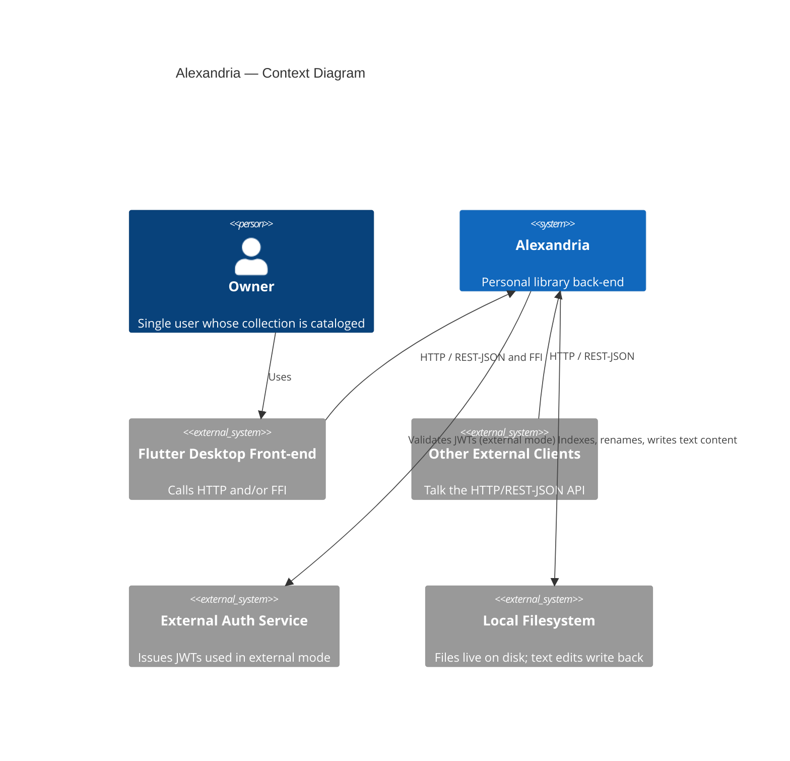
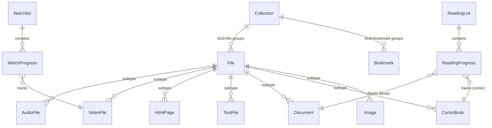

# Vision Document — Alexandria

## 1. Introduction

### 1.1 Purpose

This document establishes the **why and what, at altitude** for Alexandria — a
personal library back-end that indexes, organizes, and surfaces a single user's
on-disk media and documents. It states the problem, the product's position, the
stakeholders, the core features, and the success criteria. It states no versions,
no endpoints, and no field types — those live in the
[Technology Stack Document](Technology%20Stack%20Document.md) and the
[System Requirements Document](System%20Requirements%20Document.md).

### 1.2 Scope

Alexandria catalogs a single owner's files already living on disk: audio,
movies, series, HTML pages, Markdown and text files, PDFs and e-books, comic
books, images, and browser bookmarks. It lets the owner browse, edit metadata,
rename, organize into collections, build watchlists and reading lists to track
consumption, and edit the content of Markdown and text files in place. It exposes
the same domain operations over an HTTP/REST-JSON API and a Flutter FFI surface.

It is explicitly **out of scope** to: support multiple users or shared
libraries; perform complex media editing (audio/video re-encoding, image
manipulation); store or duplicate file bytes; automatically remove files from
disk; or issue its own JWTs in external-auth mode.

### 1.3 Definitions and Acronyms

| Term | Definition |
| --- | --- |
| **Owner** | The single authenticated user to whom all cataloged data belongs. |
| **Catalog** | The set of indexed file records, collections, bookmarks, watchlists, reading lists, and progress entries. |
| **Collection** | A named flat folder grouping files (kind = file) or bookmarks (kind = bookmark). |
| **Watchlist** | A named group tracking watch progress for movies and series (VideoFiles). |
| **ReadingList** | A named group tracking read progress for books (Documents) and comic books (ComicBooks). |
| **Purge-on-disk** | The explicit operation that removes a catalog record **and** the underlying file on disk. |
| **FFI** | Foreign Function Interface — the Rust core library callable directly by the Flutter desktop front-end. |
| **Parity** | HTTP and FFI surfaces producing identical results for the same operation. |

---

## 2. Problem Statement

Files accumulate across a single user's machine — music, movies and series,
HTML pages, Markdown and text notes, PDFs and e-books, comic books, images, and
browser bookmarks — with no unified way to browse, search, edit metadata, or
track consumption progress. Scattered files and disconnected, browser-managed
bookmarks make organization slow, lossy, and hard to automate. The owner has no
single, type-aware view of everything already on disk, and no way to track which
media they have started, finished, or intend to consume.

---

## 3. Product Position Statement

| Attribute | Description |
| --- | --- |
| **For** | A single owner of a large, growing personal media and document collection |
| **Who** | Wants to browse, organize, edit, and track progress across every file type from one place |
| **The Alexandria** | Is a fast, type-aware library back-end over files already on disk |
| **That** | Indexes thousands of files, exposes one consistent API to any client, and tracks watchlist and reading-list progress |
| **Unlike** | The operating-system file tree and separate browser-managed bookmarks, which are untyped, unsearchable as a whole, and track no consumption progress |
| **Our product** | Treats every supported file type uniformly, keeps files where they are, stores only metadata, and offers both HTTP and direct FFI access without behavioral drift |

---

## 4. Stakeholders

| Stakeholder | Role | Concern |
| --- | --- | --- |
| **Owner** | Single user whose collection is cataloged | Fast browsing, accurate metadata, safe deletion, and reliable progress tracking for watchlists and reading lists |
| **Flutter desktop front-end** | First-party client | Consistent access to every operation, with the option of in-process FFI for tight integration |
| **External clients** | Any system in any language that talks the HTTP API | A stable, well-documented REST/JSON contract with no surprise behavioral drift from the FFI path |
| **External authentication service** | Issues JWTs used in external-auth mode | A clear validation boundary; Alexandria never issues tokens itself |

---

## 5. High-Level Architecture

In local-login mode the arrow to the external auth service is absent — Alexandria
verifies credentials against a salted password hash stored in its own SQLite
database instead.

---

## 6. Core Features

| ID | Feature | Description |
| --- | --- | --- |
| **F-01** | File indexing | Scan a directory tree, create type-aware catalog records for supported file types, compute content hashes, and run indexing asynchronously without blocking reads. |
| **F-02** | Catalog browsing and metadata editing | List, query, view, and edit the metadata of any supported file type; edit comic-book, video, audio, document, and image metadata; browse by type and collection. |
| **F-03** | Renaming and lifecycle management | Rename files (which renames them on disk), soft-delete records with restore, hard-purge records, and explicitly purge a file on disk. |
| **F-04** | Text file content editing | Read Markdown and text file content and write edited content back to the file on disk. |
| **F-05** | Collections | Create, rename, and delete flat file collections and bookmark collections; add and remove items of the matching kind. |
| **F-06** | Bookmark management | Create, update, soft-delete and restore, hard-purge, and browse browser bookmarks organized in bookmark collections. |
| **F-07** | Watchlists | Create and delete watchlists, add videos, update watch progress (per episode for series), and remove videos. |
| **F-08** | Reading lists | Create and delete reading lists, add books and comic books, update read progress (per issue for comic series), and remove items. |
| **F-09** | Pluggable authentication | Authenticate the single owner via either an external JWT service or local hashed-credential login, selected at startup; authorize every operation. |
| **F-10** | Dual-transport parity | Expose the same domain operations over HTTP/REST-JSON and a Rust FFI surface with identical results. |

These `F-xx` IDs are traced to requirement ranges in
[System Requirements Document](System%20Requirements%20Document.md) §9.

---

## 7. Domain Model Overview

Each entity carries an internal primary key plus a public UUID (see
[System Requirements Document](System%20Requirements%20Document.md) §4.0). The
owner is a single implicit principal — no entity carries a per-user foreign key.
A File is referenced by its on-disk path and a content hash; the bytes are never
stored.

---

## 8. Roles Hierarchy

Alexandria has exactly one kind of actor, so no role hierarchy diagram applies.

| Role | Relationship | Permissions |
| --- | --- | --- |
| **Owner (authenticated caller)** | The single principal for all catalog data | All read and write operations across files, collections, bookmarks, watchlists, reading lists, and auth credential management (local mode) |
| **Unauthenticated caller** | No relationship to the domain | None — every operation requires a valid credential from the active auth mode |

---

## 9. Constraints

- The platform is **Rust**, with `#![deny(unsafe_code)]` applied project-wide; concrete versions are pinned in the [Technology Stack Document](Technology%20Stack%20Document.md).
- The relational store is **SQLite**, embedded and bundled with the desktop app; additional databases may be introduced later but SQLite is the starting point (see [Technology Stack Document](Technology%20Stack%20Document.md) §4).
- The API stores **metadata and a path/content-hash reference only** — never file bytes.
- The API performs **no complex media editing** — no audio or video re-encoding, no image manipulation.
- **Exactly one auth mode** is active at runtime, selected by startup configuration; JWTs are never issued by Alexandria.
- Deletion is **two-phase**: soft delete (restorable) then hard purge after a configurable retention window; on-disk files are removed only by an explicit purge-on-disk operation.
- Indexing runs **asynchronously** and must not block read/query operations.
- HTTP and FFI surfaces must produce **identical results** for the same operation.

---

## 10. Success Criteria

- Alexandria indexes thousands of files on a personal machine without blocking the caller, and subsequent catalog reads return fast.
- The owner can find, open metadata for, rename, edit (where applicable), and organize any supported file type from a single client.
- Watchlists accurately track which movies and series the owner has watched and what remains pending, per episode for series.
- Reading lists accurately track which books and comic books the owner has read and what remains pending, per issue for comic series.
- Soft-deleted items can be restored until their retention window expires; on-disk files are removed only by an explicit, intentional command.
- The HTTP API and the FFI core produce identical results for the same operation, so the Flutter front-end can choose either transport without behavioral drift.
- Authentication works in either configured mode, and the inactive mode's credentials are always rejected.
